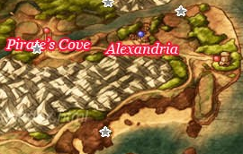
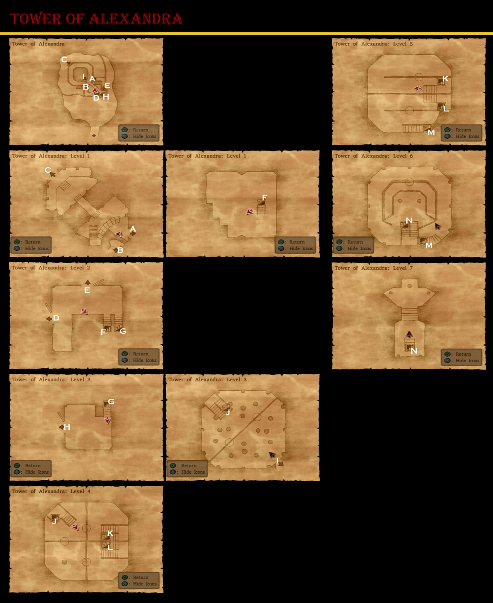
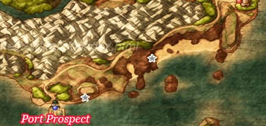

# Alexandria

## Collectable Items

* Overworld
  * Slime Earrings - West of Checkpoint
  * 100 G - West of Checkpoint along cliff
* Alexandria
  * Medicinal Herb - Southern House Pot
  * 11G - Southern House Closet
  * Holy Water - Pots across stream
  * Chimaera Wing - Eastern House Closet
  * 5G - Kitchen Pot
  * Plain Cheese - Kitchen Pot
  * Wayfarer's Clothes - 2F Cabinet
  * Seed of Magic - Attic Barrel
  * 18G - Attic Barrel
  * Moonwort Bulb - Attic Barrel
  * Jessica's Outfit - Jessica's Room (After Tower)

## Blue Chests

* East of Checkpoint
* Southeastern beach
* North side of port path

## Stores

<table>
  <tr>
      <th colspan="10">Armour and Item Shop</th>
  </tr>
  <tr>
    <th>Item</th>
    <th>Cost</th>
    <th>DEF</th>
    <th>H</th>
    <th>Y</th>
    <th>J</th>
    <th>A</th>
    <th>M</th>
    <th>R</th>
    <th>Effect</th>
  </tr>
  <tr>
    <th>Leather Kilt</th>
    <th>250G</th>
    <th>12</th>
    <th>-</th>
    <th>+</th>
    <th>-</th>
    <th>-</th>
    <th>-</th>
    <th>-</th>
    <th>A sturdy kilt fashioned from animal hide</th>
  </tr>
  <tr>
    <th>Scale Armour</th>
    <th>350G</th>
    <th>17</th>
    <th>+</th>
    <th>-</th>
    <th>-</th>
    <th>+</th>
    <th>+</th>
    <th>-</th>
    <th>A suit of armour fashioned from numerous hard scales</th>
  </tr>
  <tr>
    <th>Medicinal Herb</th>
    <th>8G</th>
    <th>-</th>
    <th>+</th>
    <th>+</th>
    <th>+</th>
    <th>+</th>
    <th>+</th>
    <th>+</th>
    <th>Restores 30-40HP for one character</th>
  </tr>
  <tr>
    <th>Antidotal Herb</th>
    <th>10G</th>
    <th>-</th>
    <th>+</th>
    <th>+</th>
    <th>+</th>
    <th>+</th>
    <th>+</th>
    <th>+</th>
    <th>Cures Poison for one character</th>
  </tr>
  <tr>
    <th>Chimaera Wing</th>
    <th>25G</th>
    <th>-</th>
    <th>+</th>
    <th>+</th>
    <th>+</th>
    <th>+</th>
    <th>+</th>
    <th>+</th>
    <th>Allows you to teleport to any town and some dungeons you have already visited</th>
  </tr>
</table>

<table>
  <tr>
      <th colspan="10">Weapon Shop</th>
  </tr>
  <tr>
    <th>Item</th>
    <th>Cost</th>
    <th>ATK</th>
    <th>H</th>
    <th>Y</th>
    <th>J</th>
    <th>A</th>
    <th>M</th>
    <th>R</th>
    <th>Effect</th>
  </tr>
  <tr>
    <th>Oaken Club</th>
    <th>110G</th>
    <th>7</th>
    <th>-</th>
    <th>+</th>
    <th>-</th>
    <th>-</th>
    <th>+</th>
    <th>-</th>
    <th>-</th>
  </tr>
  <tr>
    <th>Giant Mallet</th>
    <th>240G</th>
    <th>13</th>
    <th>-</th>
    <th>+</th>
    <th>-</th>
    <th>-</th>
    <th>+</th>
    <th>-</th>
    <th>-</th>
  </tr>
  <tr>
    <th>Copper Sword</th>
    <th>270G</th>
    <th>13</th>
    <th>+</th>
    <th>-</th>
    <th>-</th>
    <th>-</th>
    <th>-</th>
    <th>-</th>
    <th>-</th>
  </tr>
  <tr>
    <th>Boomerang</th>
    <th>420G</th>
    <th>19</th>
    <th>+</th>
    <th>-</th>
    <th>-</th>
    <th>-</th>
    <th>+</th>
    <th>-</th>
    <th>Causes damage to all enemies</th>
  </tr>
  <tr>
    <th>Stone Axe</th>
    <th>550G</th>
    <th>20</th>
    <th>-</th>
    <th>+</th>
    <th>-</th>
    <th>-</th>
    <th>-</th>
    <th>-</th>
    <th>-</th>
  </tr>
</table>

# Tower of Alexandra

Recommended Level: 7

## Collectable Items

* 200 G - Courtyard
* Seed of Agility - Basement Chest
* Moonwort Bulb - Basement Barrel
* 22G - Basement Pot
* 11G - Basement Barrel
* Medicinal Herb - Basement Barrel
* Seed of Strength - Tower Pot
* 7G - Tower Pot
* Medicinal Herb - Tower Barrel
* Antidotal Herb - Tower Pot
* Scale Shield - Tower Chest

# Port Prospect

## Collectable Items

* Overworld
  * Seed of Strength - Southern Beach
  * Seed of Life - East of Port Prospect
* Port Prospect
  * Chimaera Wing - Barrel Near Entrance
  * Medical Herb - Barrel Near Entrance
  * Seed of Wisdom - Pot Near Entrance
  * Holy Water - Inn Cabinet
  * 17G - Shop Barrel
* Ferry
  * Medicinal Herb - Cabin Barrel
  * Seed of Life - Cabin Barrel
  * Seed of Agility - Cabin Pot
  * Antidotal Herb - Cabin Pot
  * Pot Lid - Cabin Barrel
  * 12G - Cabin Pot
  * Medical Herb - Cabin Pot
  * 10G - Downstairs Pot
  * Bronze Knife - Captain's Quarters

## Stores

<table>
  <tr>
      <th colspan="3">Item Shop</th>
  </tr>
  <tr>
    <th>Item</th>
    <th>Cost</th>
    <th>Effect</th>
  </tr>
  <tr>
    <th>Medicinal Herb</th>
    <th>8G</th>
    <th>Restores 30-40HP for one character</th>
  </tr>
  <tr>
    <th>Antidotal Herb</th>
    <th>10G</th>
    <th>Cures Poison for one character</th>
  </tr>
  <tr>
    <th>Holy Water</th>
    <th>20G</th>
    <th>When used on the field, avoids battles with low level enemies, When used in battle deals 10-15 damage to a single enemy</th>
  </tr>
  <tr>
    <th>Chimaera Wing</th>
    <th>25G</th>
    <th>Allows you to teleport to any town and some dungeons you have already visited</th>
  </tr>
</table>

<table>
  <tr>
      <th colspan="10">Weapon and Armour Shop</th>
  </tr>
  <tr>
    <th>Item</th>
    <th>Cost</th>
    <th>ATK/DEF</th>
    <th>H</th>
    <th>Y</th>
    <th>J</th>
    <th>A</th>
    <th>M</th>
    <th>R</th>
    <th>Effect</th>
  </tr>
  <tr>
    <th>Stone Axe</th>
    <th>550G</th>
    <th>20</th>
    <th>-</th>
    <th>+</th>
    <th>-</th>
    <th>-</th>
    <th>-</th>
    <th>-</th>
    <th>-</th>
  </tr>
  <tr>
    <th>Iron Lance</th>
    <th>750</th>
    <th>24</th>
    <th>+</th>
    <th>-</th>
    <th>-</th>
    <th>-</th>
    <th>-</th>
    <th>-</th>
    <th>-</th>
  </tr>
  <tr>
    <th>Farmer's Scythe</th>
    <th>910</th>
    <th>28</th>
    <th>-</th>
    <th>+</th>
    <th>-</th>
    <th>-</th>
    <th>-</th>
    <th>-</th>
    <th>-</th>
  </tr>
  <tr>
    <th>Leather Kilt</th>
    <th>250G</th>
    <th>12</th>
    <th>-</th>
    <th>+</th>
    <th>-</th>
    <th>-</th>
    <th>-</th>
    <th>-</th>
    <th>A sturdy kilt fashioned from animal hide</th>
  </tr>
  <tr>
    <th>Scale Armour</th>
    <th>350G</th>
    <th>17</th>
    <th>+</th>
    <th>-</th>
    <th>-</th>
    <th>+</th>
    <th>+</th>
    <th>-</th>
    <th>A suit of armour fashioned from numerous hard scales</th>
  </tr>
  <tr>
    <th>Scale Shield</th>
    <th>180G</th>
    <th>7</th>
    <th>+</th>
    <th>+</th>
    <th>+</th>
    <th>+</th>
    <th>+</th>
    <th>+</th>
    <th>-</th>
  </tr>
</table>

## Walkthrough Tasks

1. Purchases: (910 G)
  * 1 Farmer's Scythe

## Cameron's Codex

2. Jailcat outside Port Prospect
28. Port Prospect Lighthouse
91. Window side of Inn

# Cameron's Codex - Treasure Hunt

* Farebury
  20. Defeat 30 Slimes - Creme caraslime south of Farebury
  89. Gold Slime behind Inn counter
  118. Kalderasha
* Alexandria
  27. Alexandra's Statue at the tower
  90. Gold Slime in Jessica's Room
  119. Jessica's Mother
* Other
  1. Take a picture of any monster

# Peregrin Quay

## Collectable Items

* Chimaera Wing - Armour Shop Barrel
* Leather Kilt - Armour Shop Pot
* Medicinal Herb - Item Shop Barrel
* 8G - Item Shop Barrel
* Oaken Club - Weapon Shop
* Antidotal Herb - Weapon Shop
* Seed of Defense - Next to Closed Shop
* Medicinal Herb - Next to Closed Shop
* Iron Nail - Inn Hooded Guy
* Seed of Magic - Inn Cabinet
* Boomerang - Closed Shop Chest
* 200G - Closed Shop Chest
* Mini Medal - Closed Shop Chest

## Walkthrough Tasks

1. Purchases (1476 G)
  * 4 Bronze Knives
  * 1 Thorn Whip
  * 6 Bandanas
  * 2 Holy Waters
  * 27 Medical Herbs
2. Alchemy
  * Bronze Knife + Iron Nail = Thief's Key
  * Plain Clothes + Plain Clothes = Wayfarer's Clothes
  * Bandana + Bandana = Turban
  * Bandana + Bandit's Grass Skirt = Boxer Shorts
  * Chimaera Wing + Leather Hat = Feathered Cap
  * 15x Medicinal Herb + Medicinal Herb = Strong Medicine
  * 2x Medicinal Herb + Antidotal Herb = Strong Antidote
  * Holy Water + Seed of Magic = Magic Water
3. Alchemy
  * 6x Strong Medicine + Strong Medicine = Special Medicine
  * Medicinal Herb + Strong Medicine = Rose Root
  * Strong Medicine + Holy Water = Amor Seco Essense
  * Strong Antidote + Strong Antidote = Special Antidote
4. Alchemy
  * Special Medicine + Special Medicine = Lesser Panacea

## Cameron's Codex

29. Pier Shop
92. Atop luggage midway up the stairway Inn

## Stores

<table>
  <tr>
      <th colspan="3">Item Shop</th>
  </tr>
  <tr>
    <th>Item</th>
    <th>Cost</th>
    <th>Effect</th>
  </tr>
  <tr>
    <th>Medicinal Herb</th>
    <th>8G</th>
    <th>Restores 30-40HP for one character</th>
  </tr>
  <tr>
    <th>Antidotal Herb</th>
    <th>10G</th>
    <th>Cures Poison for one character</th>
  </tr>
  <tr>
    <th>Holy Water</th>
    <th>20G</th>
    <th>When used on the field, avoids battles with low level enemies, When used in battle deals 10-15 damage to a single enemy</th>
  </tr>
  <tr>
    <th>Chimaera Wing</th>
    <th>25G</th>
    <th>Allows you to teleport to any town and some dungeons you have already visited</th>
  </tr>
</table>

<table>
  <tr>
      <th colspan="10">Item Shop 2</th>
  </tr>
  <tr>
    <th>Item</th>
    <th>Cost</th>
    <th>ATK/DEF</th>
    <th>H</th>
    <th>Y</th>
    <th>J</th>
    <th>A</th>
    <th>M</th>
    <th>R</th>
    <th>Effect</th>
  </tr>
  <tr>
    <th>Cypress Stick</th>
    <th>10G</th>
    <th>4</th>
    <th>+</th>
    <th>-</th>
    <th>-</th>
    <th>-</th>
    <th>-</th>
    <th>-</th>
    <th>-</th>
  </tr>
  <tr>
    <th>Pot Lid</th>
    <th>40G</th>
    <th>2</th>
    <th>-</th>
    <th>+</th>
    <th>+</th>
    <th>-</th>
    <th>+</th>
    <th>+</th>
    <th>-</th>
  </tr>
  <tr>
    <th>Bandana</th>
    <th>45</th>
    <th>1</th>
    <th>+</th>
    <th>-</th>
    <th>-</th>
    <th>-</th>
    <th>-</th>
    <th>-</th>
    <th>-</th>
  </tr>
  <tr>
    <th>Hairband</th>
    <th>150G</th>
    <th>5</th>
    <th>-</th>
    <th>-</th>
    <th>+</th>
    <th>-</th>
    <th>-</th>
    <th>+</th>
    <th>-</th>
  </tr>
  <tr>
    <th>Slime Earrings</th>
    <th>400G</th>
    <th>4</th>
    <th>+</th>
    <th>+</th>
    <th>+</th>
    <th>+</th>
    <th>+</th>
    <th>+</th>
    <th>-</th>
  </tr>
</table>

<table>
  <tr>
      <th colspan="10">Armour Shop</th>
  </tr>
  <tr>
    <th>Item</th>
    <th>Cost</th>
    <th>DEF</th>
    <th>H</th>
    <th>Y</th>
    <th>J</th>
    <th>A</th>
    <th>M</th>
    <th>R</th>
    <th>Effect</th>
  </tr>
  <tr>
    <th>Scale Armour</th>
    <th>350G</th>
    <th>17</th>
    <th>+</th>
    <th>-</th>
    <th>-</th>
    <th>+</th>
    <th>+</th>
    <th>-</th>
    <th>A suit of armour fashioned from numerous hard scales</th>
  </tr>
  <tr>
    <th>Silk Robe</th>
    <th>420G</th>
    <th>10</th>
    <th>-</th>
    <th>-</th>
    <th>+</th>
    <th>+</th>
    <th>-</th>
    <th>+</th>
    <th>A high-quality garment woven from pure silk</th>
  </tr>
  <tr>
    <th>Chain Mail</th>
    <th>500G</th>
    <th>20</th>
    <th>-</th>
    <th>+</th>
    <th>-</th>
    <th>-</th>
    <th>+</th>
    <th>+</th>
    <th>A comfortable and lightweight suit of armour constructed from innumerable metal links.</th>
  </tr>
  <tr>
    <th>Scale Shield</th>
    <th>180G</th>
    <th>7</th>
    <th>+</th>
    <th>+</th>
    <th>+</th>
    <th>+</th>
    <th>+</th>
    <th>+</th>
    <th>-</th>
  </tr>
  <tr>
    <th>Pointy Hat</th>
    <th>70G</th>
    <th>7</th>
    <th>+</th>
    <th>+</th>
    <th>-</th>
    <th>-</th>
    <th>-</th>
    <th>-</th>
    <th>-</th>
  </tr>
</table>

<table>
  <tr>
      <th colspan="10">Weapon Shop</th>
  </tr>
  <tr>
    <th>Item</th>
    <th>Cost</th>
    <th>ATK</th>
    <th>H</th>
    <th>Y</th>
    <th>J</th>
    <th>A</th>
    <th>M</th>
    <th>R</th>
    <th>Effect</th>
  </tr>
  <tr>
    <th>Bronze Knife</th>
    <th>150G</th>
    <th>9</th>
    <th>-</th>
    <th>-</th>
    <th>+</th>
    <th>-</th>
    <th>-</th>
    <th>+</th>
    <th>-</th>
  </tr>
  <tr>
    <th>Thorn Whip</th>
    <th>350G</th>
    <th>14</th>
    <th>-</th>
    <th>-</th>
    <th>+</th>
    <th>-</th>
    <th>-</th>
    <th>+</th>
    <th>Hits all monsters in a group</th>
  </tr>
  <tr>
    <th>Iron Lance</th>
    <th>750G</th>
    <th>24</th>
    <th>+</th>
    <th>-</th>
    <th>-</th>
    <th>-</th>
    <th>-</th>
    <th>-</th>
    <th>-</th>
  </tr>
  <tr>
    <th>Farmer's Scythe</th>
    <th>910G</th>
    <th>28</th>
    <th>-</th>
    <th>+</th>
    <th>-</th>
    <th>-</th>
    <th>-</th>
    <th>-</th>
    <th>-</th>
  </tr>
</table>

# Treasure Hunt - Thief's Key

* Farebury
  * Cypress Stick - Weapon Shop
  * Dagger - Weapon Shop
  * Mini Medal - Church
  * Mini Medal - Southeast of Farebury
* Alchemy
  * Cypress Stick + Dagger = Iron Lance
