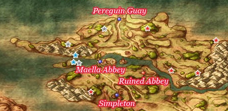
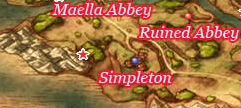
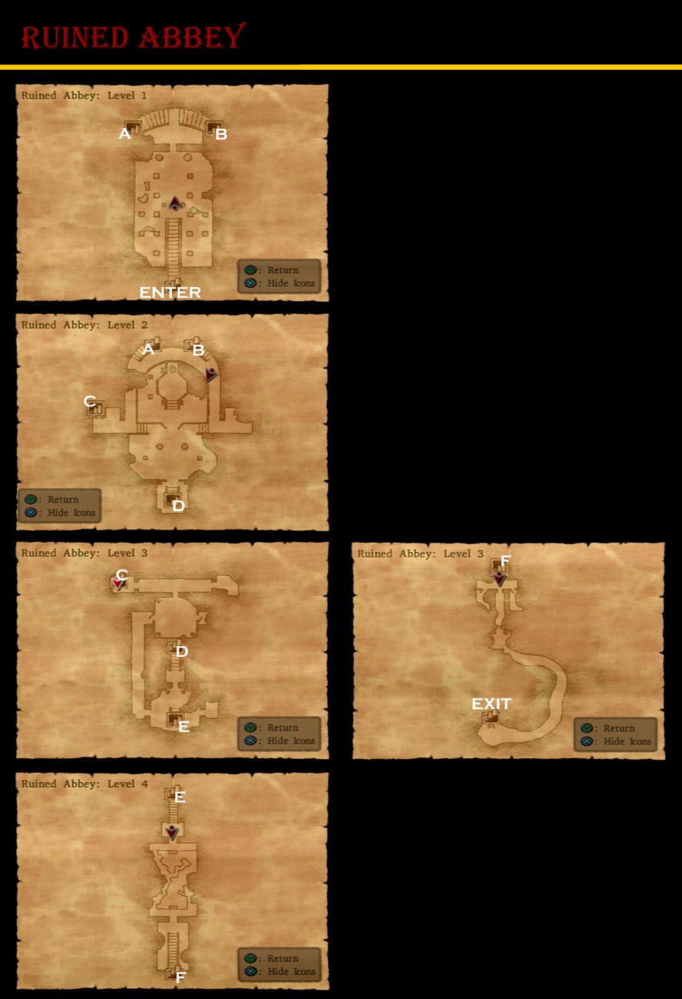

# Maella Abbey

## Collectable Items

* Overworld
  * Magic Water - West of Peregrin Quay
  * Stone Axe - Southwest of Peregrin Quay
  * Feathered Cap - East of Peregrin Quay
  * Seed of Magic - East of Peregrin Quay North Coast
  * Seed of Wisdom - South of Seed of Magic
  * Seed of Strength - West of Seed of Wisdom
* Maella Abbey
  * Mini Medal - Outdoor Pot
  * Holy Water - Outdoor Barrel
  * Mini Medal - Kitchen Barrel
  * 26G - Back Barrel

# Simpleton

## Collectable Items

* Overworld
  * Bunny Tail - South of Maella Abbey
* Simpleton
  * Mini Medal - Bar Barrel
  * 6G - Bar Barrel

## Stores

### Item Shop

| Item           | Cost | DEF | H | Y | J | A | M | R | Effect |
| -------------- | :--: | :-: | - | - | - | - | - | - | ------ |
| Medicinal Herb | 8G   |  -  | * | * | * | * | * | * | Restores 30-40HP for one character |
| Antidotal Herb | 10G  |  -  | * | * | * | * | * | * | Cures Poison for one character |
| Holy Water     | 20G  |  -  | * | * | * | * | * | * | When used on the field, avoids battles with low level enemies, When used in battle deals 10-15 damage to a single enemy |
| Chimaera Wing  | 25G  |  -  | * | * | * | * | * | * | Allows you to teleport to any town and some dungeons you have already visited |
| Chain Mail     | 500G | 20  | - | * | - | - | * | * | A comfortable and lightweight suit of armour constructed from innumerable metal links |
| Turban         | 410G |  8  | * | * | - | - | - | - | A protective head-dress made from a long strip of cloth that is wrapped around the head |

### Weapon Shop

| Item         | Cost  | ATK | H | Y | J | A | M | R | Effect |
| ------------ | :---: | :-: | - | - | - | - | - | - | ------ |
| Rapier       | 300G  | 17  | - | - | - | * | - | - | A civilised sort of sword with an extremely narrow blade |
| Thorn Whip   | 350G  | 14  | - | - | * | - | - | * | A whip covered in thorns. Capable of hitting multiple enemies in a single lash |
| Wizard Staff | 1300G | 15  | - | - | * | * | - | - | Launches tiny fireballs at enemies when used as an item in battle |
| Long Spear   | 1700G | 30  | * | - | - | - | - | - | A long and heavy spear |
| Sledgehammer | 1700G | 33  | - | * | - | - | * | - | An enormous hammer made of iron |

## Blue Chests

* East of Maella Abbey
* East of Bunny Tail

## Cameron's Codex

15. Old Abbey Metal Slime
30. Stained Glass House at Abbey back
31. Torture Room in Abbey Basement
32. Simpleton Bar
33. Stained Glass at Abbey Front
93. Abbey First Floor, Right Side
94. Behind Simpleton Bar

# Ruined Abbey

## Collectable Items

* 300G - Level 2 East Chest
* Iron Nail - Level 2 West Closet
* Mini Medal - Level 3 NE Pot
* Bronze Shield - Level 3 N Chest
* Mini Medal - Level 3 NE Barrel
* Waterweed Mould - Level 3 E Room Barrel
* 50G - Level 3 W Room Pot
* Bandit's Grass Skirt - Level 3 Boss Room Closet
* Mini Medal - Abbot's House Barrel
