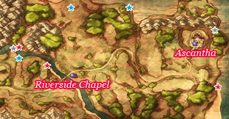
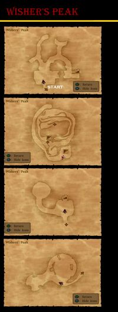

# Ascantha

## Collectable Items

* Overworld
  * Chain Mail - River Bank Far East of Maella Abbey
  * Mini Medal - River House Barrel
  * Silk Robe - River House Closet
  * 230G - North of River House
  * Seed of Magic - Riverside Chapel Closet
  * Fresh Milk - Riverside Chapel Cow
  * Seed of Life - South of River House
  * Seed of Agility - Far Northwest of River House Across River
  * 3 Fresh Milks - Cows by Ascantha Road
  * Fresh Milk - Cow South of Ascantha
  * Seed of Defense - North end of South Ascantha Beach
  * 154G - Behind Ascantha
* Town
  * Lady's Ring - Well
    * Seed of Wisdom - Show Lady's Ring to Man in Farebury Inn
  * Rennet Powder - Southwest House Pot
  * Mini Medal - Southwest House Cabinet
  * Plain Clothes - West House Closet
  * Mini Medal - West Castle Cabinet
  * 42G - West Castle Cabinet
  * Medicinal Herb - Castle Kitchen Pot
  * Red Mould - Castle Kitchen Barrel
  * Mini Medal - Castle E Room Cabinet

## Stores

### Item Shop

| Item           | Cost | Effect |
| -------------- | ---- | ------ |
| Medicinal Herb | 8G   | Restores 30-40HP for one character |
| Antidotal Herb | 10G  | Cures Poison for one character |
| Rennet Powder  | 10G  | A powder used to turn milk into cheese |
| Holy Water     | 20G  | When used on the field, avoids battles with low level enemies, When used in battle deals 10-15 damage to a single enemy |
| Chimaera Wing  | 25G  | Allows you to teleport to any town and some dungeons you have already visited |
| Moonwort Bulb  | 30G  | Cures the entire party of paralysis |

### Armour Shop

| Item           | Cost  | DEF | H | Y | J | A | M | R | Effect |
| -------------- | :---: | :-: | - | - | - | - | - | - | ------ |
| Leather Dress  | 380G  | 17  | - | - | * | - | - | * | A sturdy suit of leather armour for female adventurers |
| Bronze Armour  | 840G  | 14  | * | - | - | - | - | - | A suit of armour fashioned from forged bronze plates |
| Iron Cuirass   | 1000G | 15  | - | * | - | - | * | - | Iron armour that only covers the wearer's chest |
| Bronze Shield  | 370G  | 30  | * | * | - | - | - | - | A large shield of beaten bronze |
| Turban         | 410G  |  8  | * | * | - | - | - | - | A protective head-dress made from a long strip of cloth that is wrapped around the head |
| Slime Earrings | 400G  |  4  | * | * | * | * | * | * | Cute earrings in the shape of slimes |

### Weapon Shop

| Item             | Cost  | ATK | H | Y | J | A | M | R | Effect |
| ---------------- | :---: | :-: | - | - | - | - | - | - | ------ |
| Dagger           | 350G  | 18  | - | - | * | - | - | * | A long-bladed knife designed for combat |
| Short Bow        | 750G  | 23  | - | - | - | * | - | - | A light and easy-to-handle bow for novice archers |
| Wizard's Staff   | 1300G | 15  | - | - | * | * | - | - | Launches tiny fireballs at enemies when used as an item in battle |
| Edged Boomerang  | 1360G | 27  | * | - | - | - | * | - | A metal boomerang with knife-like edges |
| Steel Broadsword | 2000G | 35  | * | - | - | - | - | - | A sturdy sword made from forged steel |

## Walkthrough Tasks

1. Purchases (3090 G)
  * 1 Short Bow
  * 1 Edged Boomerang
  * 1 Bronze Armour
  * 4 Moonwort Bulbs
2. Alchemy
  * Chain Mail + Bronze Shield = Bronze Armour
  * Strong Medicine + Moonwort Bulb = Rose-wort

## Cameron's Codex

2. Khalamari Kid on Riverbank
5. Kisser around Ascantha
6. Slime Knights around Ascantha
21. Defeat 30 Mummy Boys - Dead Bowdy North of Ascantha Bridge
34. Atop Wishing Peak
35. River House Spinning Wheel
36. Castle Entrance
37. View from top of Castle
95. Guesthouse Inn
96. Shelves in Left Room of Castle
120. King
121. Emma
122. Dog by Item Shop

# Wisher's Peak

## Collectable Items

* Wizard's Staff - Northwest Path
* 500G - Inside Mountain
* Templar's Shield - East Path Past Peak

## Walkthrough Tasks

1. Alchemy
  * Wayfarer's Clothers + Templar's Shield = Templar's Uniform
