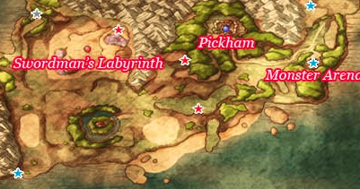
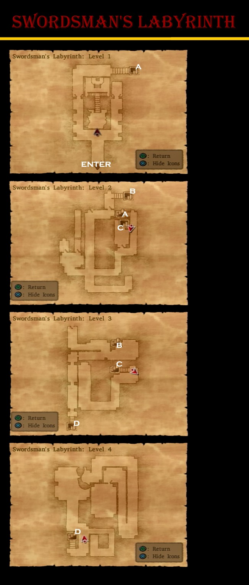

# Morrie's Place

## Monsters

* Lonely Joe - On the way to Ruined Abbey

# Pickham

## Collectable Items

* 2 Fresh Milk - Cows outside Pickham
* Bunny Tail - West Shed Cabinet
* Rennet Powder - West Shed Pot
* 12 Gold Coins - West Shed Pot
* Chain Mail - Blacksmith House Closet
* Seed of Life - West House Barrel
* Holy Water - West House Cabinet
* Mini Medal - Item Shop Bag
* Mini Medal - Well Pot
* Amor Seco Essence - Well Pot
* Cowpat - East Pot
* Mini Medal - East House Barrel
* Seed of Strength - East House Bag
* 26 Gold Coins - East Barrel
* Boxer Shorts - Roof tent Bag
* Mini Medal - West Roof Pot
* 30 Gold Coins - Brain's Pot
* Seed of Wisdom - Brain's Pot
* Waterweed Mould - Dave's Bar Barrel
* Magic Water - Northeast House Closet
* 35 Gold Coins - Inn Closet
* Red Mould - Inn Roof Barrel
* Fresh Milk - Bar Barrel
* 1,000 Gold Coins - Horse-napper
* Mini Medal - Dodgy Dave's

## Stores

### Item Shop

| Item              | Cost | Effect |
| ----------------- | ---- | ------ |
| Medicinal Herb    | 8G   | Restores 30 or more HP to a single ally |
| Antidotal Herb    | 10G  | Cures Poison for one character |
| Rennet Powder     | 10G  | A powder used to turn milk into cheese |
| Holy Water        | 20G  | When used on the field, avoids battles with low level enemies, When used in battle deals 10-15 damage to a single enemy |
| Chimaera Wing     | 25G  | Allows you to teleport to any town and some dungeons you have already visited |
| Amor Seco Essence | 120G | Restores 60 or more HP to a single ally |

### Armour Shop

| Item             | Cost  | DEF | H | Y | J | A | M | R | Effect |
| ---------------- | :---: | :-: | - | - | - | - | - | - | ------ |
| Bronze Armour    | 840G  | 14  | * | - | - | - | - | - | A suit of armour fashioned from forged bronze plates |
| Leather Cape     | 1100G | 22  | - | - | - | * | * | - | A sturdy cape made of leather |
| Dancer's Costume | 1300G | 23  | - | - | * | - | - | - | A provocative outfit for professional dancers |
| Iron Shield      | 720G  | 15  | * | * | - | - | - | - | A forged iron shield. Reduces the damage from certain fire- or ice-based attacks by 5 points |
| Iron Helmet      | 1100G | 16  | * | - | - | * | - | - | An entriely undistinguished helmet made of iron |

### Weapon Shop

| Item              | Cost  | ATK | H | Y | J | A | M | R | Effect |
| ----------------- | :---: | :-: | - | - | - | - | - | - | ------ |
| Poison Moth Knife | 950G  | 29  | - | - | * | - | - | * | Fetures a blade coated with the poison of a moth that can paralyse enemies |
| Hunter's Bow      | 1700G | 30  | - | - | - | * | - | - | A standard bow, popular among adventurers for its blend of power and convenience |
| Steel Broadsword  | 2000G | 35  | * | - | - | - | - | - | A sturdy sword made from forged steel |
| Iron Axe          | 2600G | 38  | - | * | - | - | - | - | A thick sturdy axe with a cast iron head |
| Holy Lance        | 2700G | 39  | * | - | - | - | * | - | A holy spear that has received the blessing of the Goddess |

## Walkthrough Tasks

1. Purchases (7050 G)
  * 1 Poison Moth Knife
  * 1 Iron Helmet
  * 3 Iron Shields
  * 2 Dancer's Costumes
  * 2 Amor Seco Essences
2. Alchemy
  * Hairband + Bunny Tail =
  * Plain Cheese + Amor Seco Essence =
  * Fresh Milk + Rennet Powder =

## Cameron's Codex

4. Paprikan Around Pickham
22. Defeat 30 Minidemons - Morrie Demon Above South Ascantha Beach
39. Tower View
40. Well
97. Blacksmith House
124. Upper-level fortune teller

# Swordsman's Labyrinth

## Available Irems

* Overworld
  * 450G - Dead End East of Red's
  * Leather Whip - East of Red's
  * Fresh Milk - Cow West of Labyrinth
  * Farmer's Scythe - East of Labyrinth past Swamp
* Red's
  * Mini Medal -
  * Hairband -
  * Mini Medal -
* Swordsman's Labyrinth
  * Cowpat -
  * G -
  * 11G -
  * Seed of Magic -
  * 62G -
  * Red Mould -
  * Mini Medal -
  * Antidotal Herb -
  * Mini Medal -
  * Kitty Shield -
  * Mini Medal -

## Monsters

* Squiggles - Beach South of Red's

## Walkthrough Tasks

1. Alchemy
  * Farmer's Scythe + Farmer's Scythe =
  * Iron Shield + Iron Shield =
  * Leather Whip + Scale Shield =
  * Leather Whip + Bandana =
  * Templar's Uniform + Iron Shield = 

## Cameron's Codex

38. Swordsman's Labyrinth
98. By Red's Potted Plants
123. Brain
125. Red
