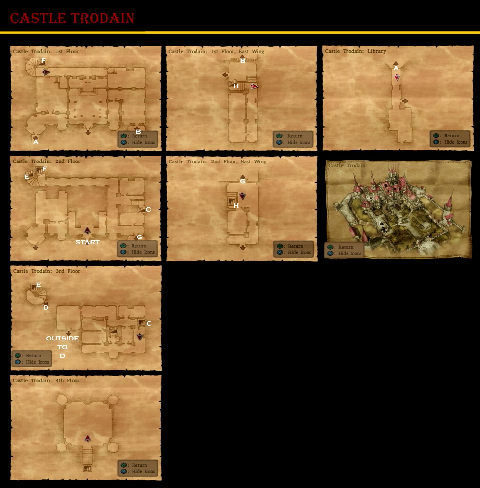

# Hilltop Hut

## Available Items

* Slime Crown - Well
* Mini Medal - Pot

## Walkthrough Tasks

1. Alchemy
  * Cypress Stick + Cypress Stick + Iron Lance = Long Spear
  * Medicinal Herb + Medicinal Herb + Medicinal Herb = Rose-Root
  * Medicinal Herb + Antidotal Herb + Antidotal Herb = Special Antidote
  * Medicinal Herb + Medicinal Herb + Moonwort Bulb = Rose-Wort
  * Moonwort Bulb + Moonwort Bulb + Moonwort Bulb = Moon's Mercy
  * Medicinal Herb + Antidotal Herb + Moonwort Bulb = Mystifying Mixture
  * Rose Root + Rose-Wort + Lesser Panacea = Greater Panacea

# Trodain

## Available Items

* Overworld
  * Sledgehammer - South of Ship
  * Seed of Magic - Tip of West Coast
  * Fresh Milk - Cow By South Trodain Tunnel
  * 2 Fresh Milks - Chapel Cows
  * 630G - West of Castle West Gully
* Trodain Castle
  * Mini Medal - 3F SE Closet
  * 29G - 3F West Barrel
  * Garter - 3F Centre Closet
  * 46G - 1F East Wing Pot
  * Mini Medal - 1F East Wing Barrel
  * Magic Beast Hide - 2F Southwest Barrel
  * Mini Medal - 2F Soutwest Barrel
  * Gold Bracer - 2F Southwest Bag
  * Magic Key - 2F Southwest
  * Templar's Sword - 2F Southwest
  * Rock Salt - 1F Kitchen Stairs Pot
  * Waterweed Mould - 1F Kitchen Pot
  * 150G - 1F Kitchen Barrel
  * Mini Medal - 1F Kitchen Barrel

## Monsters

* Smiles - In front of Trodain Castle

## Cameron's Codex

16. Liquid Metal Slime in Trodain Castle
23. Defeat 30 Terror Tabbies - Gold Nugcat on Hill West of Trodain Castle
41. Morrie's Arena
43. Trodain Castle
44. 3F Castle Piano
99. Morrie's Place Behind Bar
126. Morrie in the Arena

# Treasure Hunt - Magic Key

* Maella Abbey
  * Mini Medal - West of Abbey North Side
* Ascantha
  * Steel Broadsword - Northwest of River House
  * Mini Medal - North of Riverside Chapel
  * Agility Ring - Northeast of Riverside Chapel
* Pickham
  * Mini Medal - Behind Monster Arena
  * Seed of Defense - North of Monster Arena
  * Gold Ring - Far West of Swordsman's Labyrinth
  * Seed of Skill - Southwest of Red's House
* Port Prospect
  * Seed of Defense - West of Hilltop Hut
* Trodain
  * Lesser Panacea - East of Trodain Castle by Broken Bridge

# Land of the Moles

## Available Items

* Overworld
  * Fresh Milk - Cow in middle of area
  * Seed of Life - Right of middle area
  * Mini Medal - Above Mole Hole Entrance
* Mole Hole
  * 1500G - Level 1 West Corner
  * Mini Medal - Level 2 East Pot
  * Seed of Defense - Level 2 East Pot
  * Stone Hardhat - Level 2 South
