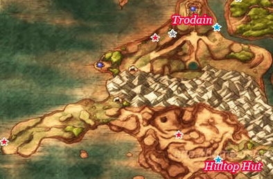
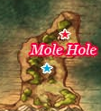

# Hilltop Hut

## Available Items

* Slime Crown - Well
* Mini Medal -

## Walkthrough Tasks

1. Alchemy
  * Cypress Stick + Cypress Stick + Iron Lance =
  * Medicinal Herb + Medicinal Herb + Medicinal Herb =
  * Medicinal Herb + Antidotal Herb + Antidotal Herb =
  * Medicinal Herb + Medicinal Herb + Moonwort Bulb =
  * Moonwort Bulb + Moonwort Bulb + Moonwort Bulb =
  * Medicinal Herb + Antidotal Herb + Moonwort Bulb =
  * Rose Root + Rose-Wort + Lesser Panacea =

# Trodain

## Available Items

* Overworld
  * Sledgehammer -
  * Seed of Magic -
  * Fresh Milk - Cow
  * 2 Fresh Milks -
  * 630G -
* Trodain Castle
  * G -
  * Mini Medal -
  * 29G -
  * Garter -
  * 46G -
  * Mini Medal -
  * Magic Beast Hide -
  * Mini Medal -
  * Gold Bracer -
  * Magic Key -
  * Templar's Sword -
  * Rock Salt -
  * Waterweed Mould -
  * 150G -
  * Mini Medal -

## Monsters

* Smiles - In front of Trodain Castle

## Cameron's Codex

41. Morrie in his Arena

# Treasure Hunt - Magic Key

* Maella Abbey
  * Mini Medal - West of Abbey North Side
* Ascantha
  * Steel Broadsword - Northwest of Riverside Chapel
  * Mini Medal - North of Riverside Chapel
  * Agility Ring - Northeast of Riverside Chapel
* Pickham
  * Mini Medal - Behind Monster Arena
  * Seed of Defense - North of Monster Arena
  * Gold Ring - West of Swordsman's Labyrinth
  * Seed of Skill - Southwest of Red's House
  * Seed of Defense - West of Hilltop Hut
* Trodain
  * Lesser Panacea - East of Trodain Castle by Broken Bridge

# Land of the Moles

## Available Items

* Overworld
  * Fresh Milk - Cow in middle of area
  * Seed of Life - Right of middle area
  * Mini Medal - Above Mole Hole Entrance
* Mole Hole
  * G -
  * Mini Medal -
  * Seed of Defense -
  * Stone Hardhat -
