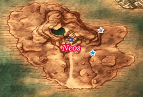
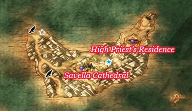

# Princess Minnie's Castle

## Available Irems

* Mini Medal - Behind Castle
* Mini Medal - Castle
* Fresh Milk - Cow behind Castle
* Fishnet Stockings - Princess Minnie

## Walkthrough Tasks

1. Purchases (175 G)
  * 1 Red Mould
  * 4 Waterweed Mould
2. Alchemy
  * Plain Cheese + Red Mould =
  * Plain Cheese + Waterweed Mould = Cool Cheese
3. Alchemy
  * Cool Cheese + Waterweed Mould =

# Neos Island

## Available Items

* Overworld
  * Magic Water -
  * Agility Ring -
* Neos
  * Seed of Magic -
  * Holy Water -
  * Chimaera Wing -
  * 16G -
  * Scholar's Specs -
  * Moonwort Bulb -
  * Spicy Cheese -
  * Seed of Skill -
  * 80G -
  * Gold Rosary -

## Walkthrough Tasks

1. Purchases (22350 G)
  * 2 Steel Scythes
  * 1 Chain Whip
  * 1 Dream Blade
  * 1 Full Plate Armour
  * 1 Light Shield
  * 1 Steel Shield
2. Alchemy
  * Short Bow + Chain Whip =
  * Long Spear + Gold Rosary =
  * Spicy Cheese + Red Mould + Red Mould =

# Treasure Hunt - Ship

* Pirate's Cove Below Alexandria Checkpoint
  * Mini Medal
  * Seed of Magic
  * 790G
* Island West of Maella Abbey
  * Iron Armour
  * Bronze Knife
* Island South of Neos
  * Fresh Milk
  * 950G
* Cape West of Pickham
  * Seed of Life - Centre Hill
  * Iron Mask - East Side
* Beach Southeast of Argonia
  * Yggdrasil Leaf - East End
  * Seed of Strength - West End
* Island in far Southwest Corner
  * Platinum Sword
* Princess Minnie
  * Posh Waistcoat

## Walkthrough Tasks

1. Alchemy
  * Bronze Knife + Bronze Knife =
  * Leather Shield + Bronze Knife =

# Savella

## Available Items

* Overworld
  * Seed of Life -
  * Magic Water -
  * Fresh Milk -
  * Seed of Magic -
  * Seed of Defense -
* Savella Cathedral
  * Mini Medal -
  * Seed of Wisdom -
  * Staff of Divine Wrath - Princess Minnie

## Stores

### Item Shop

## Cameron's Codex

## Walkthrough Tasks

1. Purchases (26000 G)
  * 2 Partisans
  * 4 Silver Mail
2. Alchemy
  * Dancer's Costume + Silver Mail = Dancer's Mail
