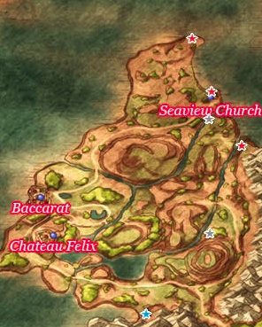
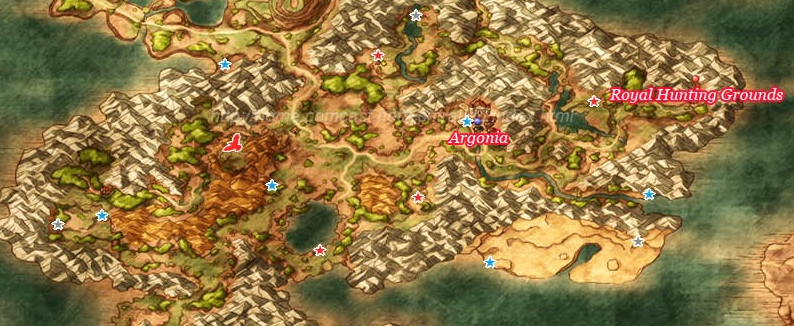
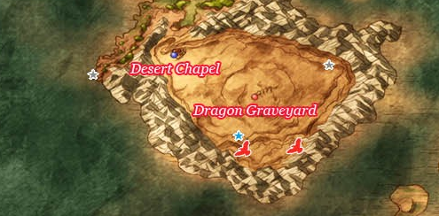

# Baccarat

## Available Items

* Seaview Chapel
  * Tough Guy Tattoo - Behind Seaview Chapel
  * Mini Medal - Seaview Chapel Closet
  * Fresh Milk - Seaview Chapel Cow
  * 1200G - North of Seaview Chapel
* Baccarat
  * Seed of Defense - Pot Opposite Church
  * Strong Medicine - East House Barrel
  * Mini Medal - East House Closet
  * Cool Cheese - Restaurant Barrel
  * 72G - West Alley Barrel
  * Seed of Strength - First West House Cabinet
  * Mini Medal - Barrel outside Guard House
  * Mini Medal - Guard House Barrel
  * Mini Medal - Inn 1F Cabinet
  * Ruby of Protection - Bank Chest
  * Dancer's Costume - Inn 2F Cabinet
  * Amor Seco Essence - Inn Pub Barrel
  * Mini Medal - Inn Pub Barrel
  * Bunny Tail - Inn Dressing Room Closet
  * Garter - Inn Dressing Room Closet
* Overworld
  * Mini Medal - South of Chateau Felix on Inlet
  * Fresh Milk - Cow along road South of Chateau Felix
  * Seed of Agility - Behind Hill Far East of Chateau Felix
  * Seed of Defense - North End of Cliffs Far East of Chateau Felix
  * Yggdrasil Leaf - Spirit Tree at Dawn if None
  * 800G - South of Seaview Chapel on Middle Island

## Stores

### Item Shop

| Item              | Cost | Effect |
| ----------------- | ---- | ------ |
| Medicinal Herb    | 8G   | Restores 30 or more HP to a single ally |
| Antidotal Herb    | 10G  | Cures Poison for one character |
| Holy Water        | 20G  | When used on the field, avoids battles with low level enemies, When used in battle deals 10-15 damage to a single enemy |
| Chimaera Wing     | 25G  | Allows you to teleport to any town and some dungeons you have already visited |
| Moonwort Bulb     |  30G | Cures the entire part of the effects of paralysis |
| Amor Seco Essence | 120G | Restores 60 or more HP to a single ally |

### Weapon and Armour Shop

| Item             | Cost  | ATK/DEF | H | Y | J | A | M | R | Effect |
| ---------------- | :---: | :-----: | - | - | - | - | - | - | ------ |
| Poison Needle    | 1900G |    1    | * | - | - | - | - | - | Armour made from forged steel plates that cover the wearer's body |
| Steel Scythe     | 3700G |   42    | - | * | - | - | - | - | A scythe designed specificaaly for combat |
| Dancer's Costume | 1300G |   17    | - | - | * | - | - | - | A provocative outfit for professional dancers |
| Iron Armour      | 1800G |   32    | * | * | - | - | - | - | Heavy and sturdy iron armour |
| Light Shield     | 2250G |    17   | * | * | * | * | * | * | A light and easy-to-handle shield that can be used by anyone
| Coral Hairpin    |  950G |    20   | - | - | * | - | - | * | An accessory carved from a beautiful piece of coral |

## Walkthrough Tasks

1. Purchases (8550G)
  * 4 Poison Needles
  * 1 Coral Hairpin

## Carmeron's Codex

24. Defeat 30 Treefaces - Chereevil Blossom Atop Hill Southeast of Chateau Felix
45. Pond Northeast of Chateau Felix
46. Small Island South of Chateau Felix
47. Next to Bridge East of Chateau Felix
48. East of Chateau Felix in Valley
49. Spirit Tree at Dawn
50. Seaview Chapel
52. Inn Pub at night
53. Statue behind Inn
54. Chateau Felix
101. Inn Basement Changing Room
102. First West House atop Bookshelf
103. Chateau Felix Right Cage
128. Master Felix

# Northwest Isle

## Available Items

* Zombie Mail - East of Dark Ruins
* Mini Medal - Along Path to Dark Ruins
* Mini Medal - Dark Ruins Right House Barrel
* Staff of Divine Wrath - Princess Minnie

# Argonia

## Collectable Items

* Overworld
  * Iron Helmet - East River next to Docked Ship
  * Light Shield - West of Royal Hunting Grounds
  * 41G - Royal Hunting Grounds Pot
  * Mini Medal - Royal Hunting Grounds Barrel
  * Seed of Wisdom - East Side of North Argonia Waterfall
  * Mini Medal - Argonia West Wall
  * Eagle Dagger - Southwest of Argonia
  * Prayer Ring - Northwest of Argonia
  * Fresh Milk - Mystic Spring Hut Cow
  * Seed of Skill - Mystic Spring Hut Cabinet
  * Mini Medal - Mystic Spring Hut Pot
  * 1500G - South of Mystic Spring Hut
  * Seed of Agility - Northwest of Lake
  * Steel Shield - South Edge of Lake
  * 2 Fresh Milks - Cows along South Argonia Lake Shore
  * Prayer Ring - Far West of Lake
* Argonia Town
  * Strong Medicine - Inn Barrel
  * 38 Gold Coins - Inn Pot
  * Mini Medal - Inn Cabinet
  * Wayfarer's Clothes - Inn Closet
  * Feathered Cap - Barrel Behind Inn
  * 80G - Pot Behind Weapon Shop
  * Iron Axe - Weapon Shop Cabinet
  * Rennet Powder - Weapon Shop Neighbour Pot
  * Magic Water - Hill Mansion 2F Closet
  * Plain Cheese - Hill Mansion Kitchen Barrel
  * Cool Cheese - First South House Pot
  * Turban - First South House 2F Cabinet
  * Mini Medal - South Wall Tower Barrel
  * Hairband - Second South House 2F Closet
  * Strong Antidote - Second South House Kitchen Barrel
  * Leather Cape - Western Hall Cabinet
* Argonia Castle
  * Mini Medal - 1F East Cabinet
  * Mini Medal - 3F West Wing Closet
  * 50 Gold Coins - 3F West Wing Pot
  * Rennet Powder - 3F West Wing Pot
  * Seed of Strength - 3F West Wing Cabinet
  * 30 Gold Coins - 3F East Wing Closet
  * Mini Medal - 3F East Wing Cabinet
  * Elfin Elixir - 5F East Wing Closet
  * Cloak of Evasion - 4F West Wing
  * Rock Salt - 1F Kitchen Barrel
  * Gold Nugget - Princess Minnie

## Stores

### Item Shop

| Item              | Cost | Effect |
| ----------------- | ---- | ------ |
| Medicinal Herb    | 8G   | Restores 30 or more HP to a single ally |
| Antidotal Herb    | 10G  | Cures Poison for one character |
| Holy Water        | 20G  | When used on the field, avoids battles with low level enemies, When used in battle deals 10-15 damage to a single enemy |
| Moonwort Bulb     |  30G | Cures the entire part of the effects of paralysis |
| Chimaera Wing     | 25G  | Allows you to teleport to any town and some dungeons you have already visited |

### Weapon and Armour Shop

| Item             | Cost  | ATK/DEF | H | Y | J | A | M | R | Effect |
| ---------------- | :---: | :-----: | - | - | - | - | - | - | ------ |
| Battle-axe       | 4300G |   45    | - | * | - | - | - | - | A large axe specially designed for combat |
| Partisan         | 4400G |   44    | * | - | - | - | - | - | A large lance that can be used for cutting as well as thrusting |
| Silver Mail      | 4300G |   50    | * | - | - | * | - | - | Silver armour that reduces damage from enemy spell by 20 points |
| Magic Vestment   | 4400G |   39    | - | - | - | * | * | * | An enchanted garment that reduces damage from spells by a third |
| Light Shield     | 2250G |    17   | * | * | * | * | * | * | A light and easy-to-handle shield that can be used by anyone
| Silver Tiara     | 1450G |    24   | - | - | * | - | - | * | A beautifully handcrafted piece of decorative headwear |

## Walkthrough Tasks

1. Purchases (4300 G)
  * 1 Battle Axe
2. Alchemy
  * Battle Axe + Thief's Key = Bandit Axe
  * Magic Water + Plain Cheese = Chunky Cheese

## Cameron's Codex

55. 2F Castle Painting
56. Argonia Castle
104. West Hall Above Stage
105. Right Outside Church
106. Castle East 5F
129. King Clavius
130. Prince Charmles

# Royal Hunting Grounds

## Available Items

* Mini Medal - Northeast Path Bag
* Dragon Scale - Eastern Path

# Desert

## Available Items

* Lightning Staff - West of Desert Chapel Southwest Cape
* Dragon Scale - Southern Desert Edge By Well
* Dragon Dung - Northeastern Desert Edge By Well

## Stores

### Campsite Merchant

| Item             | Cost  | ATK/DEF | H | Y | J | A | M | R | Effect |
| ---------------- | :---: | :-----: | - | - | - | - | - | - | ------ |
| Medicinal Herb   | 8G    |    -    | * | * | * | * | * | * | Restores 30 or more HP to a single ally |
| Moonwort Bulb    |  30G  |    -    | * | * | * | * | * | * | Cures the entire part of the effects of paralysis |
| Holy Water       | 20G   |    -    | * | * | * | * | * | * | When used on the field, avoids battles with low level enemies, When used in battle deals 10-15 damage to a single enemy |
| Dream Blade      | 4700G |   43    | * | - | - | * | - | - | A magical sword that can occasionally put enemies to sleep |
| Tortoise Shell   | 2300G |   37    | - | * | - | - | * | - | A large tortoise shell worn in place of armour by those who don't mind looking silly |
| Cloak of Evasion | 3000G |   29    | - | - | * | * | * | * | A magical cloak that makes it easier to dodge enemy attacks |

### Desert Chapel Store

| Item              | Cost  | ATK | H | Y | J | A | M | R | Effect |
| ----------------- | :---: | :-: | - | - | - | - | - | - | ------ |
| Medicinal Herb    | 8G    |  -  | * | * | * | * | * | * | Restores 30 or more HP to a single ally |
| Antidotal Herb    |  10G  |  -  | * | * | * | * | * | * | Cures Poison for one character |
| Chimaera Wing     |  25G  |  -  | * | * | * | * | * | * | Allows you to teleport to any town and some dungeons you have already visited |
| Amor Seco Essence | 120G  |  -  | * | * | * | * | * | * | Restores 60 or more HP to a single character |
| Dream Blade       | 4700G | 43  | * | - | - | * | - | - | A magical sword that can occasionally put enemies to sleep |

## Walkthrough Tasks

1. Purchases(Campsite Merchant) (2300 G)
  * 1 Turtle Shell
2. Alchemy
  * Eagle Dagger + Poison Needle = Assassin's Dagger
  * Light Shield + Fresh Milk + Fresh Milk = White Shield

# Treasure Hunt - After Hunting Grounds

* Argonia Vault
  * Mini Medal
  * Devil's Tail
  * Battle Fork
  * Magical Hat
* Waterfall Hut Woodsman
  * 2 Cured Cheese
  * 2 Angel Cheese
  * 4 Mild Cheese

## Bazaar Stores

### Item Shop 1

| Item               | Cost  | Effect |
| ------------------ | ----- | ------ |
| Bunny Tail         | 50G   | A silky-soft and comfortable accessory |
| Gold Bracer        | 350G  | A pure gold bracer that increases the wearer's defence |
| Gold Ring          | 2000G | A ring that slightly increases the wearer's defense |
| Tough Guy Tattoo   | 2400G | A removable tattoo with a strange design. Increases power when worn |
| Scholar's Specs    | 2700G | A pair of spectacles that makes the wearer appear more intelligent |
| Ruby of Protection | 3100G | A beautiful ruby that increases the wearer's defence |

### Item Shop 2

| Item            | Cost | Effect |
| --------------- | ---- | ------ |
| Rennet Powder   | 10G  | A powder used to turn milk into cheese |
| Fresh Milk      | 30G  | Fresh cow's milk, straight from the udder |
| Red Mould       | 30G  | A chunk of mould with a fiery red color |
| Waterweed Mould | 35G  | A chunk of mould that's as cold as ice |

### Armour Shop

| Item          | Cost  | DEF | H | Y | J | A | M | R | Effect |
| ------------- | :---: | :-: | - | - | - | - | - | - | ------ |
| Heavy Armour  | 5000G | 52  | - | * | - | - | - | - | Thick armour that reduces damage from fire- and ice-based spells by 15 points |
| Silk Bustier  | 5500G | 44  | - | - | * | - | - | * | A high-quality bustier made of silk |
| Magic Armour  | 6100G | 55  | * | - | - | * | * | - | Enchanted Armour that reduces damage from enemy spells by 15 points |
| Magic Shield  | 5000G | 27  | * | - | - | * | * | - | An enchanted shield that reduces damage from spells by 15 points |
| Magicical Hat | 2700G | 25  | - | - | * | - | - | * | Intriguingly, and in spite of its name, this hat boasts absolutely no special properties at all |
| Iron Mask     | 3500G | 25  | * | * | - | - | - | - | An iron mask that fully covers the wearer's face for improved defense |

### Weapon Shop

| Item                 | Cost  | ATK | H | Y | J | A | M | R | Effect |
| -------------------- | :---: | :-: | - | - | - | - | - | - | ------ |
| Chain Whip           | 2200G | 32  | - | - | * | - | - | * | A whip made from sturdy metal chain Capable of hitting multiple enemies in a single lash |
| Razor Wing Boomerang | 3800G | 42  | * | - | - | - | * | - | A boomrang with frightfully sharp steel edges |
| Zombiesbane          | 6300G | 54  | * | - | - | * | - | - | A holy sword created for slaying zombies and other undead monsters |
| War Hammer           | 6700G | 51  | - | * | - | - | * | - | A steel armour specially designed for combat |
| Falcon Knife         | 7700G | 34  | - | - | * | - | - | * | A magical dagger that lends its user the agility to attack twice in rapid succession |

## Walkthrough Tasks

1. Purchases (Argonia Bazaar) (69350G-70350G)
  * 2 Zombiesbanes
  * 1 War Hammer
  * 1 Heavy Armour
  * 1 Silk Bustier
  * 2 Magical Hats
  * 2 Magic Shields
  * 1 Yggdrasil Leaf - If needed
  * 2 Gold Bracers
  * 5 Gold Rings
  * 3 Tough Guy Tattoos
  * 2 Rubies of Protection
2. Alchemy
  * Zombiesbane + Silver Mail = Zombie Mail
  * Silk Bustier + Bunny Tail = Bunny Suit
  * Heavy Armour + Bandit Axe + Bandit's Grass Skirt = Bandit Mail
  * Red Mould + Waterweed Mould + Yggdrasil Leaf = Premium Mould
  * 2x Holy Water + Gold Rosary + Tough Guy Tattoo = Holy Talisman
  * Magic Water + Yggdrasil Leaf = Yggdrasil Dew
3. Alchemy
  * Holy Talisman + Templar's Sword = Holy Silver Rapier
  * Holy Talisman + Zombiesbane = Zombie Slayer
4. Recharge Sun Mirror
  * Sea Dragon Appears along river beneath Arcadia
