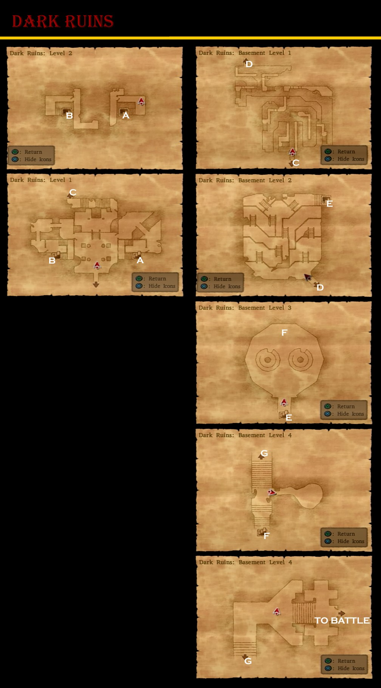
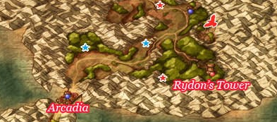
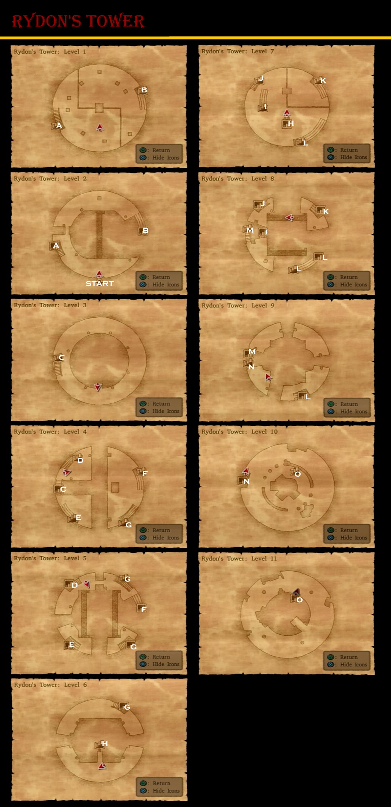

# Dark Ruins

## Available Items

* 2000G -
* Dragon Scale -
* Mini Medal -
* Saint's Ashes -

# Arcadia

## Available Items

* Arcadia
  * Wizard's Staff (Dominico's 2F Closet)
  * Magic Water (Dominico's 1F Pot)
  * Lesser Panacea (Dominico's 1F Pot)
  * Mini Medal (Dominico's 1F Cupboard)
  * Mini Medal (Above Armor Shop, Pot)
  * Cloak of Evasion (Behind Armor Counter, Closet)
  * Mini Medal (Behind Armor Counter, Barrel)
  * Mini Medal (Inn, Barrel)
  * Seed of Strength (Inn, Closet)
  * 26 Gold Coins (Item Shop, Barrel)
  * Mystifying Mixture (Mystery Shop, Pot)
  * Rock Salt (Under Church Courtyard, Pot)
  * Rennet Powder (South House, Upper West, Pot)
  * Poison Moth Knife (South House, Upper West, Cupboard)
  * Cowpat (South House, Upper North, Barrel)
  * Mini Medal (South House, Upper North, Pot)
  * Bunny Tail (South House, Upper North, Cupboard)
  * 350 Gold Coins (Bar, Barrel)
  * Magic Water (Bar, Barrel)
  * Amor Seco Essence (Bar, Barrel)
  * Leather Dress (Kranbattle's, Closet)
  * 27 Gold Coins (North House, Upper West, Pot)
  * Strength Ring (North House, Upper West, Closet)
  * Seed of Strength (North House, Upper South, Pot)
  * Mini Medal (North House, Upper South, Pot)
  * 230 Gold Coins (North House, Upper South, Pot)
  * Dragon Scale (North House, Upper South, Cupboard)
  * Giant Maller (North house, Upper South)
  * Fresh Milk (North House, Front, Barrel)
  * Rennet Powder (North House, Front, Barrel)
  * Gold Bracer (North House, Front, Closet)
  * Dragon Dung (North House, Front, Barrel)
  * Seed of Skill (Secret Shop, 2000 G)
* Castle Trodain
  * Imp Knife Recipe (By Fountain)
* Overworld
  * Titan Belt (Just North of Arcadia)
  * Silver Tiara (Near Mountains Southeast of Arcadia)
  * Elfin Elixir (West of Rydon's Tower)
  * Fresh Milk (Cow next to Chapel)
  * Assassin's Dagger (West of Chapel)
* Dominico's Secret Library
  * Mini Medal
  * Magic Vestment
  * 650 Gold Coins

## Stores

<table>
  <tr>
      <th colspan="10">Weapon Shop</th>
  </tr>
  <tr>
    <th>Item</th>
    <th>Cost</th>
    <th>ATK</th>
    <th>H</th>
    <th>Y</th>
    <th>J</th>
    <th>A</th>
    <th>M</th>
    <th>R</th>
    <th>Effects</th>
  </tr>
  <tr>
    <td>Sword Breaker</td>
    <td>5500G</td>
    <td>56</td>
    <td>-</td>
    <td>-</td>
    <td>+</td>
    <td>-</td>
    <td>-</td>
    <td>-</td>
    <td>-</td>
  </tr>
  <tr>
    <td>Swallowtail</td>
    <td>6800G</td>
    <td>53</td>
    <td>+</td>
    <td>-</td>
    <td>-</td>
    <td>-</td>
    <td>+</td>
    <td>-</td>
    <td>Causes damage to all enemies</td>
  </tr>
  <tr>
    <td>Bastard Sword</td>
    <td>8800G</td>
    <td>61</td>
    <td>+</td>
    <td>-</td>
    <td>+</td>
    <td>-</td>
    <td>-</td>
    <td>-</td>
    <td>-</td>
  </tr>
  <tr>
    <td>Hell Scythe</td>
    <td>9500G</td>
    <td>65</td>
    <td>-</td>
    <td>+</td>
    <td>-</td>
    <td>-</td>
    <td>-</td>
    <td>-</td>
    <td>-</td>
  </tr>
</table>

<table>
  <tr>
      <th colspan="10">Armour Shop</th>
  </tr>
  <tr>
    <th>Item</th>
    <th>Cost</th>
    <th>DEF</th>
    <th>H</th>
    <th>Y</th>
    <th>J</th>
    <th>A</th>
    <th>M</th>
    <th>R</th>
    <th>Effects</th>
  </tr>
  <tr>
    <td>Cloak of Evasion</td>
    <td>3000G</td>
    <td>29</td>
    <td>-</td>
    <td>-</td>
    <td>+</td>
    <td>+</td>
    <td>+</td>
    <td>+</td>
    <td>A magical cloak that makes it easier to dodge enemy attacks</td>
  </tr>
  <tr>
    <td>Magic Armour</td>
    <td>6100G</td>
    <td>55</td>
    <td>+</td>
    <td>-</td>
    <td>-</td>
    <td>+</td>
    <td>+</td>
    <td>-</td>
    <td>-</td>
  </tr>
  <tr>
    <td>Magic Bikini</td>
    <td>13800G</td>
    <td>50</td>
    <td>-</td>
    <td>-</td>
    <td>+</td>
    <td>-</td>
    <td>-</td>
    <td>+</td>
    <td>Reduces non-Zap spell damage by 15 points</td>
  </tr>
  <tr>
    <td>Magic Shield</td>
    <td>5000G</td>
    <td>27</td>
    <td>+</td>
    <td>-</td>
    <td>-</td>
    <td>+</td>
    <td>+</td>
    <td>-</td>
    <td>Mitigates 15 points of damage from Bang, Frizz and Sizz magic groups</td>
  </tr>
  <tr>
    <td>Magical Shield</td>
    <td>2700G</td>
    <td>25</td>
    <td>-</td>
    <td>-</td>
    <td>+</td>
    <td>-</td>
    <td>-</td>
    <td>+</td>
    <td>-</td>
  </tr>
  <tr>
    <td>Iron Mask</td>
    <td>3500G</td>
    <td>25</td>
    <td>+</td>
    <td>+</td>
    <td>-</td>
    <td>-</td>
    <td>-</td>
    <td>-</td>
    <td>-</td>
  </tr>
</table>

<table>
  <tr>
      <th colspan="3">Item Shop</th>
  </tr>
  <tr>
    <th>Item</th>
    <th>Cost</th>
    <th>Effects</th>
  </tr>
  <tr>
    <td>Medicinal Herb</td>
    <td>8G</td>
    <td>Restores 30-40HP to one target</td>
  </tr>
  <tr>
    <td>Antidotal Herb</td>
    <td>10G</td>
    <td>Cures Poison for one character</td>
  </tr>
  <tr>
    <td>Holy Water</td>
    <td>20G</td>
    <td>When used on the field, avoids battles with low level enemies, When used in battle deals 10-15 damage to a single enemy</td>
  </tr>
  <tr>
    <td>Chimaera Wing</td>
    <td>25G</td>
    <td>Allows you to teleport to any town and some dungeons that you have already visited.</td>
  </tr>
  <tr>
    <td>Moonwort Bulb</td>
    <td>30G</td>
    <td>Cures Sleep and Paralysis for one character</td>
  </tr>
  <tr>
    <td>Rockbomb Shard</td>
    <td>450G</td>
    <td>Causes 50-100 damage to all enemies</td>
  </tr>
</table>

## Walkthrough Tasks

1. Purchases (34900 G)
  * 1 Sword Breaker
  * 1 Swallowtail
  * 1 Bastard Sword
  * 1 Magic Bikini
2. Alchemy
  * Cloak of Evasion + Boxer Swords = Robe of Serenity
  * Rock Salt + Amor Seco Essence = Holy Water
  * Rock Salt + Plain Cheese = Hard Cheese
  * Rock Salt + Fresh Milk + Rennet Powder = Soft Cheese
  * Giant Mallet + Iron Helmet + Iron Helmet = Sledgehammer

# Rydon's Tower

## Available Items

* 3000 Gold Coins (Front Entrance)
* Recovery Ring (L9 North East Platform)
* Cheiron's Bow (L11 South)
