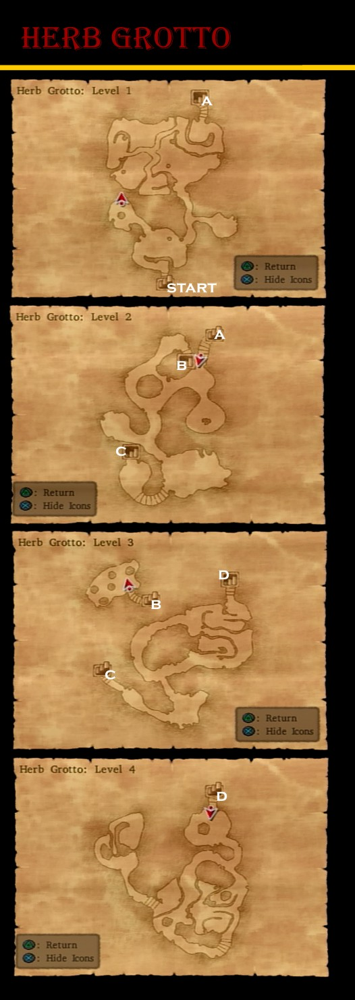

# Blizzard Peaks

## Available Items

* Marta's Cottage *VIP: Items lost after finishing Herb Grotto*
  * Mini Medal - Cabinet
  * Special Medicine - Pot
  * Special Antidote - Pot
  * Mini Medal - Barn Barrel
* Overworld
  * Holy Silver Rapier - West of Marta's Cottage
  * Agility Ring - South of Holy Silver Rapier
  * Yggdrasil Leaf - Crevasse Southeast of Holy Silver Rapier
  * Mini Medal - Outside Herb Grotto Entrance
* Orkutsk
  * Amor Seco Essence - Bar Barrel
  * Mini Medal - Item Shop Pot
  * Mini Medal - Mayor's Pot
  * Chilly Cheese - Mayor's Closet
  * Seed of Defense - Tunnel Barrel
  * Mini Medal - Tunnel Cabinet
  * Rockbomb Shard - Tunnel Barrel
  * Chimaera Wing - Item Shop Pot
  * Ruby of Protection - Item Shop Pot
  * Magic Water - Marek's Room Pot
  * Wing of Bat - Marek's Room Pot
  * Mini Medal - Barrel Beneath Weapon Shop
  * Edged Boomerang - Weapon Shop
* Miracle Sword - Princess Minnie
* Alistar's Armour - Jessica's Mother

## Stores

### Item Shop

| Item              | Cost | Effect |
| ----------------- | ---- | ------ |
| Medicinal Herb    | 8G   | Restores 30 or more HP to a single ally |
| Antidotal Herb    | 10G  | Cures Poison for one character |
| Holy Water        | 20G  | When used on the field, avoids battles with low level enemies, When used in battle deals 10-15 damage to a single enemy |
| Chimaera Wing     | 25G  | Allows you to teleport to any town and some dungeons you have already visited |
| Amor Seco Essence | 120G | Restores 60 or more HP to a single ally |
| White Gold Bell   | 200G | A bell that summons light sabrecats - bright brethren of the sabrecats - hither |

### Armour Shop

| Item          |  Cost  | DEF | H | Y | J | A | M | R | Effect |
| ------------- | :----: | :-: | - | - | - | - | - | - | ------ |
| Velvet Cape   |  9400G | 60  | - | - | - | * | * | - | A durable cape made of velvet |
| Dragon Mail   | 12000G | 60  | * | * | - | - | - | - | Armour fashioned from dragon scales. Provides excellent protection from fire- and ice-based spells |
| Dragon Shield |  6900G | 30  | * | * | - | - | - | - | A shield fashioned from dragon scales. Provides excellent protection from fire- and ice-based spells |
| Ice Shield    |  8500G | 33  | * | - | - | * | - | - | A shield that increases the wielder's resistance to ice-based attacks when used as an item in battle |
| Iron Headgear |  5500G | 32  | * | * | - | - | * | - | Headgear reinforced with iron sheets for improved defence |

### Weapon Shop

| Item              |  Cost  | ATK | H | Y | J | A | M | R | Effect |
| ----------------- | :----: | :-: | - | - | - | - | - | - | ------ |
| Swallowtail       |  6800G | 53  | * | - | - | - | * | - | A boomerang bearing a motif of two swallows |
| Falcon Knife      |  7700G | 34  | - | - | * | * | - | - | A magical dagger that lends its user the agility to attack twice in rapid sucession |
| Spiked Steel Whip |  8800G | 62  | - | - | * | - | - | * | A powerful whip covered in painful-looking steel barbs |
| Dragonsbane       | 11000G | 72  | * | - | - | - | - | - | A forged steel sword capable of piercing dragon scales |
| King Axe          | 17000G | 80  | - | * | - | - | - | - | An expertly crafted axe richly engraved with magical runes |
| Iron Claw         |  2000G | 55  | - | - | - | - | * | - | A claw manufactured from iron |
| Iron Fan          |  1600G | 47  | * | - | - | - | - | * | A fan made of iron |

## Walkthrough Tasks

1. Purchases (26100 G)
  * 1 Dragonsbane
  * 1 Velvet Cape
  * 1 Iron Headgear
  * 1 White Gold Bell
2. Alchemy
  * Wizard's Staff + Rockbomb Shard + Rockbomb Shard = Magma Staff
  * 2x Chilly Cheese + Waterweed Mould + Waterweed Mould = Cold Cheese
3. Monster Arena
  * Recruit Roborg just south of Holy Silver Rapier
  * Use Roborg for Ranks G-D
    * Strength Ring
    * Bunny Suit
    * Ring of Clarity
    * Mighty Armlet
  * Recruit Cybot West of Orkutsk
  * Recruit Talos South of Neos
  * Use these Roborg, Cybot and Talos for Ranks C-B
    * Saint's Ashes
    * Bardiche of Binding
  * Recruit Octurion on southeast coast of Beach South of Argonia
  * Recruit Skeledoid on southwest of Dark Ruins
  * Use Talos, Octurion and Skeledoid for Ranks A-S
    * Hero Spear
    * Dragon Robe

## Cameron's Codex

9. Killing Machine around Orkutsk
13. White Sabrecat summoned using White Gold Bell
25. Defeat 30 Night Sneakers around Ascantha - Santaclops West of Orkutsk
42. Statue Atop Monster Arena
65. Orkutusk Entrance
66. Mayor's House
109. Beneath Irem Shop
110. Outside Mayor's House

# Dragon Graveyard

## Available Items

* Baccarat Mansion
  * Magic Water - Mansion Balcony Barrel
  * Rennet Powder - Mansion Barrel
  * Fresh Milk - Mansion Pot
  * Seed of Wisdom - Mansion Pot
  * Gold Ring - Mansion Closet
  * Mini Medal - Mansion Closet
  * Spangled Dress - Mansion Closet
  * 600 Tokens - Reward
* Dragon Graveyard
  * 2000G - Straight Ahead from Entrance
  * Mini Medal - North Passageway
  * Dragon Dung - East Passage Northeast Bag
  * Dragon Shield - Inside 3 Horn Skull

## Casino Prizes

| Item                | Tokens | ATK/DEF | H | Y | J | A | M | R | Effect |
| ------------------- | :----: | :-----: | - | - | - | - | - | - | ------ |
| Prayer Ring         |  1000  |    5    | * | * | * | * | * | * | A ring that restores some of the wearer's MP when used as an item |
| Spangled Dress      |  3000  |   46    | - | - | * | - | - | * | A chic dress worn by fashionable women-about-town |
| Saint's Ashes       |  5000  |    -    | - | - | - | - | - | - | Holy Ashes that can be used to purify cursed objects |
| Falcon Blade        | 10000  |   37    | * | - | - | * | - | - | A sword capable of sliving twice in rapid succession, faster than a falcon in flight |
| Gothic Mitre        | 25000  |   36    | * | - | - | - | - | - | A magical hat able to halve the chances of being choked by sudden-death spells, sleep, paralysis and confusion |
| Liquid Metal Armour | 50000  |   101   | * | * | * | * | * | * | Metallic armour that reduces damage from enemy spells by a third |
| Gringham Whip       | 200000 |   127   | - | - | * | - | - | * | A legendary whip. Cabable of hitting all enemies in a single lash |

## Walkthrough Tasks

1. Casino Purchases (502000 Tokens)
  * 4 Silver Platters
  * 6 Agility Rings
  * 3 Rune Staffs
  * 1 Platinum Headgear
  * 9 Prayer Rings
  * 2 Spangled Dresses
  * 17 Saint's Ashes
  * 3 Falcon Blades
  * 3 Liquid Metal Armors
  * 1 Gringham Whip
2. Alchemy
  * Rune Staff + Wizard's Staff = Staff of Antimagic
  * Iron Shield + Silver Platter = White Shield
  * Coral Hairpin + Silver Platter = Silver Tiara
  * 3x Seed of Strength + Prayer Ring = Strength Ring
  * 5x Seed of Life + Prayer Ring = Recovery Ring
  * 3x Seed of Defense + Prayer Ring = Ruby of Protection
  * Seed of Agility + Prayer Ring = Agility Ring
  * Saint's Ashes + Zombie Mail = Platinum Mail
  * 2x Saint's Ashes + Partisan = Sandstorm Spear
  * Strength Ring + Leather Kilt = Titan Belt
  * Strength Ring + Magic Shield + Cured Cheese = Power Shield
  * Cypress Stick + Cypress Stick + Strength Ring = Hunter's Bow
  * Full Plate Armor + Ruby of Protection + Prayer Ring = Magic Armor
  * 3x Spangled Dress + Ruby of Protection + Gold Bracer = Shimmering Dress
  * Steel Shield + Ruby of Protection + Prayer Ring = Magic Shield
  * Iron Curiass + Silver Platter + Silver Platter = Silver Cuirass
3. Alchemy
  * Gold Ring + Seed of Magic = Prayer Ring
  * 2x Gold Ring + Poison Needle = Ring of Immunity
  * Gold Ring + Poison Moth Knife = Full Moon Ring
  * Gold Ring + Dream Blade = Ring of Awakening
  * 3x Agility Ring + Bandana = Mercury's Bandana
  * 2x Recovery Ring + Gold Bracer = Life Bracer
  * Gold Ring + Sandstorm Spear = Ring of Truth
  * Magic Armour + Edged Boomerang = Spiked Armour
  * 2x Strength Ring + Titan Belt = Mighty Armlet
  * Hunter's Bow + Garter = Eros' Bow
  * Rune Staff + Light Shield + Shimmering Dress = Shamshir of Light
  * Slime Earrings + Tough Guy Tattoo + Agility Ring = Falcon Knife
4. Alchemy
  * Seed of Wisdom + Ring of Clarity + Ring of Awakening = Scholar's Specs
  * Feathered Cap + Mercury's Bandana = Hermes' Hat
  * Miracle Sword + Life Bracer = Uber Miracle Sword
  * Eros' Bow + Power Shield = Cheiron's Bow
  * Rune Staff + Life Bracer + Yggdrasil Leaf = Staff of Resurrection
  * Full Moon Ring + Ring of Immunity + Ring of Truth = Catholicon Ring
  * 2x Magical Hat + Scholar's Specs = Scholar's Cap
5. Alchemy
  * Scholar's Cap + Magic Vestment = Sage's Robe

## Cameron's Codex

51. Baccarat Casino Sign When lit up
59. East Passage, North Passage Three East
60. Behind Doors of Judgement
127. Cash and Carrie

# Herb Grotto

## Available Items

* 3000G - Level 1 First Left Passage
* Mini Medal - Level 1 East Pot
* Rose Wort - Level 1 East Pot
* Hermes' Hat - Level 1 South Ice Bridge
* Elfin Elixir - Level 2 Opposite Entrance
* Devil's Tail - Level 3 Northwest
* 2100G - Level 3 Northwest
* Mini Medal - Level 2 West Pot
* Rose Root - Level 2 West Pot
* Seed of Life - Level 2 Southeast Pot
* Mini Medal - Level 3 South Pot
* Icicle Dirk - Level 4 High Section South
* Sacred Armor - Princess Minnie

## Cameron's Codex

67. Level 1 Ice Bridge

# Ultimate Key - Treasure Hunting

* Pickham - Back Left House
  * Rune Staff
  * Power Shield
  * Mini Medal
* Red's Basement
  * Spiked Steel Whip
  * Seed of Agility
  * Mini Medal
  * Garter
* Castle Trodain - 2F East Wing
  * Seed of Magic
  * Yggdrasil Dew
  * Rusty Old Sword
  * Mini Medal
* Argonia Castle - 3F Treasury
  * Skull Ring
  * Mini Medal
  * Moon Axe
* Le Puff-Puff Club - North of Argonia
  * Mini Medal
  * Silver Platter
* Arcadia - Item Shop
  * Mini Medal
  * Titan Belt
  * Seed of Magic
* Seed of Skill - Arcadia Secret Shop 5000G
* Princess Minnie's Castle
  * Double-Edged Sword
  * Seed of Strength
  * Seed of Life
  * Mini Medal
* Orichalcum - Princess Minnie

## Walkthrough Tasks

1. Alchemy
  * Skull Ring + Saint's Ashes + Saint's Ashes = Sorceror's Ring
  * Double-Edged Sword + Saint's Ashes + Saint's Ashes = Uber Double-Edge

## Cameron's Codex

57. Le Puff-Puff Club Bunny Girl
