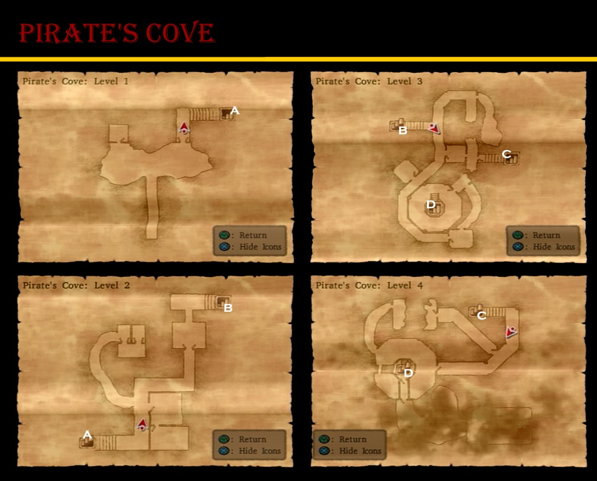
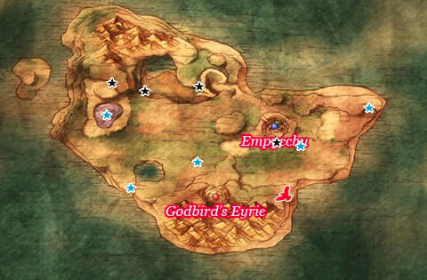
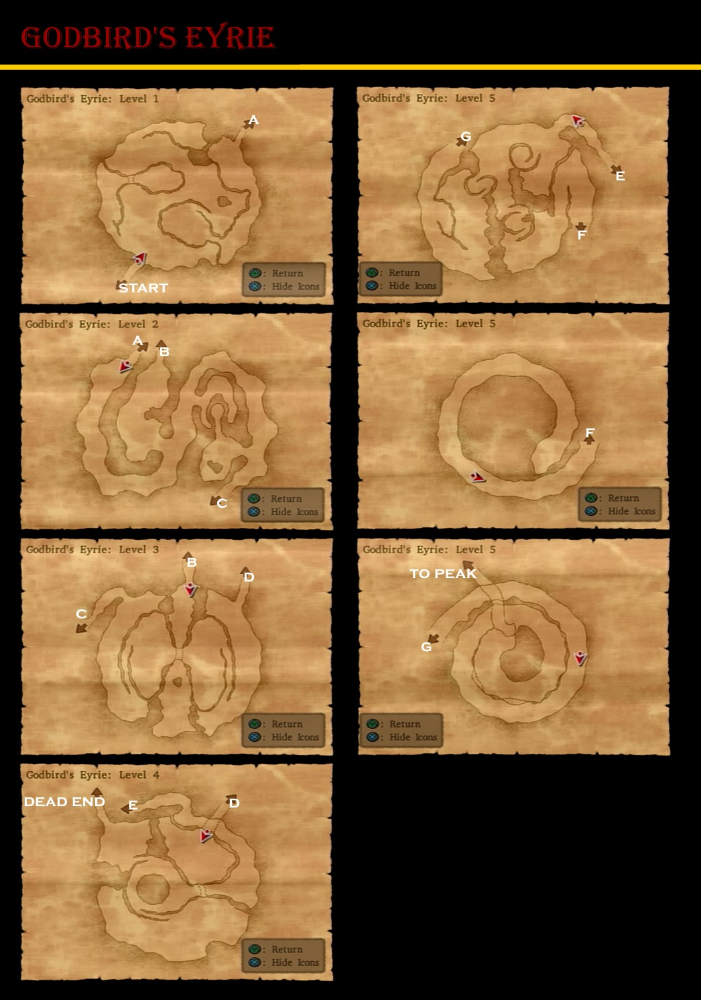

# Pirate's Cove

## Available Items

* Mini Medal -
* Magic Water -
* Mini Medal -
* G -
* Rock Salt -
* Mini Medal -
* Hades' Helm -
* Bone Shield -

# Isolated Plateau

## Available Items

* Overworld
  * Fresh Milk -
  * Maigcal Mace -
  * Fresh Milk -
  * Fresh Milk -
  * Fresh Milk -
  * Lesser Panacea -
  * Mighty Armlet -
  * Fresh Milk -
  * Fresh Milk -
  * Mini Medal -
  * Elfin Elixir -
* Empycchu
  * Chimaera Wing -
  * Seed of Strength -
  * Red Mould -
  * Waterweed Mould -
  * Mini Medal -
  * Rennet Powder -
  * Rock Salt -
  * Special Medicine -
  * Mini Medal -
  * Fresh Milk -
  * Fur Poncho -
  * Seed of Skill -
  * Mini Medal -
* Metal King Helm - Princess Minnie

## Walkthrough Steps

1. Purchases (31300G)
  * 2 Magical Maces
  * 1 Mythril Helm
2. Alchemy
  * Dragonsbane + Mighty Armlet =
  * War Hammer + Mighty Armlet =
  * Bandit Mail + Mighty Armlet + Mighty Armlet =
  * Feather Cap + Fur Poncho =
  * Magical Mace + Magical Hat + Bandit's Grass Skirt =

# World of Darkness

## Available Items

* Overworld
  * Mini Medal -
  * Devil's Tail -
  * Iron Headgear -
  * Seed of Agility -
* Dark Empycchu
  * Seed of Magic -
  * Mini Medal -
  * Rock Salt -
  * Cowpat -
  * Cold Cheese -
  * Mini Medal -
  * 180G -
  * Special Antidote -
  * Mini Medal -
  * Premium Mould -
  * Fresh Milk -
  * Dragon Scale -
  * Mini Medal -

## Walkthrough Tasks

1. Alchemy
  * Scholar's Cap + Iron Headgear =

# Dark Godbird's Eyrie

## Available Items

* G -
* Ring of Truth -
* Gold Nugget -
* Demon Whip -
* Saint's Ashes -

# Godbird's Eyrie

## Available Items

* Mini Medal -
* Mini Medal -
* Gold Nugget -
* Dragon Dung -
* Orichalcum -

# Godbird's Soulstone - Treasure Hunting

* Nook Grass - Marek at Orkutsk
* Flametang Boomerang - Plateau West of Campsite
* Yggdrasil Dew - Island Northwest of Pickham
* Skull Helm - South Empycchu Plateau
* Mini Medal - South Desert Plateau
* Ogre Shield - South Desert Plateau
* Conqueror's Axe - Plateau North of Rydon's Tower
* Yggdrasil Leaf - Shack Ruins East of Farebury
* Mini Medal - Shack Ruins East of Farebury
* Mini Medal - Beach East of Farebury: Search Sand
* Dangerous Bustier - Princess Minnie

## Walkthrough Tasks

1. Alchemy
  * Demon Whip + Saint's Ashes =
  * Spicy Cheese + Nook Grass =
  * Magic Shield + Flametang Boomerang =
  * Magic Water + Yggdrasil Dew =
2. Alchemy
  * Swallowtail + Flameshield =
  * Super Spicy Cheese + Cold Cheese + Rock Salt =
