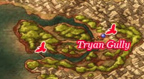

# Tyran Gully

## Available Items

* Overworld
  * Super Spicy Cheese -
  * Fresh Milk -
  * Fresh Milk -
  * Mini Medal -
* Tyran Gully
  * Mini Medal -
  * Elfin Elixir -
  * Slime Crown -
  * Staff of Anti-Magic -
  * Premium Mould -
  * Seed of Defense -
  * Mini Medal -
  * Yggdrasil Dew -

## Walkthrough Tasks

1. Purchases (147800G)
  * 1 Great Bow
  * 1 Heavy Hatchet
  * 4 Mirror Shields
  * 1 Great Helm
  * 1 Flowing Dress
2. Alchemy
  * Flowing Dress + Magical Skirt =
  * Great Bow + Eros' Bow + Cheiron's Bow =
  * Silver Mail + Mirror Shield + Mirror Shield =
  * Mirror Shield + White Shield + Holy Water =
  * Mirror Shield + Amor Seco Essence + Magic Water =
3. Alchemy
  * Angel Robe + Gold Rosary + Shimmering Dress =

# Lord High Priest's Residence

## Available Items

* Seed of Life -
* Mini Medal -
* Sage's Robe -
* Mini Medal -

## Walkthrough Tasks

1. Alchemy
  * Sage's Robe + Magic Water + Nook Grass =

# Black Citadel - Treasure Hunting

## Available Items

* Flail of Fury - Red
* 3 Highly String Cheese - Waterfall Hut Woodsman
* Nook Grass - Marek at Marta's Grave
* 400 Casino Tokens -
* Seed of Magic -
* Mini Medal -
