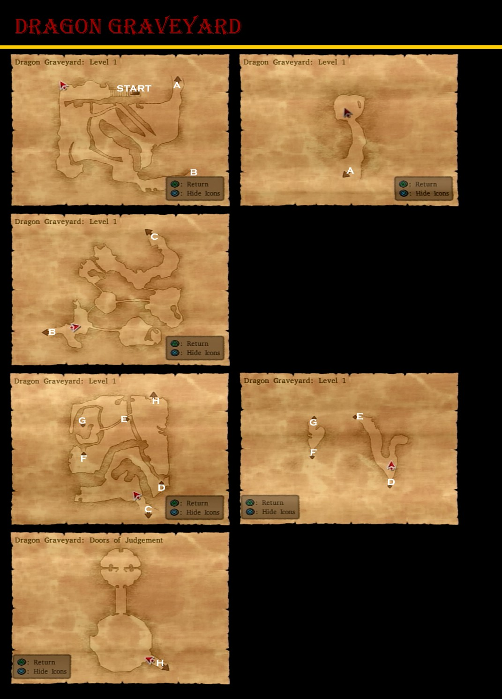
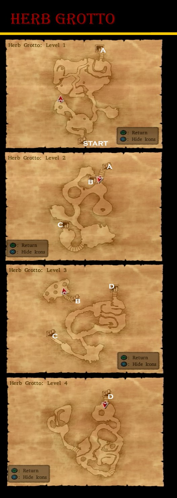

# Orkutsk

## Available Items

* Amor Seco Essence (Bar, Barrel)
* Mini Medal (Item Store, Pot)
* Mini Medal (Mayor's, Pot)
* Chilly Cheese (Mayor's Closet)
* Seed of Defense (Tunnel, Barrel)
* Mini Medal (Tunnel, Cupboard)
* Rockbomb Shard (Tunnel, Barrel)
* Chimaera Wing (Item Shop, Pot)
* Ruby of Protection (Item Shop, Pot)
* Magic Water (Marek's Room, Pot)
* Wing of Bat (Marek's Room, Pot)
* Mini Medal (Beneath Weapon Shop, Barrel)
* Edged Boomerang (Weapon Shop)
* Miracle Sword (Princess Minie)

## Stores

<table>
  <tr>
      <th colspan="3">Item Shop</th>
  </tr>
  <tr>
    <th>Item</th>
    <th>Cost</th>
    <th>Effects</th>
  </tr>
  <tr>
    <td>Medicinal Herb</td>
    <td>8G</td>
    <td>Restores 30-40HP to one target</td>
  </tr>
  <tr>
    <td>Antidotal Herb</td>
    <td>10G</td>
    <td>Cures Poison for one character</td>
  </tr>
  <tr>
    <td>Holy Water</td>
    <td>20G</td>
    <td>When used on the field, avoids battles with low level enemies, When used in battle deals 10-15 damage to a single enemy</td>
  </tr>
  <tr>
    <td>Chimaera Wing</td>
    <td>25G</td>
    <td>Allows you to teleport to any town and some dungeons that you have already visited.</td>
  </tr>
  <tr>
    <td>Amor Seco Essence</td>
    <td>120G</td>
    <td>Restores 70-90HP for one character</td>
  </tr>
  <tr>
    <td>White Gold Bell</td>
    <td>200G</td>
    <td>Summons a white great sabrecat</td>
  </tr>
</table>

<table>
  <tr>
      <th colspan="10">Armour Shop</th>
  </tr>
  <tr>
    <th>Item</th>
    <th>Cost</th>
    <th>DEF</th>
    <th>H</th>
    <th>Y</th>
    <th>J</th>
    <th>A</th>
    <th>M</th>
    <th>R</th>
    <th>Effects</th>
  </tr>
  <tr>
    <td>Velvet Cape</td>
    <td>9400G</td>
    <td>60</td>
    <td>-</td>
    <td>-</td>
    <td>-</td>
    <td>+</td>
    <td>+</td>
    <td>-</td>
    <td>-</td>
  </tr>
  <tr>
    <td>Dragon Mail</td>
    <td>12000G</td>
    <td>60</td>
    <td>+</td>
    <td>+</td>
    <td>-</td>
    <td>-</td>
    <td>-</td>
    <td>-</td>
    <td>-</td>
  </tr>
  <tr>
    <td>Dragon Shield</td>
    <td>6900G</td>
    <td>30</td>
    <td>+</td>
    <td>+</td>
    <td>-</td>
    <td>-</td>
    <td>-</td>
    <td>-</td>
    <td>Mitigates 25 points of fire and ice damage</td>
  </tr>
  <tr>
    <td>Ice Shield</td>
    <td>8500G</td>
    <td>33</td>
    <td>+</td>
    <td>-</td>
    <td>-</td>
    <td>+</td>
    <td>-</td>
    <td>-</td>
    <td>Mitigates 5 points of Ice Damage. Casts Insulatle when used as an item in battle</td>
  </tr>
  <tr>
    <td>Iron Headgear</td>
    <td>5500G</td>
    <td>32</td>
    <td>+</td>
    <td>+</td>
    <td>-</td>
    <td>-</td>
    <td>+</td>
    <td>-</td>
    <td>-</td>
  </tr>
</table>

<table>
  <tr>
      <th colspan="10">Weapon Shop</th>
  </tr>
  <tr>
    <th>Item</th>
    <th>Cost</th>
    <th>ATK</th>
    <th>H</th>
    <th>Y</th>
    <th>J</th>
    <th>A</th>
    <th>M</th>
    <th>R</th>
    <th>Effects</th>
  </tr>
  <tr>
    <td>Swallowtail</td>
    <td>6800G</td>
    <td>53</td>
    <td>+</td>
    <td>-</td>
    <td>-</td>
    <td>-</td>
    <td>+</td>
    <td>-</td>
    <td>Causes damage to all enemies</td>
  </tr>
  <tr>
    <td>Falcon Knife</td>
    <td>7700G</td>
    <td>34</td>
    <td>+</td>
    <td>-</td>
    <td>+</td>
    <td>+</td>
    <td>-</td>
    <td>+</td>
    <td>Attacks 2 times in one round</td>
  </tr>
  <tr>
    <td>Spiked Steel Whip</td>
    <td>8300G</td>
    <td>62</td>
    <td>-</td>
    <td>-</td>
    <td>+</td>
    <td>-</td>
    <td>-</td>
    <td>+</td>
    <td>Attacks all enemies in a group</td>
  </tr>
  <tr>
    <td>Dragonsbane</td>
    <td>11000G</td>
    <td>72</td>
    <td>+</td>
    <td>-</td>
    <td>+</td>
    <td>-</td>
    <td>-</td>
    <td>+</td>
    <td>Causes additional damage when attacking dragon-type emonsters</td>
  </tr>
  <tr>
    <td>King Axe</td>
    <td>17000</td>
    <td>80</td>
    <td>-</td>
    <td>+</td>
    <td>-</td>
    <td>-</td>
    <td>-</td>
    <td>-</td>
    <td>-</td>
  </tr>
  <tr>
    <td>Iron Claw</td>
    <td>2000G</td>
    <td>55</td>
    <td>-</td>
    <td>-</td>
    <td>-</td>
    <td>-</td>
    <td>+</td>
    <td>-</td>
    <td>-</td>
  </tr>
  <tr>
    <td>Iron Fan</td>
    <td>1600G</td>
    <td>47</td>
    <td>-</td>
    <td>-</td>
    <td>-</td>
    <td>-</td>
    <td>-</td>
    <td>+</td>
    <td>-</td>
  </tr>
</table>

## Walkthrough Tasks

1. Purchases (25900 G)
  * 1 Dragonsbane
  * 1 Velvet Cape
  * 1 Iron Headgear
2. Alchemy
  * Wizard's Staff + Rockbomb Shard + Rockbomb Shard = Magma Staff
  * 2x Chilly Cheese + Waterweed Mould + Waterweed Mould = Cold Cheese
3. Monster Arena
  * Use Roborg for Ranks G-D
    * Strength Ring
    * Bunny Suit
    * Ring of Clarity
    * Mighty Armlet
  * Recruit Cybot West of Orkutusk
  * Recruit Talos South of Neos
  * Use these Roborg, Cybot and Talos for Ranks D-B
    * Saint's Ashes
    * Bardiche of Binding
  * Recruit Octurion on southeast coast of Desert South of Argonia
  * Recruit Skeledoid on southwest of Dark Ruins
  * Use Talos, Octurion and Skeledoid for Ranks A-S
    * Hero Spear
    * Dragon Robe

# Baccrat 2

## Available Items

* Mini Medal (Cabin, Barrel)
* Magic Water (Mansion Balcony, Barrel)
* Rennet Powder (Mansion, Barrel)
* Fresh Milk (Mansion, Pot)
* Seed of Wisdom (Mansion, Pot)
* Gold Ring (Mansion, Closet)
* Mini Medal (Mansion, Closet)
* Spangled Dress (Mansion, Closet)

## Walkthrough Tasks

1. Alchemy
  * Gold Ring + Seed of Magic = Prayer Ring
  * 2x Gold Ring + Poison Needle = Ring of Immunity
  * Gold Ring + Poison Moth Knife = Full Moon Ring
  * Gold Ring + Dream Blade = Ring of Awakening

# Dragon Graveyard

## Available Items

* 2000 Gold Coins (Straight Ahead, Entrance)
* Mini Medal (North Passageway from First Room)
* Dragon Dung (East of First Room, Bottom Right Corner)
* Dragon Shield (Side Passage Below Surface)

## Walkthrough Tasks

1. Casino Purchases (502000 Tokens)
  * 4 Silver Platters
  * 6 Agility Rings
  * 3 Rune Staffs
  * 1 Platinum Headgear
  * 9 Prayer Rings
  * 2 Spangled Dresses
  * 17 Saint's Ashes
  * 3 Falcon Blades
  * 3 Liquid Metal Armors
  * 1 Gringham Whip
2. Alchemy
  * Rune Staff + Wizard's Staff = Staff of Antimagic
  * Iron Shield + Silver Platter = White Shield
  * Coral Hairpin + Silver Platter = Silver Tiara
  * 3x Seed of Strength + Prayer Ring = Strength Ring
  * 5x Seed of Life + Prayer Ring = Recovery Ring
  * Seed of Defense + Prayer Ring = Ruby of Protection
  * Seed of Agility + Prayer Ring = Agility Ring
  * Saint's Ashes + Zombie Mail = Platinum Mail
  * 2x Saint's Ashes + Partisan = Sandstorm Spear
  * Strength Ring + Leather Kilt = Titan Belt
  * Strength Ring + Magic Shield + Cured Cheese = Power Shield
  * Cypress Stick + Cypress Stick + Strength Ring = Hunter's Bow
  * Seed of Wisdom + Ring of Clarity + Ring of Awakening = Scholar's Specs
  * Full Plate Armor + Ruby of Protection + Prayer Ring = Magic Armor
  * 3x Spangled Dress + Ruby of Protection + Gold Bracer = Shimmering Dress
  * Steel Shield + Ruby of Protection + Prayer Ring = Magic Shield
  * Iron Curiass + Silver Platter + Silver Platter = Silver Curiass
3. Alchemy
  * 3x Agility Ring + Bandana = Mercury's Bandana
  * 2x Recovery Ring + Gold Bracer = Life Bracer
  * Gold Ring + Sandstorm Spear = Ring of Truth
  * Magic Armor + Edged Boomerang = Spiked Armor
  * 2x Strength Ring + Titan Belt = Mighty Armlet
  * 2x Magical Hat + Scholar's Specs = Scholar's Cap
  * Hunter's Bow + Garter = Eros' Bow
  * Rune Staff + Light Shield + Shimmering Dress = Shamshir of Light
  * Slime Earrings + Tough Guy Tattoo + Agility Ring = Falcon Knife
4. Alchemy
  * Feathered Cap + Mercury's Bandana = Hermes' Hat
  * Miracle Sword + Life Bracer = Uber Miracle Sword
  * Eros' Bow + Power Shield = Cheiron's Bow
  * Scholar's Cap + Magic Vestment = Sage's Robe
  * Rune Staff + Life Bracer + Yggdrasil Leaf = Staff or Ressurection
  * Full Moon Ring + Ring of Immunity + Ring of Truth = Catholicon Ring

# Herb Grotto

## Available Items

* 3000 Gold Coins (L1, Right Passage from Entrance)
* Mini Medal (L1, Right Turn down Long Passage, Pot)
* Rose Wort (L1, Right Turn down Long Passage, Pot)
* Hermes' Hat (L1, South exit of Ice Bridge)
* Elfin Elixir (L2, Directly opposite Entrance)
* Devil's Tail (L3, Top Left)
* 2100 Gold Coins (L3, Top Left)
* Mini Medal (L2, Lower Left, Above Stairs, Pot)
* Rose Root (L2, Lower Left, Above Stairs, Pot)
* Seed of Life (L2, West of Stairs, Pot)
* Mini Medal (L3, Past Entrance, Pot)
* Icicle Dirk (South End of High Passage)
* Sacred Armor (Princess Minnie)

## Ultimate Key - Treasure Hunting

* Pickham - Back Left House
  * Rune Staff
  * Power Shield
  * Mini Medal
* Red's Basement
  * Spiked Steel Whip
  * Seed of Agility
  * Mini Medal
  * Garter
* Trodain Castle - 2F Right Building
  * Seed of Magic
  * Yggdrasil Dew
  * Rusty Old Sword
  * Mini Medal
* Argonia - 3rd Floor Treasury
  * Skull Ring
  * Mini Medal
  * Moon Axe
* Le Puff-Puff Club - Changing Room
  * Mini Medal
  * Silver Platter
* Arcadia - Item Shop
  * Mini Medal
  * Titan Belt
  * Seed of Magic
* Princess Minnie's Castle
  * Double-Edged Sword
  * Seed of Strength
  * Seed of Life
  * Mini Medal
* Orichalcum (Princess Minnie)

## Walkthrough Tasks

1. Alchemy
  * Skull Ring + Saint's Ashes + Saint's Ashes = Sorceror's Ring
  * Double-Edged Sword + Saint's Ashes + Saint's Ashes = Uber Double-Edge

# Pirate's Cove

## Available Items

*
