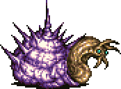
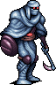
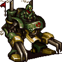

# Narshe Mine

## Boss Battle: Ymir

<table>
  <thead>
    <tr>
      <td rowspan="3"></td>
      <td>
        <b>Level:</b> 16 
        <b>HP:</b> 1,600 
        <b>MP</b> 1,000 
        <b>ABP:</b> 0
      </td>
    </tr>
    <tr>
      <td>
        <b>Steal:</b> Nothing 
        <b>Drops:</b> Hi-Potion
      </td>
    </tr>
    <tr>
      <td>
        <b>Weakness:</b> - 
        <b>Immunity:</b> - 
        <b>Absorbs:</b> -
      </td>
    </tr>
  </thead>
  <tbody>
    <tr>
      <td colspan="2"><b>Difficulty:</b> Simple</td>
    </tr>
  </tbody>
  <tfoot>
    <tr>
      <td colspan="2">
        <u><b>Strategy</b></u> 
        This boss hides in its shell every ten seconds. Whenever an attack lands on the shell it counters with <b>Megavolt</b>. At this stage this move can easily KO a party member. Wait until it has left the shell to attack.
      </td>
    </tr>
  </tfoot>
</table>

# Old Man's House

## Available Items

* Elixir - Old Man's Clock

# Narshe Mines

## Available Items

* Phoenix Down - Above Save Point
  * Later becomes Guard Spec Bracelet
* Sleeping Bag - West of Phoenix Down
  * Later becomes Elixir

# Defending Terra

## Boss Battle: Guard Leader, Silver Lobo x2

<table>
  <thead>
    <tr>
      <td rowspan="3"></td>
      <td>
        <b>Level:</b> 8 
        <b>HP:</b> 420 
        <b>MP</b> 150 
        <b>ABP:</b> 0
      </td>
    </tr>
    <tr>
      <td>
        <b>Steal:</b> Mythril Knife (87.5%) 
        <b>Drops:</b> Hi-Potion (12.5%)
      </td>
    </tr>
    <tr>
      <td>
        <b>Weakness:</b> - 
        <b>Immunity:</b> - 
        <b>Absorbs:</b> -
      </td>
    </tr>
  </thead>
  <tbody>
    <tr>
      <td colspan="2"><b>Difficulty:</b> Medium</td>
    </tr>
  </tbody>
  <tfoot>
    <tr>
      <td colspan="2">
        <u><b>Strategy</b></u> 
        A strong enemy for your current level. Try stealing the Mythril Knife, however don't spend too long as your healing item stock is barebones at best. You cannot damage the boss himself until after <i>one</i> of the Lobos has been taken down. Once alone the boss will use a powerful <b>Charge</b> capable of KOing your party members.
      </td>
    </tr>
  </tfoot>
</table>

# Adventuring School

## Available Items

* Ether - Field Science Yellow Pot
* Sleeping Bag - Battle Tactics
* Potion - Advanced Battle Tactics

# Figaro Castle

## Available Items

* Phoenix Down - Upstairs from Throne Room Entrance
* Gold Needle - Left Shop outside Throne Room
* Antidote - Right Shop outside Throne Room
* Potion - Right Shop outside Throne Room

## Shops

The Shops within Figaro Castle give a discount with Edgar in the party

### Item Shop

| Item | Price |
| ---- | ----- |
| Potion | 50 |
| Ether | 1500 |
| Antidote | 50 |
| Gold Needle | 200 |
| Echo Screen | 120 |
| Phoenix Down | 500 |
| Sleeping Bag | 500 |
| Tent | 1200 |

### Weapon Shop

| Item | Price |
| ---- | ----- |
| Auto Crossbow | 250 |
| Noiseblaster | 500 |
| Bioblaster | 750 |

## Boss Battle: Magitek Armor x2

<table>
  <thead>
    <tr>
      <td rowspan="3"></td>
      <td>
        <b>Level:</b> 8 
        <b>HP:</b> 210 
        <b>MP</b> 250 
        <b>ABP:</b> 0
      </td>
    </tr>
    <tr>
      <td>
        <b>Steal:</b>
          <ul>
            <li>Potion (87.5%)</li>
            <li>Hi-Potion (12.5%)</li>
          </ul> 
        <b>Drops:</b> Hi-Potion (12.5%)
      </td>
    </tr>
    <tr>
      <td>
        <b>Weakness:</b> &#9889; (200%) 
        <b>Immunity:</b> - 
        <b>Absorbs:</b> -
      </td>
    </tr>
  </thead>
  <tbody>
    <tr>
      <td colspan="2"><b>Difficulty:</b> Simple</td>
    </tr>
  </tbody>
  <tfoot>
    <tr>
      <td colspan="2">
        <u><b>Strategy</b></u> 
        <b>Magitek Laser</b> deals about 65 damage and <b>Metal Kick</b> deals about 20. Use Edgar to span <b>Auto Crossbow</b> and this shouldn't be too hard. Don't forget to use magic as Terra for added fun.
      </td>
    </tr>
  </tfoot>
</table>

# Figaro Cave

## Available Items

* Ether - Second Room
  * Becomes Thunder Rod Later
* Ether - Second Room
  * Becomes Hi-Ether Later
* Phoenix Down - Upstairs from Second Room
  * Becomes X-Potion Later

# South Figaro

## Available Items

* Hyper Wrist
  * Within the North House Hidden Basement down the hidden southern stairs
* Hermes Sandals
  * Within the North House Hidden Basement down the hidden southern stairs
* 500G - House North of Chocobo Stables Hidden Basement
* 1,000G - House North of Chocobo Stables Hidden Basement
* 1,500G - House North of Chocobo Stables Hidden Basement
* Phoenix Down - Barrel in northwest house
* Potion - Barrel between Weapon and Armor shop
  * Later becomes X-Potion
* Antidote - Barrel North of Port Entrance
  * Later bceomes Tent
* Eye Drops - Box North of Port Entrance
  * Later becomes Remedy
* Potion - Barrel next to Chocobo Stable
  * Later becomes Holy Water
* Green Cherry - Behind Chocobo Stable
  * Later becomes Tent
* Gold Needle - Southwest corner of tow
  * Later becomes Elixir
* Teleport Stone - Atop wall above Chocobo Stable
  * Later becomes Phoenix Down
* Potion - Bucket in house north of South Figaro

## Shops

### Item Shop

| Item | Price |
| ---- | ----- |
| Potion | 50 |
| Antidote | 50 |
| Gold Needle | 200 |
| Eye Drops | 50 |
| Echo Screen | 120 |
| Phoenix Down | 500 |
| Sleeping Bag | 500 |
| Tent | 1200 |

### Weapon Shop

| Item | Price |
| ---- | ----- |
| Dagger | 150 |
| Mythril Knife | 300 |
| Mythril Sword | 450 |
| Great Sword | 800 |
| Noiseblaster | 500 |
| Bioblaster | 750 |

### Armor Shop

| Item | Price |
| ---- | ----- |
| Buckler | 200 |
| Heavy Shield | 400 |
| Hairband | 150 |
| Plumed Hat | 250 |
| Cotton Robe | 200 |
| Kenpo Gi | 250 |

### Relic Shop

| Item | Price |
| ---- | ----- |
| Sprint Shows | 1500 |
| Silver Spectacles | 500 |
| Star Pendant | 500 |
| Jeweled Ring | 1000 |
| Knight's Code | 1000 |

# Mt. Kolts

## Available Items

* Main Gauche - Second Cave Area Southeast exit
* Gigas Glove - Second Cave Hidden path east of bridge
* Tent - Through Cave on other side of mountain
* Tent - Cave after Vargas

## Boss Battle: Vargas, Ipooh x2

<table>
  <thead>
    <tr>
      <td rowspan="3"></td>
      <td>
        <b>Level:</b> 12 
        <b>HP:</b> 11,600 
        <b>MP</b> 220 
        <b>ABP:</b> 0
      </td>
    </tr>
    <tr>
      <td>
        <b>Steal:</b>
          <ul>
            <li>Potion (87.5%)</li>
            <li>Mythril Claws (12.5%)</li>
          </ul> 
        <b>Drops:</b> Hi-Potion (12.5%)
      </td>
    </tr>
    <tr>
      <td>
        <b>Weakness:</b> &#9760; (200%) 
        <b>Immunity:</b> - 
        <b>Absorbs:</b> -
      </td>
    </tr>
  </thead>
  <tbody>
    <tr>
      <td colspan="2"><b>Difficulty:</b> Medium</td>
    </tr>
  </tbody>
  <tfoot>
    <tr>
      <td colspan="2">
        <u><b>Strategy</b></u> 
        This is probably the hardest boss thus far. Take your time and keep up your HP. Vargas uses <b>Gale Cut</b> every other turn, dealing about 40 damage to the party.   
        Once you've dealt enough damage Sabin shows up. Select <b><i>Blitz</i></b> and press <b>&#8678; &#8680; &#8678; A</b> to unleash <i>Raging Fist</i>.
      </td>
    </tr>
  </tfoot>
</table>

# Returner Hideout

## Available Items

* Phoenix Down - Chest next to Locke
* Phoenix Down - North Room
* Air Knife - North Room
* Knight's Code - North Room
* Antidote - North Room Bucket
* Ether - North Room Pot
* White Cape - North Room East Wall Passage
* Green Cherry - Main Room Pot next
* Hi-Potion - Banon's Room
* Gauntlet or Genji Glove - Answer Banon
  * Yes - Gauntlet
  * No x3 - Genji Glove

## Shops

### Item Shop

| Item | Price |
| ---- | ----- |
| Eye Drops | 50 |
| Potion | 50 |
| Hi-Potion | 300 |
| Ether | 1500 |
| Echo Screen | 120 |
| Sleeping Bag | 500 |
| Tent | 1200 |
| Sprint Shoes | 1500 |

# Lethe River

## Boss Battle: Ultros

<table>
  <thead>
    <tr>
      <td rowspan="3"></td>
      <td>
        <b>Level:</b> 13 
        <b>HP:</b> 3,000 
        <b>MP</b> 640 
        <b>ABP:</b> 0
      </td>
    </tr>
    <tr>
      <td>
        <b>Steal:</b> Nothing 
        <b>Drops:</b> Nothing
      </td>
    </tr>
    <tr>
      <td>
        <b>Weakness:</b>
        <ul>
          <li>  (200%)</li>
          <li> &#9889; (200%)</li>
        </ul> 
        <b>Immunity:</b> - 
        <b>Absorbs:</b> -
      </td>
    </tr>
  </thead>
  <tbody>
    <tr>
      <td colspan="2"><b>Difficulty:</b> Hard</td>
    </tr>
  </tbody>
  <tfoot>
    <tr>
      <td colspan="2">
        <u><b>Strategy</b></u> 
        The first death of many runs. Constant healing is a necessity. Thankfully you have two healers. Use <b>Auto Crossbow</b> and Sabin's Aura Bolt <b>&#8681; &#8681; &#8678;</b>. Terra's <b>Fire</b> is useful as long as you don't need to heal.
      </td>
    </tr>
  </tfoot>
</table>
