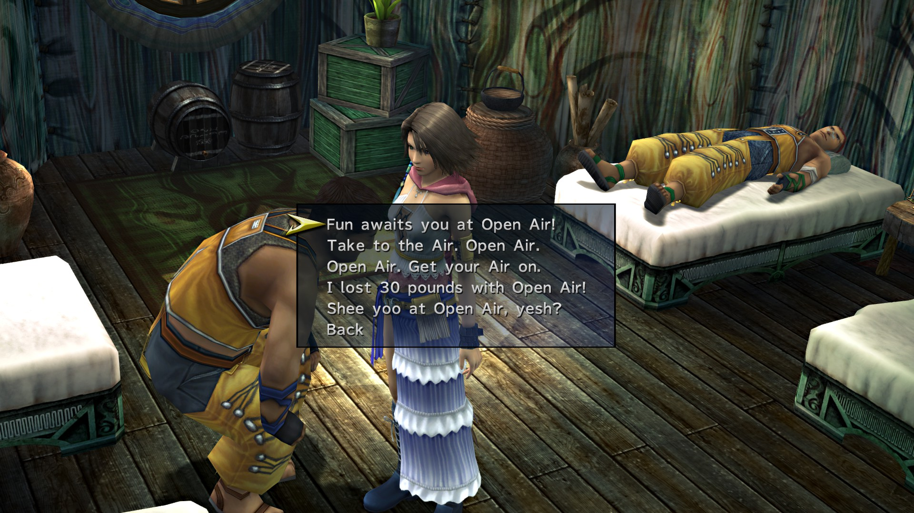
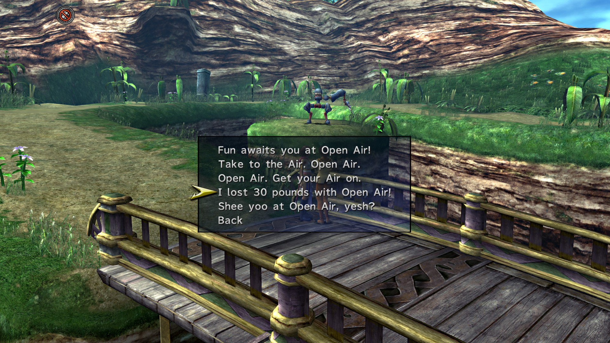

# Prologue

* Ensure you talk to the 'Moogle' in the second dock area

# Airship Celsius

* Talk to Paine
* Talk to Rikku
* Talk to Buddy
  * Al Bhed Primer
* Talk to Brother twice
  * Al Bhed Primer (x3)
  * Festivalist Dress Sphere
* Talk to Shinra
* Watch Treasure Sphere: Journey's Start
* Talk to Shinra about Garment Grids
  * Vanguard Garment Grid
* Talk to Barkeep in Cabin
* Sleep in Cabin by speaking to Barkeep
* Engine Room Treasures
* Save here
* Speak to Buddy to be sent to Mt. Gagazet

# Mount Gagazet

* Save Game after parkour tutorial
* Complete Mission
* Check Save (6%)

# Airship Celsius

* Comfort Brother
* Speak to Shinra
  * Black Mage Dressphere
* Rest in Cabin

# Luca

* Deliver Balloons
  * Healing Wind Garment Grid
* Dock 5 Treasures
  * Thunder Spawn Garment Grid
* Stadium Basement Rin
  * Al Bhed Primer
* Listen to Sphere Break Tutorial in other basement for coins

# Mi'ihen

* Watch cutscene

# Mushroom Rock

* Speak to Yaibal
* Speak to Clasko before starting mission
* Follow Ormi and Logos
  * Crimson Sphere 9
* Mission Complete
  * Heart of Flame Garment Grid
* Restless Sleep Garment Grid
  * Down path right of Save Sphere
* Speak to Lucil twice
* Speak to Maechen
  * DO NOT TOUCH ANYTHING
  * Shake his hand
* Return to Mushroom Rock entrance and speak to Clasko
  * Allow him on board
* Return to Celsius
* Watch Crimson Record 1
* Speak to Clasko
* Check Save (13%)

# Djose

* Wait in line
* Interview with Gippal
  * Al Bhed Primer
* Follow Gippal
  * Letter of Introduction
* Check Save (14%)

# Moonflow

* Accept mission from Tobli.
* Complete mission
  * Gun Mage Dressphere
  * Helios Garment Grid
* Return to Mushroom Rock and confuse Bully Cap for White Wind on Gun Mage

# Guadosalam

* Watch cutscene near Farplane entrance
* Check Save (15%)

# Thunder Plains

* Watch Cutscene

# Macalania Woods

* Confuse Haizhe for Mighty Guard on Gun Mage
  * Can also get Absorb
* Speak to Donga at spring East then South from Entrance
* Speak to Pukutak halfway through forest
* Speak to Trommel 4 Times
  * Full Throttle Special Dressphere.
  * Unerring Path Garment Grid
* Watch cutscene at Travel Agency
  * Al Bhed Primer
* Chase down O'aka
  * Ice Queen Garment Grid
* Return to Celsius and speak to O'aka

# Bikanel Desert

* Al Bhed Primer
* Dig ONCE
  * Still of Night Garment Grid
* Check Save (18%)

# Bevelle

* Cutscene with Baralai

# Calm Lands

* Begin PR Mission
* Check Save (19%)

# Mt. Gagazet

* Agree to take care of Lian and Ayde
* Give Responses
  * "You have to learn to deal with these things!"
  * "I can imagine how you must feel..."
  * "Leave it to the Gullwings!"
  * "I'm sure you're right."
  * "I will never forget their sacrifice."
  * "I wouldn't forgive them either."
  * "A change for the better, I hope."
    * this guy is actually on the mountain trail; you can warp close to him at the Fayth Scar if you prefer

# Besaid

* Enter Village and watch scene with Wakka
* Enter Lulu's hut and speak to her, rest afterwards
* Exit hut and accept mission from Lulu
* Find Ciphers
  * First Cipher key: statue overlooking village
  * Second Cipher key: atop pillar in next area
  * Third Cipher Key: climb left at beach entrance
    * Hi-Potion and 1,000G if you continue climbing into bay
  * Fourth Cipher Key: across beach
* Enter Cave
* Complete Mission
  * White Mage Dressphere
  * Protection Halo Garment Grid

Option 2

Option 1

Option 5

Option 4

Option 1

Option 3

# Zanarkand

* Answer Cid
  * 'You bet I do'
* Heart Reborn Garment Grid
  * 'Is that you Isaaru?'
* Check Save (23%)

# Luca PR

## Outskirts

Option 3

Option 4

## Square

Option 4

Option 5

## Stadium Entrance

Option 3

Option 2

## Dock 3

Option 4

Option 1

# Kilika PR

## Dock

Option 5

Option 4

## Residential Area

Option 2

Option 5

Option 4

Option 5

# Djose PR

## Djose Temple

Option 3

Option 1

Option 2

## Pilgrimage Road

Option 3

Option 5

Option 1

Option 4

Option 3

# Moonflow PR

## South Bank Road

Option 3

## South Wharf

Option 5

Option 5

## North Wharf

Option 5

## North Bank Road

Option 1

# Guadosalam PR

Option 1

Option 2

Option 3

Option 4

Option 2

# Macalania PR

## Macalania South

Option 2

## Macalania Campsite

Option 2

# Mi'ihen Highroad PR

## South End

Option 1

Option 2

Option 3

## Central

Option 4

Option 2

## Agency

Option 1

Option 3

Option 2

## Newroad, North

Option 4

## North End

Option 5

## Oldroad, North

Option 2

## OldRoad, South

Option 4

Option 1

Option 3

# Kilika

* View at Dona's hut in second part of Kilika
* Speak with Telescope holder to view Youth League HQ
* Megalixir jump up tree to SE after peeking through bushes
* Craven Monkey
* Carved Monkey
  * Hi-Potion
* Craven Monkey
  * Ether
* Carved Monkey
* Carved Monkey
  * Turbo Ether
  * Menace of the Deep Garment Grid
* Boss Fight
  * Awesome Sphere
