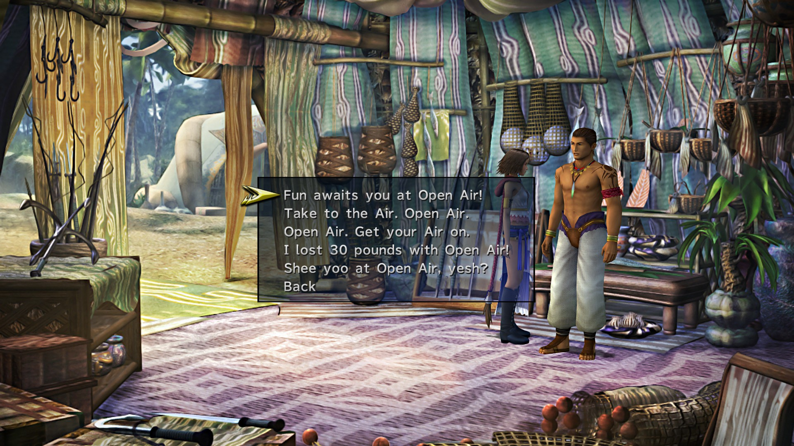
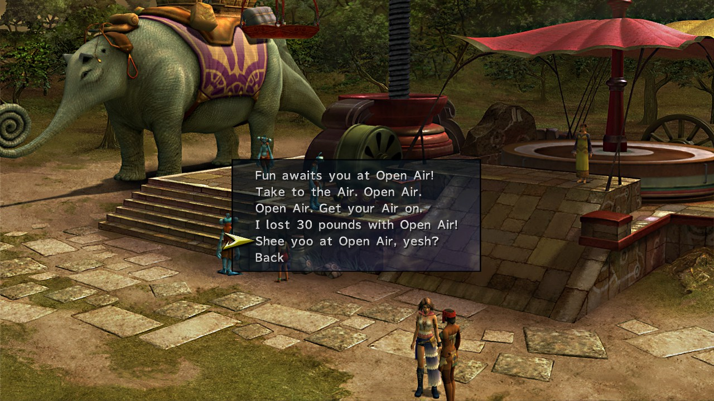

# Prologue 1.6%

* Ensure you talk to the 'Moogle' in the second dock area

# Airship Celsius 1.8% (3.4%)

* Talk to Buddy
  * Al Bhed Primer
* Talk to Brother twice
  * Al Bhed Primer
  * Al Bhed Primer
  * Festivalist Dress Sphere
* Talk to Rikku
* Talk to Paine
* Talk to Shinra
* Watch Treasure Sphere: Journey's Start
* Talk to Shinra about Garment Grids
  * Vanguard Garment Grid
* Talk to Barkeep in Cabin
* Sleep in Cabin by speaking to Barkeep
* Engine Room Treasures
* Save here
* Speak to Buddy to be sent to Mt. Gagazet

# Mount Gagazet 2.6% (6%)

* Fall down gap for Yellow Ring
* Save Game after parkour tutorial
  * Security for time limit
* Cross in front of waterfall for Elixir
* Boss Fight
* Follow main path North for Mega Phoenix
* Enter Passage through ruins
* Activate switches to West and East
* Jump into pit for White Ring
* Go east at next intersection for Red Ring
  * Double back afterwards and head North
* Continue ahead until climbing spire
* Take level path around spire for Star Pendant
* Collect Muscle Belt for winning the race
* Boss Fight

# Airship Celsius 0.6% (6.6%)

* Comfort Brother
* Speak to Shinra
  * Black Mage Dressphere

# Kilika

* Visit Dona's House
* Speak to person with camera looking at Youth League HQ

# Luca 1.6% (8.2%)

* Deliver Balloons
  * Healing Wind Garment Grid
* Dock 5 Treasures
  * Thunder Spawn Garment Grid
* Stadium Basement Rin
  * Al Bhed Primer
* Listen to Sphere Break Tutorial in other basement for coins

# Calm Lands 0.2% (8.4%)

* Begin PR Mission

# Luca PR

## Outskirts

Option 3

Option 4

## Square

Option 4

Option 5

## Stadium Entrance

Option 3

Option 2

## Dock 3

Option 4

Option 1

# Kilika PR

## Dock

Option 5

Option 4

## Residential Area

Option 2

Option 5

Option 4

Option 5

# Mushroom Rock 4.6% (13%)

* Follow Logos and Ormi
* Yaibal
* Accept Offer
* Speak to Clasko
* Continue along path for 1000G behind statue
* Follow Clasko
* Mission Start
* Follow Logos and Ormi into valley
  * Crimson Sphere 9
  * Touch Statue
* Mission Complete
  * Glass Buckle
  * Heart of Flame Garment Grid
* Favorite Outfit just past Elma
* Restless Sleep Garment Grid down ledge towards entrance of Youth League HQ
* Speak to Lucil
* Listen to all of Maechen's ramble
  * Don't press any buttons
  * Shake his hand
* Return to start of Mushroom Rock
  * Can use Airship
* Speak to Clasko and allow him on the ship
* View Crimson Sphere aboard ship
* Check Save 13%

# Djose 1% (14%)

## Djose Temple

* Phoenix Down west of temple entrance
* Speak to person in small building to register
* Enter main temple
  * Al Bhed Primer
* Echo Screen in temple

Option 3

Option 1

Option 2

* Leave temple and go south to bridge for cutscene

## Pilgrimage Road

* 2 Potions at bridge crossroads

Option 3

Option 5

Option 1

Option 4

Option 3

* Check Save 14%

# Moonflow 0.6% (14.6%)

* Speak to red guy running around on Southern Bank (Tobli)
  * Do not come from Djose
* Mission Start
* Perfect Completion
  * Gun Mage Dressphere
  * Circlet
  * Helios Guard Garment Grid

## South Bank Road

Option 3

## South Wharf

Option 5

Option 5

## North Bank Road

Option 5

## North Bank Road

Option 1

* Return to Mushroom Rock and confuse Bully Cap for White Wind on Gun Mage

# Guadosalam 0.4% (15%)

Option 1

Option 2

Option 3

Option 4

Option 2

* Watch Cutscene near Farplane entrance
* Check Save 15%

# Thunder Plains 0.2% (15.2%)

* Enter and watch cutscene

# Macalania 2.2% (17.4%)

## Macalania South

Option 2

## Macalania Campsite

Option 2

* Confuse Haizhe for Mighty Guard on Gun Mage
* Watch Bayra Cutscene
  * Go East
  * Go East
  * Go South
  * Speak to Donga
  * Return to Woods Entrance
  * Use Sparkling Path to get to Lake Road
  * Turbo Ether
  * Go Southwest
  * Speak to Pukutak
* Speak to Trommel 4 times at Lake
  * Full Throttle Dressphere
  * Unerring Path Garment Grid
* Macalania Travel Agency
  * Al Bhed Primer
  * Hi-Potion
* Chase O'aka
* Mission Start
  * White Ring
* Let O'aka on Ship
* Mission Complete
  * Ice Queen Garment Grid

# Bikanel 0.8% (18.2%)

* DO NOT DO EXTRA DIGGING
* Follow Rikku until arriving at Al Bhed camp
  * Al Bhed Primer
* Speak to men in NE corner for cutscene
* Talk to NPCs until Nhadala arrives
* Speak to  Nhadala
* Go to Western Expanse
* Find designated item
  * Elixir
  * Still of Night Garment Grid

# Bevelle 0.6% (18.8%)

* Go north then west
* Watch cutscene
* Enter Large door
* Use lift to get Tiara from Baralai

# Mi'ihen Highroad 0.2% (8.4%)

## South End

Option 1

Option 2

Option 3

## Central

Option 4

Option 2

## Agency

Option 1

Option 3

Option 2

## Newroad, North

Option 4

## North End

Option 5

## Oldroad, North

Option 2

## OldRoad, South

Option 4

Option 1

Option 3

# Mt. Gagazet 0.4% (19.4%)

* Give Responses
  * "I can imagine how you must feel..."
  * "You have to learn to deal with these things!"
  * "Leave it to the Gullwings!"
  * "I'm sure you're right."
  * "I will never forget their sacrifice."
  * "I wouldn't forgive them either."
  * "A change for the better, I hope."
    * this guy is actually on the mountain trail; you can warp close to him at the Fayth Scar if you prefer

# Besaid 2.2% (21.6%)

Option 2

Option 1

Option 5

Option 4

Option 1

Option 3

* Enter Besaid and speak with Wakka
  * Optional: Pick Jaw up from floor after the revelation
* Take a walk with Lulu
* Rest at Lulu's
* Exit Lulu's and speak with her outside to start mission
* Leave village
* First Cipher key: statue overlooking village
* Second Cipher key: atop pillar in next area
* Fall down just before bridge for 2 Chocobo Wings
* Third Cipher Key: climb left at beach entrance
  * Hi-Potion and 1,000G if you continue climbing into bay
* Fourth Cipher Key: across beach
* Enter 'Cave'
* Head Left at intersection for 2 Potions
* Boss Fight
  * White Mage Dressphere
  * Besaid Sphere
  * Protection Halo Garment Grid

# Zanarkand 1.8% (23.4%)

* Mission start
* "Of course I remember!"
* "Sure I do"
* "You bet I do"
* Great Hall Treasures
* "Is that you, Isaaru?"
  * Heart Reborn Garment Grid
* Boss Fight
  * Sphere Fragment

# Kilika 1.6% (25%)

* Megalixir jump up tree to SE after peeking through bushes
* Craven Monkey
* Carved Monkey
  * Hi-Potion
* Craven Monkey
  * Ether
* Carved Monkey
* Carved Monkey
  * Turbo Ether
  * Menace of the Deep Garment Grid
* Boss Fight
  * Awesome Sphere
