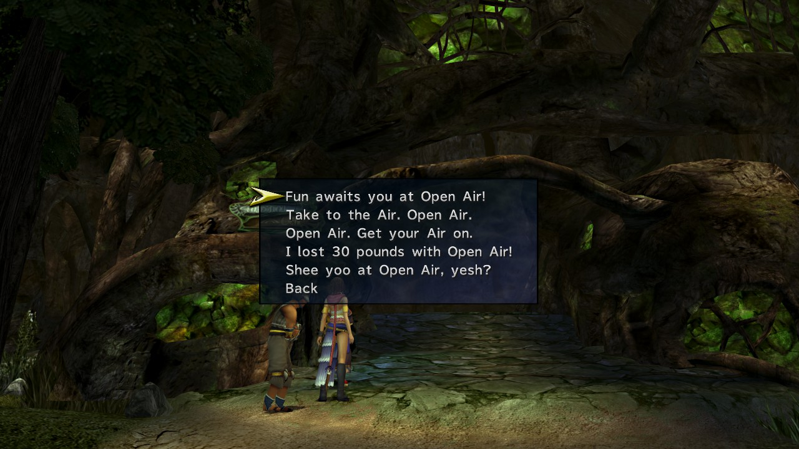
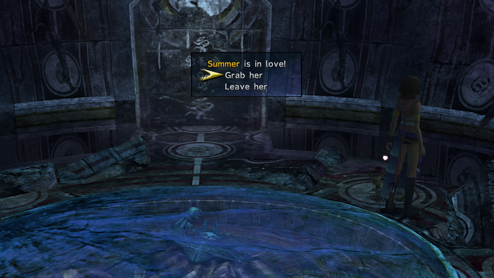
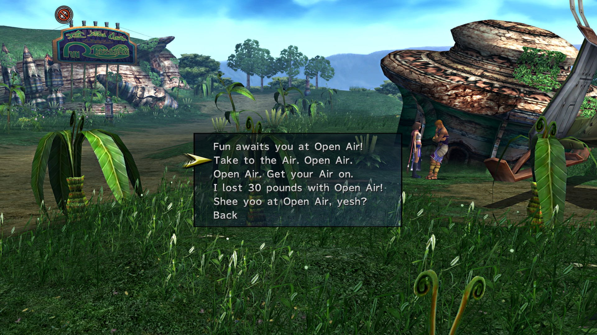

# Airship Celsius 4.2% (29.2%)

* Watch Sphere
  * Al Bhed Primer
* Collect Chests in Engine Room
* Speak to Barkeep and rest
* Push musicians into elevator
* Watch cutscene
* Return to bridge
* Select Youth League
* Automatic Events

# Besaid 0.8% (29.8%)

Option 2

Option 1

Option 5

Option 4

Option 1

Option 3

* Talk to Blizball Players
* Listen to Beclem
* Go through Beclem's challenge
* Engima Plate Grid
* Don't get hit, rack up lots of chains

# Guadosalam(Extras) 0.2% (30%)

* Save on arrival
* Enter Southeastern building and do Data Dealer minigame
  * Resseting for the dealer is recommended
* Solution below

<table>
  <tr>
    <th>Clue</th>
    <th>Location and Person</th>
    <th>Reward</th>
  </tr>
  <tr>
    <td>"He is someone loafing about indoors"</td>
    <td>The Hypello in the Tobli Productions area</td>
    <td>25,000G</td>
  </tr>
  <tr>
    <td>"I believe it's someone interested in joining the Syndicate"</td>
    <td>The woman in brown and green next to the large Chateau</td>
    <td>40,000G</td>
  </tr>
  <tr>
    <td>"I haven't the slightest clue what this guy is doing"</td>
    <td>The aimlessly-walking Hypello outside</td>
    <td>50,000G</td>
  </tr>
  <tr>
    <td>"It is a woman"</td>
    <td>The woman east to the Tobli Productions entrance</td><td>70,000G</td>
  </tr>
  <tr>
    <td>"It was someone rather young, yes"</td>
    <td>The woman with the red bandana in northwest Guadosalam</td>
    <td>30,000G</td>
  </tr>
  <tr>
    <td>"It's a guy sitting down"</td>
    <td>Kid in the helmet just outside the Dealer's place</td>
    <td>50,000G</td>
  </tr>
  <tr>
    <td>"It's someone by the entrance to town"</td>
    <td>The man near the Thunder Plains exit</td>
    <td>60,000G</td>
  </tr>
  <tr>
    <td>"It's someone near the door that will not open"</td>
    <td>Man in the blue bandana in southwest Guadosalam</td>
    <td>50,000G</td>
  </tr>
  <tr>
    <td>"It's someone right next to a door"</td>
    <td>Man west of the Tobli Productions entrance</td>
    <td>30,000G</td>
  </tr>
  <tr>
    <td>"It's someone sitting down; I wonder what he's doing there?"</td>
    <td>The man with the blue shirt in northwest Guadosalam</td>
    <td>40,000G</td>
  </tr>
  <tr>
    <td>"It's the last person you'd expect, no question"</td>
    <td>The Data Dealer!</td>
    <td>100,000G</td>
  </tr>
  <tr>
    <td>"The guy you're after is just sitting around"</td>
    <td>Man in red shorts outside the Dealer's place</td>
    <td>30,000G</td>
  </tr>
  <tr>
    <td>"The person is a woman"</td>
    <td>The woman in green in northwest Guadosalam</td>
    <td>25,000G</td>
  </tr>
  <tr>
    <td>"This guy's in a place you wouldn't expect"</td>
    <td>The shopkeep in the ... well, Guadosalam's shop!</td>
    <td>90,000G</td>
  </tr>
  <tr>
    <td>"This individual can be found indoors"</td>
    <td>The "overweight man" in Guadosalam's shop</td>
    <td>30,000G</td>
  </tr>
  <tr>
    <td>"This man bears himself with confidence"</td>
    <td>Man with brown headgear outside the Dealer's place</td>
    <td>30,000G</td>
  </tr>
</table>

# Luca 0.8% (30.8%)

## Outskirts

Option 3

Option 5

* Speak to Shelinda
  * Covetous Garment Grid

## Square

Option 4

Option 5

## Stadium Entrance

Option 3

Option 2

## Dock 3

Option 4

Option 1

* O'aka's Debt
  * Buy 99 Phoenix Downs from O'aka
  * Sell to Barkeep
  * Repeat until debt is paid
  * Can sell O'aka discounted items to get G back

# Moonflow 0.2% (31%)

## South Wharf

Option 5

Option 5

## North Bank Road

Option 5

## North Bank Road

Option 1

* Speak to Tobli on Southern bank
* Agree to sell tickets
  * Best sells below
    * You start on South Bank
  * Optimal: 12500G profit

## South Bank Road

1500G

## South Bank

1500G

## South Wharf

1500G

1500G

2000G

## North Wharf

2000G

2000G

2000G

## North Bank Road

1500G

2000G

* Automatic event with Tobli at end
* Check Save (31%)

# Kilika 0.2% (31.2%)

* View Cutscene and return

# Zanarkand Ruins 0.4% (31.6%)

* Talk to Isaaru inside the dome
* Help Isaaru pair up monkeys

1. Birch and Sequoia
  * 
  * 
2. Spring and Autumn
  * 
  * 
3. Dusky and Dawne
  * 
  * 
4. Rosemary and Thyme
  * 
  * 
5. Terran and Skye
  * 
  * 
6. Minni and Maxx
  * 
  * 
7. Summer and Winter
  * 
  * 
8. Peke and Valli
  * 
  * 
9. Canis and Felina
  * 
  * 
10. Arroh and Quivrr
  * 
  * 
11. Golde and Sylva
  * 
  * 
12. Luna and Sol
  * 
  * 

# Mi'ihen Highroad 1.4% (33%)

* Do Marriage and Promo in listed areas before starting quest

## New Road, North

Option 4

## North End

Option 5

## Old Road, North

Option 2

## Old Road, South

Option 1

Option 3

Option 4

## Agency

Option 1

Option 3

Option 2

* Save Game
* Talk to Calli outside Travel agency to start mission
* Phase 1
  * Ignore Rikku all 3 times
* Phase 2
  * Fail 3 times
  * See a cutscene where Rikku falls at end and follow Rikku
* Phase 3
  * Rikku should jump atop ruins and point the way
  * If she doesn't fall of ruins reset
  * Move towards Luca and automatic scene occurs
  * If not speak to Al Bhed lady and have her use hover to help capture Chocobo
* Save Game at Travel Agency
* Make sure you reach Calli before timer runs out
* Boss Fight
  * Selene Garment Grid
* DO NOT PRESS ANY BUTTONS AFTER BEATING BOSS
  * Ensure you see Rikku along the bridge during mission complete screen
* Return to Mi'ihen and pick up Clasko and Calli

## Central

Option 2

Option 4

## South End

Option 3

Option 1

Option 2

* Check Save (33%)

# Mushroom Rock 1% (34%)

* Go to Den of Woe
  * Crimson Sphere 7
* Got to Youth League HQ
  * Speak with Lucil and Elma
* Return to Ship and watch Crimson Record 7
* Check Save (34%)

# Calm Lands 0.8% (34.8%)

* Enter by airship for Clasko cutscene and follow him
  * Monster Arena
* Speak with Clasko to start Mission
  * First Monster is to North and right of save sphere
  * Walk through entire dungeon without touching any monster
  * They're looking at the next monster you fight
  * Except for the one you do fight
    * Interact with this one
  * After 5 battles talk to Clasko for one more fight
  * Alchemist Dressphere
  * Highroad Winds Garment Grid
* Get Gysahl Greens from Clasko
* Speak to Lian and Ayde at Travel agency

# Thunder Plains 0.2% (35%)

* Capture a chocobo here
* Speak to Cid
* Attempt to Calibrate Lightning Towers
  * 5 minimum
  * 1, 2, 3, 4, 6 easiest
* Check Save (35%)

# Bevelle

* Enter and leave

# Macalania Woods 1.4% (36.4%)

* Walk past Shimmering Path and talk to Hypello
* Go to where you meet Trommel and speak to Bayra
* Mission Start!
* Find Donga at Shimmering Path Intersection

## Macalania South

Option 3

## Macalania Campsite

Option 3

* Find Pukutak at the South Spring where Yuna swam in FFX
* Return to Bayra
* Mission Complete
* Speak to Hypello for reward before returning to ship
  * Bitter Farewell Garment Grid

# Djose 0.4% (36.8%)

## Djose Temple

Option 3

Option 1

Option 2

## Pilgrimage Road

Option 3

Option 5

Option 1

Option 4

Option 3

* Head South toward Mushroom Rock for cutscene
* Continue South and find Yuna's Dressphere
* Boss Fight

# Bikanel 0.2% (37%)

* Talk to Nhadala
* Go to Oasis
  * Machina Maw
* Boss Fight
  * Hour of Need Garment Grid

# Mt. Gagazet 1% (38%)

* Speak to Kimahri Twice
  * "You have to figure this out on your own"
* Give Responses
  * "Please, try to think about it some more"
  * "And what of the Guado?"
  * "What if the Guado retaliate?"
  * "Then... there won't be anyone left to fight"
  * "He does seem very tired."
  * "Maybe the Guado really are to blame."
* Head to the Fayth Scar
* Mission Start
* Follow goons but not into hot springs
* Go route above Save Sphere
* Witness cutscene over hot spring
* BOSS FIGHT
  * Stonehewn Garment Grid
  * Bum Rush Garment Grid
* Save Check(38%)

# Guadosalam Chateau 3.8% (41.8%)

* Crimson Sphere 10
* Healing Light Garment Grid

# Bevelle 3% (44.8%)

* First Tower sliding down chain is tower 1
  * 2-6 going clockwise
* 1, 3, 5 for security
* Ribbon
  * Activate Tower 2
  * Activate Tower 1 Four times
  * Activate Tower 6
  * Activate Tower 1 Twice
  * Activate Tower 4
  * Activate Tower 3
* Downtrodden Garment Grid
* Machine Puzzle
  * Bloodlust
  * Wring
* Dark Knight Dressphere
  * 3 Pillar Puzzle
