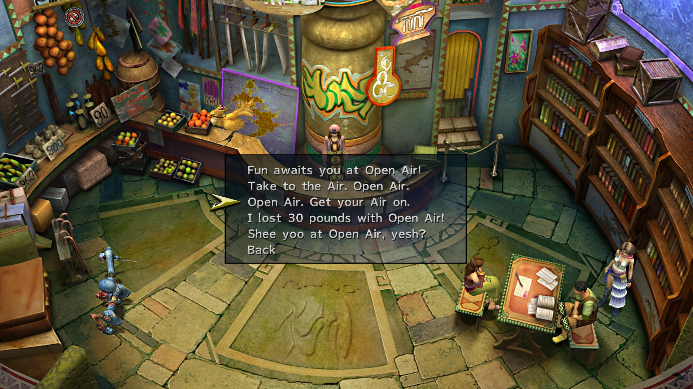
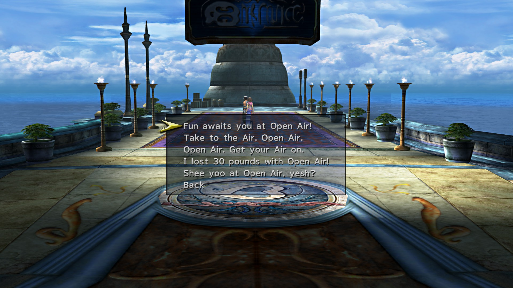

# Airship Celsius 4% (29%)

* Watch Sphere
  * Al Bhed Primer
* Collect Chests in Engine Room
  * 5 Phoenix Downs
  * 2 Ethers
  * 4 Remedies
  * 8 Potions
* Speak to Barkeep and rest
* Push musicians into cabin
* Watch cutscene
* Return to bridge
* Select Youth League
* Automatic Events

# Besaid 0.8% (30%)

Option 2

Option 1

Option 5

Option 4

Option 1

Option 3

* Leave village and head towards beach
* Wall Ring behind first waterfall bridge
* 1,500G and 2 Hi-Potions to left at beach
* Cave
  * 3 Potions
* Talk to Blizball Players
* Listen to Beclem
* Go through Beclem's challenge
  * Don't get hit, rack up lots of chains
* Save Game

# Guadosalam(Extras) 0.2% (30.2%)

Option 1

Option 2

Option 4

Option 2

Option 3

* Save on arrival
* Enter Southeastern building and do Data Dealer minigame
* Solution below

<table>
  <tr>
    <th>Clue</th>
    <th>Location and Person</th>
    <th>Reward</th>
  </tr>
  <tr>
    <td>"He is someone loafing about indoors"</td>
    <td>The Hypello in the Tobli Productions area</td>
    <td>25,000G</td>
  </tr>
  <tr>
    <td>"I believe it's someone interested in joining the Syndicate"</td>
    <td>The woman in brown and green next to the large Chateau</td>
    <td>40,000G</td>
  </tr>
  <tr>
    <td>"I haven't the slightest clue what this guy is doing"</td>
    <td>The aimlessly-walking Hypello outside</td>
    <td>50,000G</td>
  </tr>
  <tr>
    <td>"It is a woman"</td>
    <td>The woman east to the Tobli Productions entrance</td><td>70,000G</td>
  </tr>
  <tr>
    <td>"It was someone rather young, yes"</td>
    <td>The woman with the red bandana in northwest Guadosalam</td>
    <td>30,000G</td>
  </tr>
  <tr>
    <td>"It's a guy sitting down"</td>
    <td>Kid in the helmet just outside the Dealer's place</td>
    <td>50,000G</td>
  </tr>
  <tr>
    <td>"It's someone by the entrance to town"</td>
    <td>The man near the Thunder Plains exit</td>
    <td>60,000G</td>
  </tr>
  <tr>
    <td>"It's someone near the door that will not open"</td>
    <td>Man in the blue bandana in southwest Guadosalam</td>
    <td>50,000G</td>
  </tr>
  <tr>
    <td>"It's someone right next to a door"</td>
    <td>Man west of the Tobli Productions entrance</td>
    <td>30,000G</td>
  </tr>
  <tr>
    <td>"It's someone sitting down; I wonder what he's doing there?"</td>
    <td>The man with the blue shirt in northwest Guadosalam</td>
    <td>40,000G</td>
  </tr>
  <tr>
    <td>"It's the last person you'd expect, no question</td>
    <td>The Data Dealer!</td>
    <td>100,000G</td>
  </tr>
  <tr>
    <td>"The guy you're after is just sitting around</td>
    <td>Man in red shorts outside the Dealer's place</td>
    <td>30,000G</td>
  </tr>
  <tr>
    <td>"The person is a woman"</td>
    <td>The woman in green in northwest Guadosalam</td>
    <td>25,000G</td>
  </tr>
  <tr>
    <td>"This guy's in a place you wouldn't expect"</td>
    <td>The shopkeep in the ... well, Guadosalam's shop!</td>
    <td>90,000G</td>
  </tr>
  <tr>
    <td>"This individual can be found indoors"</td>
    <td>The "overweight man" in Guadosalam's shop</td>
    <td>30,000G</td>
  </tr>
  <tr>
    <td>"This man bears himself with confidence"</td>
    <td>Man with brown headgear outside the Dealer's place</td>
    <td>30,000G</td>
  </tr>
</table>

# Djose 0.4% (30.6%)

## Djose Temple

Option 3

Option 1

Option 2

## Pilgrimage Road

Option 3

Option 5

Option 1

Option 4

Option 3

* Head South toward Mushroom Rock for cutscene
* Continue South and find Yuna's Dressphere
* Boss Fight

# Mi'ihen Highroad 1.4% (32%)

* Do Marriage and Promo in listed areas before starting quest

## OldRoad, South

Option 4

Option 1

Option 3

## Oldroad, North

Option 2

## North End

Option 5

## Newroad, North

Option 4

## Agency

Option 1

Option 3

Option 2

* Save Game
* Talk to Calli outside Travel agency to start mission
* Phase 1
  * Ignore Rikku all 3 times
* Phase 2
  * Do not actually catch the chocobo
  * See a cutscene where Rikku falls at end and follow Rikku (if not reset)
    * Rikku should jump atop ruins and point the way
* Phase 3
  * Move towards Luca and automatic scene occurs
  * If not speak to Al Bhed lady and have her use hover to help capture Chocobo
* Save Game at Travel Agency
* Make sure you reach Calli before timer runs out
* Boss Fight
* DO NOT PRESS ANY BUTTONS AFTER BEATING BOSS
  * Ensure you see Rikku along the bridge during mission complete screen
* Return to Mi'ihen and pick up Clasko and Calli

## South End

Option 1

Option 2

Option 3

## Central

Option 4

Option 2

* Save Game (32%)

# Calm Lands 0.8 (32.8%)

* Enter by airship for Clasko cutscene and follow him
  * Monster Arena
* Speak with Clasko to start Mission
  * First Monster is to North and right of save sphere
  * Walk through entire dungeon without touching any monster
  * They're looking at the next monster you fight
  * Except for the one you do fight
    * Interact with this one
  * After 5 battles talk to Clasko for one more fight
  * Alchemist Dressphere
* Speak to Lian and Ayde at Travel agency

# Thunder Plains 0.2% (33%)

* Capture a chocobo here
* Speak to Cid
* Check Save 33%
* Attempt to Calibrate Lightning Towers
  * 5 minimum
  * 1, 2, 3, 4, 6 easiest

# Moonflow 0.2% (33.2%)

## South Wharf

Option 5

Option 5

## North Bank Road

Option 5

## North Bank Road

Option 1

* Speak to Tobli on Southern bank
* Agree to sell tickets
  * Best sells below
    * You start on South Bank
  * Optimal: 12500G profit
* Automatic event with Tobli at end

<table>
  <tr>
  <th colspan="3">Best Sellers
  <tr>
  <th>Area of Moonflow</th>
  <th>Specific Location/Person</th>
  <th>Ticket Price</th>
  </tr>
  <tr>
  <td>South Bank Road</td>
  <td>Woman at southern exit</td>
  <td>1500G</td>
  </tr>
  <tr>
  <td>South Bank</td>
  <td>Woman with a bandana on</td>
  <td>1500G</td>
  </tr>
  <tr>
  <td>South Wharf</td>
  <td>Woman near the Save Sphere</td>
  <td>1500G</td>
  </tr>
  <tr>
  <td>South Wharf(Dock)</td>
  <td>Man on the stairs</td>
  <td>1500G</td>
  </tr>
  <tr>
  <td>South Wharf(Dock)</td>
  <td>Man in the southwest corner</td>
  <td>2000G</td>
  </tr>
  <tr>
  <td>North Wharf(Dock)</td>
  <td>Girl in northeastern corner</td>
  <td>2000G</td>
  </tr>
  <tr>
  <td>North Wharf(Dock)</td>
  <td>Boy just to the right of a Hypello</td>
  <td>2000G</td>
  </tr>
  <tr>
  <td>North Wharf</td>
  <td>Woman here</td>
  <td>2000G</td>
  </tr>
  <tr>
  <td>North Bank Road</td>
  <td>First man on the roadside</td>
  <td>1500G</td>
  </tr>
  <tr>
  <td>North Bank Road</td>
  <td>Man near the elderly lady</td>
  <td>2000G</td>
  </tr>
</table>

# Luca 0.8% (34%)

* Speak to Shelinda
  * Covetous Garment Grid

## Outskirts

Option 3

Option 4

## Bridge

Option 1

Option 4

Option 4

Option 5

## Stadium Entrance

Option 2

Option 3

* O'aka's Debt
  * Buy 99 Phoenix Downs from O'aka
  * Sell to Barkeep
  * Repeat until debt is paid
  * Can sell O'aka discounted items to get G back
* Check Save (34%)

# Mushroom Rock 1% (35%)

* Go to Den of Woe
  * Crimson Sphere 7
* Got to Youth League HQ
  * Speak with Lucil and Elma
* Return to Ship and watch Crimson Record 7
* Check Save (35%)

# Macalania Woods 1.4% (36.4%)

* Walk past Shimmering Path and talk to Hypello
* Go to where you meet Trommel and speak to Bayra
* Mission Start!
* Find Donga at Shimmering Path Intersection

## Macalania South

Option 3

## Macalania Campsite

Option 3

* Find Pukutak at the South Spring where Yuna swam in FFX
* Return to Bayra
* Mission Complete
* Speak to Hypello for reward before returning to ship

# Zanarkand Ruins 0.4% (36.8%)

* Talk to Isaaru inside the dome
* Help Isaaru pair up monkeys
  * Isaaru is in area 1, subsequent areas are 2, 3... etc

| First | Area | Second | Area |
| ----- | :--: | ------ | :--: |
| Birch | 6 | Sequoia | 4 |
| Spring | 5 | Autumn | 2 |
| Dusky | 1 | Dawn | 6 |
| Rosemary | 5 | Thyme | 3 |
| Terran | 3 | Skye | 6 |
| Minni | 5 | Maxx | 3 |
| Summer | 4 | Winter | 1 |
| Peke | 3 | Valli | 4 |
| Canis | 5 | Felina | 1 |
| Arroh | 3 | Quivrr | 1 |
| Golde | 4 | Sylva | 1 |
| Luna | 1 | Sol | 5 |

# Kilika 0.2% (37%)

* View Cutscene and return
* Check Save (37%)

# Mt. Gagazet 1% (38%)

* Speak to Kimahri Twice and choose second option
* Give Responses
  * "I can imagine how you must feel..."
  * "You have to learn to deal with these things!"
  * "Leave it to the Gullwings!"
  * "I'm sure you're right."
  * "I will never forget their sacrifice."
  * "I wouldn't forgive them either."
  * "A change for the better, I hope."
    * this guy is actually on the mountain trail; you can warp close to him at the Fayth Scar if you prefer
* Follow goons
* Go past cave
* Witness cutscene over hot spring
* BOSS FIGHT
* Save Check(38%)

# Bikanel Desert 0.2% (38.2%)

* Talk to Nhadala
* Go to Oasis
  * Machina Maw
* Boss Fight

# Airship Celsius 0.2% (38.4%)

* Cutscene

# Guadosalam 3.4% (41.8%)

* Enter Airship
* After Leblanc cutscene talk to Ormi and Logos
* Fail first Leblanc Assignment for Heady Perfume
* Cutscene with Brother and Rikku
* Boss Fight
* Crimson Sphere 10
* Find Heady Perfume
* Boss Fight
* Disarm Security System
* Enter Leblanc's room

# Airship Celsius 0.4% (42.2%)

* Cutscene

# Bevelle 2.6% (44.8%)

* Complete Mission
* Treasures
  * Downtrodden Garment Grid
  * Ribbon
  * Wring
  * Bloodlust
  * Dark Knight Dress Sphere
