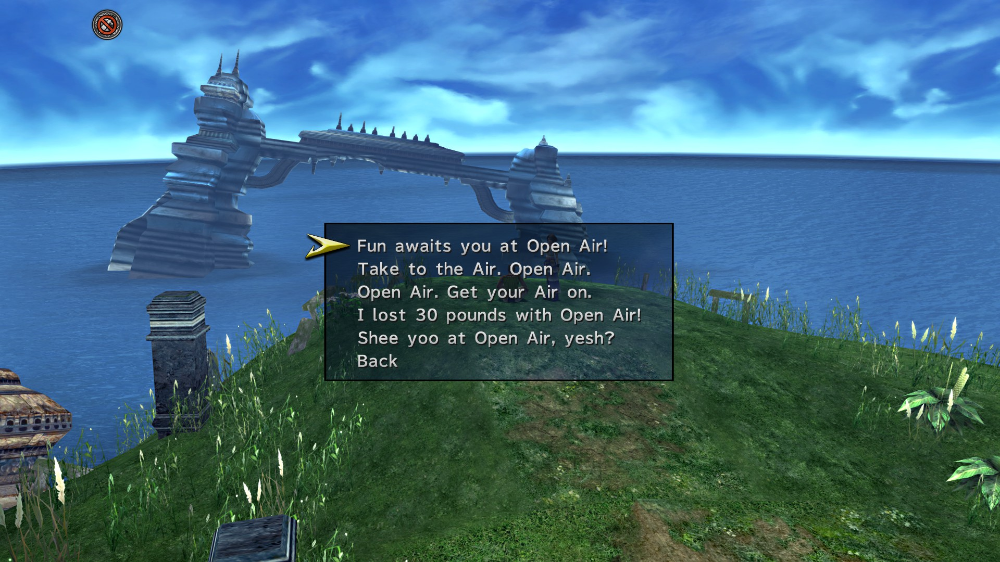

# Celsius 0.8% (45.6%)

* Rest in Cabin
* Engine Room Treasures

# Mushroom Rock 0.4% (50%)

* Follow Destination Marker
* Check Save (46%)

# Luca 0.8% (46.8%)

* Win Tournament
  * Save after 2 wins
  * Lady Luck Dressphere

## Outskirts

Choice 3

Choice 5

## Bridge

Choice 1

Choice 4

Choice 4

Choice 5

## Stadium Entrance

Choice 2

Choice 3

# Djose 0.2% (47%)

* Visit and watch cutscene
  * Al Bhed Primer
* Save Check (47%)

# Guadosalam 2% (49%)

Choice 1

Choice 2

Choice 4

Choice 2

Choice 3

* Enter Living room for cutscene
* Speak to LeBlanc
* Speak to Logos and Ormi
* Enter Passage in living room
  * Climb Boxes for Crimson Sphere 4
* Return to Logos and Ormi
  * Logos PShere
  * Ormi sphere
* Inspect drawer by bed
* Speak to Maechen
  * DO NOT TOUCH ANYTHING
* Watch Crimson Record 4
* Save Check (49%)

# Mi'ihen 0.6% (49.6%)

## North End

***MUST BE DONE DURING SIDE QUEST***

Choice 5

* Mission Complete
* Undying Storm Garment Grid

## South End

Choice 1

Choice 2

Choice 3

## Central

Choice 4

Choice 2

## Agency

Choice 1

Choice 3

Choice 2

## Newroad, North

Choice 4

## Oldroad, North

Choice 2

## Oldroad, South

Choice 4

Choice 1

Choice 3

# Bikanel 0.4% (46%)

* DO NOT DIG
* Head to Cactaur Nation
* Start Mission
  * Lobivia at Oasis
* Check Save (50%)

# Macalania 0.8% (50.8%)

* Mission Start
* Berserker Dressphere
* Al Bhed Primer
* Pride of the Sword Garment Grid
* Place commsphere at south entrance

Choice 1

Choice 4

# Thunder Plains 0.2% (51%)

* Speak to Lian and Ayde
  * Tell them to go to Kilika
* Speak to Cid
* Cactuar Islaya in Northern area
* Save Check (51%)

# Besaid 2% (53%)

* Mission Complete

Choice 2

Choice 1

Choice 5

Choice 4

Choice 3

* Enter temple and use Besaid Key
* Ciphers
  * Raging Giant Garment Grid
* Cactuar Tourenya on Beach
* Check Save (53%)

# Kilika 1.6% (54.6%)

* Clear Temple
* Don't forget Samurai Dressphere
* View Progress of construction

# Moonflow 0.2% (54.8%)

* Speak to Tobli twice

## South Bank Road

Choice 3

## South Wharf

Choice 3

Choice 3

## North Wharf

Choice 3

## North Bank Road

Choice 3

# Zanarkand 0.2% (55%)

* Speak to Isaaru
* Check Save (55%)

# Calm Lands 0.4% (55.4%)

* Mission Start
  * Leave cavern for Energy Core 7
  * Tetra Master Garment Grid
  * Will get Besaid Key from Tourist
* Visit Travel Agency and Chocobo Ranch to place CommSpheres
* Cactuar Areq and Arroja in Calm Lands gorge area

# Bevelle 1.6% (57%)

* Place Commsphere
* Enter for cutscene
* Take lift in temple to Bevelle Underground
* Cutscene in Antechamber
* Crimson Sphere 1
* View Crimson Report 1
* Check Save (57%)

# Mt. Gagazet 0.4% (57.4%)

* Trainer Dressphere
* Place CommSphere at Hot Spring
* Fight Garik
  * Wishbringer Garment Grid

# Djose 2.2% (59.6%)

* Al Bhed Primer
* Unwavering Guard Garment Grid
* Crimson Sphere 2
* Crimson Sphere 3
* Whistle 4 times
