# Farebury

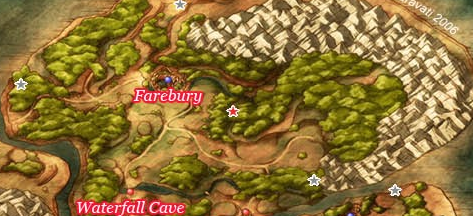

## Collectable Items

* Secluded Grove
  * Medical Herb - Barrel
* Farebury
  * 4G - Barrel outside Inn
  * Holy Water -
  * Plain Clothes -
  * Chimaera Wing -
  * Cypress Stick -
  * Antidotal Herb -
  * Medicinal Herb -
  * 3G - Inn backdoor Bag
  * 5G - House near armour shop
  * Antidotal Herb - House near armour shop
  * Medicinal Herb - Pot behind pub
  * Leather Shield - Well
  * 8G - House near Well
  * Plain Clothes - House near Well
  * 20G - House near weapon shop Cabinet
  * Seed of Defense - Behind Church
  * Medicinal Herb - Church
  * Pot Lid - Church
  * 2G - Upstairs Barrel
  * Medicinal Herb - Upstairs Barrel
  * 10G - Pub backdoor barrel
  * Antidotal Herb - Pub Barrel
  * 4G - Kalderasha's Cabinet
  * Medicinal Herb - Kalderasha's Cabiner
  * 7G - Kalderasha's Barrel
  * Thief's Key Recipe - Church Bell Tower (Night)
* World Map
  * Seed of Life - North of Farebury
  * Boxer Shorts - Far West of Farebury
  * 82G - Southeast of Farebury
* Waterfall Hut
  * Seed of Agility - Waterfall Hut Bag
  * Holy Water - Waterfall Hut Bag
  * 8 Plain Cheese - Retrieve Tool Baf from Crimson Tree E of Farebury

## Blue Chests

* Southwest of town
* South of town
* Further south of town
* A corner east of town
* SW of town near Waterfall Cave

## Stores

<table>
  <tr>
    <th colspan="9">Item Shop</th>
  </tr>
  <tr>
    <th>Item</th>
    <th>Cost</th>
    <th>DEF</th>
    <th>H</th>
    <th>Y</th>
    <th>J</th>
    <th>A</th>
    <th>M</th>
    <th>R</th>
    <th>Effect</th>
  </tr>
  <tr>
    <th>Medicinal Herb</th>
    <th>8G</th>
    <th>-</th>
    <th>+</th>
    <th>+</th>
    <th>+</th>
    <th>+</th>
    <th>+</th>
    <th>+</th>
    <th>Restores 30-40 HP for one character</th>
  </tr>
  <tr>
    <th>Antidotal Herb</th>
    <th>10G</th>
    <th>-</th>
    <th>+</th>
    <th>+</th>
    <th>+</th>
    <th>+</th>
    <th>+</th>
    <th>+</th>
    <th>Cures Poison for one character</th>
  </tr>
  <tr>
    <th>Chimaera Wing</th>
    <th>25G</th>
    <th>-</th>
    <th>+</th>
    <th>+</th>
    <th>+</th>
    <th>+</th>
    <th>+</th>
    <th>+</th>
    <th>Allows you to teleport to any town and some dungeons you have already visited</th>
  </tr>
  <tr>
    <th>Plain Clothes</th>
    <th>30G</th>
    <th>4</th>
    <th>+</th>
    <th>+</th>
    <th>+</th>
    <th>+</th>
    <th>+</th>
    <th>+</th>
    <th>An unremarkable garment made from cotton</th>
  </tr>
</table>

<table>
  <tr>
      <th colspan="10">Armour Shop</th>
  </tr>
  <tr>
    <th>Item</th>
    <th>Cost</th>
    <th>DEF</th>
    <th>H</th>
    <th>Y</th>
    <th>J</th>
    <th>A</th>
    <th>M</th>
    <th>R</th>
    <th>Effect</th>
  </tr>
  <tr>
    <th>Bandit's Grass Skirt</th>
    <th>35G</th>
    <th>5</th>
    <th>-</th>
    <th>+</th>
    <th>-</th>
    <th>-</th>
    <th>-</th>
    <th>-</th>
    <th>A rough grass kilt of the king preferred by Yangus</th>
  </tr>
  <tr>
    <th>Wayfarer's Clothes</th>
    <th>70G</th>
    <th>7</th>
    <th>+</th>
    <th>+</th>
    <th>+</th>
    <th>+</th>
    <th>+</th>
    <th>+</th>
    <th>Rugged hempen garments loved by travelers for their sturdiness</th>
  </tr>
  <tr>
    <th>Leather Armour</th>
    <th>180G</th>
    <th>11</th>
    <th>+</th>
    <th>-</th>
    <th>-</th>
    <th>+</th>
    <th>+</th>
    <th>-</th>
    <th>Lightweight armour made of leather</th>
  </tr>
  <tr>
    <th>Leather Shield</th>
    <th>70G</th>
    <th>4</th>
    <th>+</th>
    <th>+</th>
    <th>-</th>
    <th>+</th>
    <th>+</th>
    <th>-</th>
    <th></th>
  </tr>
  <tr>
    <th>Leather Hat</th>
    <th>65G</th>
    <th>3</th>
    <th>+</th>
    <th>+</th>
    <th>+</th>
    <th>+</th>
    <th>+</th>
    <th>+</th>
    <th></th>
  </tr>
</table>

<table>
  <tr>
      <th colspan="10">Weapon Shop</th>
  </tr>
  <tr>
    <th>Item</th>
    <th>Cost</th>
    <th>ATK</th>
    <th>H</th>
    <th>Y</th>
    <th>J</th>
    <th>A</th>
    <th>M</th>
    <th>R</th>
    <th>Effect</th>
  </tr>
  <tr>
    <th>Cypress Stick</th>
    <th>10G</th>
    <th>4</th>
    <th>+</th>
    <th>-</th>
    <th>-</th>
    <th>-</th>
    <th>-</th>
    <th>-</th>
    <th></th>
  </tr>
  <tr>
    <th>Oaken Club</th>
    <th>110G</th>
    <th>7</th>
    <th>-</th>
    <th>+</th>
    <th>-</th>
    <th>-</th>
    <th>+</th>
    <th>-</th>
    <th></th>
  </tr>
  <tr>
    <th>Giant Mallet</th>
    <th>240G</th>
    <th>13</th>
    <th>-</th>
    <th>+</th>
    <th>-</th>
    <th>-</th>
    <th>+</th>
    <th>-</th>
    <th></th>
  </tr>
  <tr>
    <th>Copper Sword</th>
    <th>270G</th>
    <th>13</th>
    <th>+</th>
    <th>-</th>
    <th>-</th>
    <th>-</th>
    <th>-</th>
    <th>-</th>
    <th></th>
  </tr>
  <tr>
    <th>Boomerang</th>
    <th>420G</th>
    <th>19</th>
    <th>+</th>
    <th>-</th>
    <th>-</th>
    <th>-</th>
    <th>+</th>
    <th>-</th>
    <th>Causes damage to all enemies</th>
  </tr>
</table>

## Walkthrough Tasks

1. Purchases: (145 G)
  * 4 Cypress Sticks
  * 1 Bandit's Grass Skirt
  * 1 Leather Shield

# Waterfall Cave

Recommended Level: 5

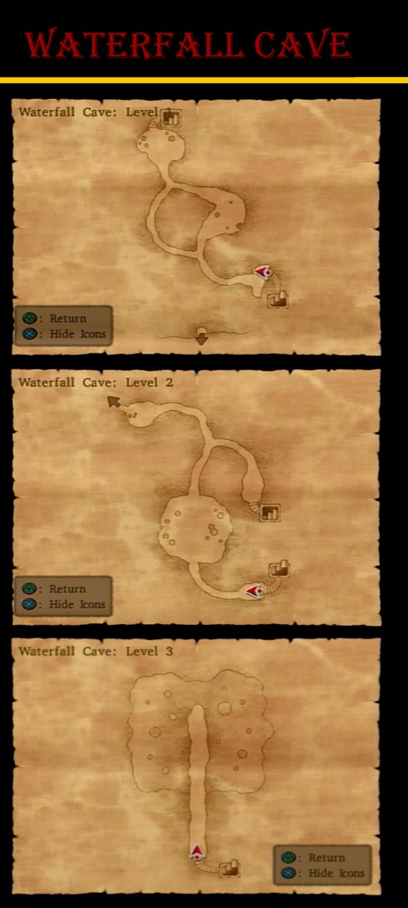

## Collectable Items

* 100G - Junction
* Chimaera Wing - Right Fork
* Medicinal Herb - North of Chimaera Wing
* Leather Hat - With Medicinal Herb
* Copper Sword - Left after Hammerhood

# Alexandria

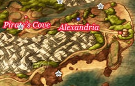

## Collectable Items

* Overworld
  * Slime Earrings - West of Checkpoint
  * 100 G - East of Checkpoint along cliff
* Alexandria
  * Medicinal Herb - Southern House
  * 11G - Southern House
  * Holy Water - Pots across stream
  * Chimaera Wing - Inside House Pot
  * 5G - Kitchen Pot
  * Plain Cheese - Kitchen Pot
  * Wayfarer's Clothes - 2F Cabinet
  * Seed of Magic - Attic
  * 18G - Attic
  * Moonwort Bulb - Attic
  * Jessica's Outfit - Jessica's Room (After Tower)

## Blue Chests

* East of Checkpoint
* Southeastern beach
* North side of port path

## Stores

<table>
  <tr>
      <th colspan="10">Armour and Item Shop</th>
  </tr>
  <tr>
    <th>Item</th>
    <th>Cost</th>
    <th>DEF</th>
    <th>H</th>
    <th>Y</th>
    <th>J</th>
    <th>A</th>
    <th>M</th>
    <th>R</th>
    <th>Effect</th>
  </tr>
  <tr>
    <th>Leather Kilt</th>
    <th>250G</th>
    <th>12</th>
    <th>-</th>
    <th>+</th>
    <th>-</th>
    <th>-</th>
    <th>-</th>
    <th>-</th>
    <th>A sturdy kilt fashioned from animal hide</th>
  </tr>
  <tr>
    <th>Scale Armour</th>
    <th>350G</th>
    <th>17</th>
    <th>+</th>
    <th>-</th>
    <th>-</th>
    <th>+</th>
    <th>+</th>
    <th>-</th>
    <th>A suit of armour fashioned from numerous hard scales</th>
  </tr>
  <tr>
    <th>Medicinal Herb</th>
    <th>8G</th>
    <th>-</th>
    <th>+</th>
    <th>+</th>
    <th>+</th>
    <th>+</th>
    <th>+</th>
    <th>+</th>
    <th>Restores 30-40HP for one character</th>
  </tr>
  <tr>
    <th>Antidotal Herb</th>
    <th>10G</th>
    <th>-</th>
    <th>+</th>
    <th>+</th>
    <th>+</th>
    <th>+</th>
    <th>+</th>
    <th>+</th>
    <th>Cures Poison for one character</th>
  </tr>
  <tr>
    <th>Chimaera Wing</th>
    <th>25G</th>
    <th>-</th>
    <th>+</th>
    <th>+</th>
    <th>+</th>
    <th>+</th>
    <th>+</th>
    <th>+</th>
    <th>Allows you to teleport to any town and some dungeons you have already visited</th>
  </tr>
</table>

<table>
  <tr>
      <th colspan="10">Weapon Shop</th>
  </tr>
  <tr>
    <th>Item</th>
    <th>Cost</th>
    <th>ATK</th>
    <th>H</th>
    <th>Y</th>
    <th>J</th>
    <th>A</th>
    <th>M</th>
    <th>R</th>
    <th>Effect</th>
  </tr>
  <tr>
    <th>Oaken Club</th>
    <th>110G</th>
    <th>7</th>
    <th>-</th>
    <th>+</th>
    <th>-</th>
    <th>-</th>
    <th>+</th>
    <th>-</th>
    <th>-</th>
  </tr>
  <tr>
    <th>Giant Mallet</th>
    <th>240G</th>
    <th>13</th>
    <th>-</th>
    <th>+</th>
    <th>-</th>
    <th>-</th>
    <th>+</th>
    <th>-</th>
    <th>-</th>
  </tr>
  <tr>
    <th>Copper Sword</th>
    <th>270G</th>
    <th>13</th>
    <th>+</th>
    <th>-</th>
    <th>-</th>
    <th>-</th>
    <th>-</th>
    <th>-</th>
    <th>-</th>
  </tr>
  <tr>
    <th>Boomerang</th>
    <th>420G</th>
    <th>19</th>
    <th>+</th>
    <th>-</th>
    <th>-</th>
    <th>-</th>
    <th>+</th>
    <th>-</th>
    <th>Causes damage to all enemies</th>
  </tr>
  <tr>
    <th>Stone Axe</th>
    <th>550G</th>
    <th>20</th>
    <th>-</th>
    <th>+</th>
    <th>-</th>
    <th>-</th>
    <th>-</th>
    <th>-</th>
    <th>-</th>
  </tr>
</table>

# Tower of Alexandra

Recommended Level: 7

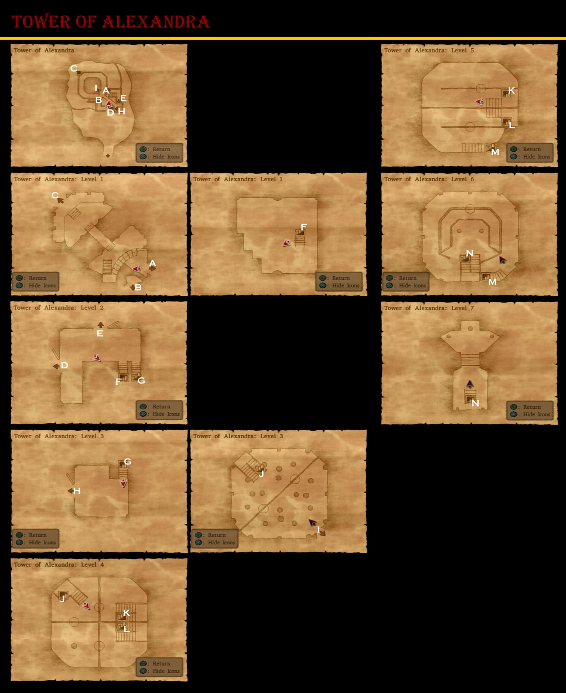

## Collectable Items

* 200 G - Courtyard
* Seed of Agility - Basement
* Moonwort Bulb - Basement
* 22G - Basement
* 11G - Basement
* Medicinal Herb - Basement
* Seed of Strength - Tower Pot
* 7G - Tower Pot
* Medicinal Herb - Tower Barrel
* Antidotal Herb - Tower Pot
* Scale Shield - Tower Chest

# Port Prospect

## Collectable Items

* Overworld
  * Seed of Strength - Southern Beach
  * Seed of Life - East of Port Prospect
* Port Prospect
  * Chimaera Wing - Near Entrance
  * Medical Herb - Near Entrance
  * Seed of Wisdom - Near Entrance
  * Holy Water - Inn Dresser
  * 17G - Shop Barrel
* Ferry
  * Medicinal Herb - Cabin
  * Seed of Life - Cabin
  * Seed of Agility - Cabin
  * Antidotal Herb - Cabin
  * Pot Lid - Cabin
  * 12G - Cabin
  * Medical Herb - Cabin
  * 10G - Downstairs Pot
  * Bronze Knife - Captain's Quarters

## Stores

<table>
  <tr>
      <th colspan="3">Item Shop</th>
  </tr>
  <tr>
    <th>Item</th>
    <th>Cost</th>
    <th>Effect</th>
  </tr>
  <tr>
    <th>Medicinal Herb</th>
    <th>8G</th>
    <th>Restores 30-40HP for one character</th>
  </tr>
  <tr>
    <th>Antidotal Herb</th>
    <th>10G</th>
    <th>Cures Poison for one character</th>
  </tr>
  <tr>
    <th>Holy Water</th>
    <th>20G</th>
    <th>When used on the field, avoids battles with low level enemies, When used in battle deals 10-15 damage to a single enemy</th>
  </tr>
  <tr>
    <th>Chimaera Wing</th>
    <th>25G</th>
    <th>Allows you to teleport to any town and some dungeons you have already visited</th>
  </tr>
</table>

<table>
  <tr>
      <th colspan="10">Weapon and Armour Shop</th>
  </tr>
  <tr>
    <th>Item</th>
    <th>Cost</th>
    <th>ATK/DEF</th>
    <th>H</th>
    <th>Y</th>
    <th>J</th>
    <th>A</th>
    <th>M</th>
    <th>R</th>
    <th>Effect</th>
  </tr>
  <tr>
    <th>Stone Axe</th>
    <th>550G</th>
    <th>20</th>
    <th>-</th>
    <th>+</th>
    <th>-</th>
    <th>-</th>
    <th>-</th>
    <th>-</th>
    <th>-</th>
  </tr>
  <tr>
    <th>Iron Lance</th>
    <th>750</th>
    <th>24</th>
    <th>+</th>
    <th>-</th>
    <th>-</th>
    <th>-</th>
    <th>-</th>
    <th>-</th>
    <th>-</th>
  </tr>
  <tr>
    <th>Farmer's Scythe</th>
    <th>910</th>
    <th>28</th>
    <th>-</th>
    <th>+</th>
    <th>-</th>
    <th>-</th>
    <th>-</th>
    <th>-</th>
    <th>-</th>
  </tr>
  <tr>
    <th>Leather Kilt</th>
    <th>250G</th>
    <th>12</th>
    <th>-</th>
    <th>+</th>
    <th>-</th>
    <th>-</th>
    <th>-</th>
    <th>-</th>
    <th>A sturdy kilt fashioned from animal hide</th>
  </tr>
  <tr>
    <th>Scale Armour</th>
    <th>350G</th>
    <th>17</th>
    <th>+</th>
    <th>-</th>
    <th>-</th>
    <th>+</th>
    <th>+</th>
    <th>-</th>
    <th>A suit of armour fashioned from numerous hard scales</th>
  </tr>
  <tr>
    <th>Scale Shield</th>
    <th>180G</th>
    <th>7</th>
    <th>+</th>
    <th>+</th>
    <th>+</th>
    <th>+</th>
    <th>+</th>
    <th>+</th>
    <th>-</th>
  </tr>
</table>

## Walkthrough Tasks

1. Purchases: (910 G)
  * 1 Farmer's Scythe

## Cameron's Codex

2. Candy Cat outside Port Prospect
28. Port Prospect Lighthouse
91. Window side of Inn

# Cameron's Codex - Treasure Hunt

* Farebury
  4. Paprikan - Forest in south Farebury
  20. Defeat 30 Slimes - Creme caraslime south of Farebury
  89. Gold Slime behind Inn counter
  118. Kalderasha
* Alexandria
  27. Alexandra's Statue at the tower
  90. Gold Slime in Jessica's Room
  119. Jessica's Mother
* Other
  1. Take a picture of any monster

# Peregrin Quay

## Collectable Items

* Chimaera Wing - Armour Shop Pot
* Leather Kilt - Armour Shop Pot
* Medicinal Herb - Item Shop Barrel
* 8G - Item Shop Barrel
* Oaken Club - Weapon Shop
* Antidotal Herb - Weapon Shop
* Seed of Defense - Next to Closed Shop
* Medicinal Herb - Next to Closed Shop
* Iron Nail - Inn Hooded Guy
* Seed of Magic - Inn Cabinet
* Boomerang - Closed Shop Chest
* 200G - Closed Shop Chest
* Mini Medal - Closed Shop Chest

## Walkthrough Tasks

1. Purchases (1476 G)
  * 4 Bronze Knives
  * 1 Thorn Whip
  * 6 Bandanas
  * 2 Holy Waters
  * 27 Medical Herbs
2. Alchemy
  * Bronze Knife + Iron Nail = Thief's Key
  * Plain Clothes + Plain Clothes = Wayfarer's Clothes
  * Bandana + Bandana = Turban
  * Bandana + Bandit's Grass Skirt = Boxer Shorts
  * Chimaera Wing + Leather Hat = Feathered Cap
  * 15x Medicinal Herb + Medicinal Herb = Strong Medicine
  * 2x Medicinal Herb + Antidotal Herb = Strong Antidote
  * Holy Water + Seed of Magic = Magic Water
3. Alchemy
  * 6x Strong Medicine + Strong Medicine = Special Medicine
  * Medicinal Herb + Strong Medicine = Rose Root
  * Strong Medicine + Holy Water = Amor Seco Essense
  * Strong Antidote + Strong Antidote = Special Antidote
4. Alchemy
  * Special Medicine + Special Medicine = Lesser Panacea

## Cameron's Codex

29. Pier Shop
92. Atop luggage midway up the stairway INN

## Stores

<table>
  <tr>
      <th colspan="3">Item Shop</th>
  </tr>
  <tr>
    <th>Item</th>
    <th>Cost</th>
    <th>Effect</th>
  </tr>
  <tr>
    <th>Medicinal Herb</th>
    <th>8G</th>
    <th>Restores 30-40HP for one character</th>
  </tr>
  <tr>
    <th>Antidotal Herb</th>
    <th>10G</th>
    <th>Cures Poison for one character</th>
  </tr>
  <tr>
    <th>Holy Water</th>
    <th>20G</th>
    <th>When used on the field, avoids battles with low level enemies, When used in battle deals 10-15 damage to a single enemy</th>
  </tr>
  <tr>
    <th>Chimaera Wing</th>
    <th>25G</th>
    <th>Allows you to teleport to any town and some dungeons you have already visited</th>
  </tr>
</table>

<table>
  <tr>
      <th colspan="10">Item Shop 2</th>
  </tr>
  <tr>
    <th>Item</th>
    <th>Cost</th>
    <th>ATK/DEF</th>
    <th>H</th>
    <th>Y</th>
    <th>J</th>
    <th>A</th>
    <th>M</th>
    <th>R</th>
    <th>Effect</th>
  </tr>
  <tr>
    <th>Cypress Stick</th>
    <th>10G</th>
    <th>4</th>
    <th>+</th>
    <th>-</th>
    <th>-</th>
    <th>-</th>
    <th>-</th>
    <th>-</th>
    <th>-</th>
  </tr>
  <tr>
    <th>Pot Lid</th>
    <th>40G</th>
    <th>2</th>
    <th>-</th>
    <th>+</th>
    <th>+</th>
    <th>-</th>
    <th>+</th>
    <th>+</th>
    <th>-</th>
  </tr>
  <tr>
    <th>Bandana</th>
    <th>45</th>
    <th>1</th>
    <th>+</th>
    <th>-</th>
    <th>-</th>
    <th>-</th>
    <th>-</th>
    <th>-</th>
    <th>-</th>
  </tr>
  <tr>
    <th>Hairband</th>
    <th>150G</th>
    <th>5</th>
    <th>-</th>
    <th>-</th>
    <th>+</th>
    <th>-</th>
    <th>-</th>
    <th>+</th>
    <th>-</th>
  </tr>
  <tr>
    <th>Slime Earrings</th>
    <th>400G</th>
    <th>4</th>
    <th>+</th>
    <th>+</th>
    <th>+</th>
    <th>+</th>
    <th>+</th>
    <th>+</th>
    <th>-</th>
  </tr>
</table>

<table>
  <tr>
      <th colspan="10">Armour Shop</th>
  </tr>
  <tr>
    <th>Item</th>
    <th>Cost</th>
    <th>DEF</th>
    <th>H</th>
    <th>Y</th>
    <th>J</th>
    <th>A</th>
    <th>M</th>
    <th>R</th>
    <th>Effect</th>
  </tr>
  <tr>
    <th>Scale Armour</th>
    <th>350G</th>
    <th>17</th>
    <th>+</th>
    <th>-</th>
    <th>-</th>
    <th>+</th>
    <th>+</th>
    <th>-</th>
    <th>A suit of armour fashioned from numerous hard scales</th>
  </tr>
  <tr>
    <th>Silk Robe</th>
    <th>420G</th>
    <th>10</th>
    <th>-</th>
    <th>-</th>
    <th>+</th>
    <th>+</th>
    <th>-</th>
    <th>+</th>
    <th>A high-quality garment woven from pure silk</th>
  </tr>
  <tr>
    <th>Chain Mail</th>
    <th>500G</th>
    <th>20</th>
    <th>-</th>
    <th>+</th>
    <th>-</th>
    <th>-</th>
    <th>+</th>
    <th>+</th>
    <th>A comfortable and lightweight suit of armour constructed from innumerable metal links.</th>
  </tr>
  <tr>
    <th>Scale Shield</th>
    <th>180G</th>
    <th>7</th>
    <th>+</th>
    <th>+</th>
    <th>+</th>
    <th>+</th>
    <th>+</th>
    <th>+</th>
    <th>-</th>
  </tr>
  <tr>
    <th>Pointy Hat</th>
    <th>70G</th>
    <th>7</th>
    <th>+</th>
    <th>+</th>
    <th>-</th>
    <th>-</th>
    <th>-</th>
    <th>-</th>
    <th>-</th>
  </tr>
</table>

<table>
  <tr>
      <th colspan="10">Weapon Shop</th>
  </tr>
  <tr>
    <th>Item</th>
    <th>Cost</th>
    <th>ATK</th>
    <th>H</th>
    <th>Y</th>
    <th>J</th>
    <th>A</th>
    <th>M</th>
    <th>R</th>
    <th>Effect</th>
  </tr>
  <tr>
    <th>Bronze Knife</th>
    <th>150G</th>
    <th>9</th>
    <th>-</th>
    <th>-</th>
    <th>+</th>
    <th>-</th>
    <th>-</th>
    <th>+</th>
    <th>-</th>
  </tr>
  <tr>
    <th>Thorn Whip</th>
    <th>350G</th>
    <th>14</th>
    <th>-</th>
    <th>-</th>
    <th>+</th>
    <th>-</th>
    <th>-</th>
    <th>+</th>
    <th>Hits all monsters in a group</th>
  </tr>
  <tr>
    <th>Iron Lance</th>
    <th>750G</th>
    <th>24</th>
    <th>+</th>
    <th>-</th>
    <th>-</th>
    <th>-</th>
    <th>-</th>
    <th>-</th>
    <th>-</th>
  </tr>
  <tr>
    <th>Farmer's Scythe</th>
    <th>910G</th>
    <th>28</th>
    <th>-</th>
    <th>+</th>
    <th>-</th>
    <th>-</th>
    <th>-</th>
    <th>-</th>
    <th>-</th>
  </tr>
</table>

# Treasure Hunt - Thief's Key

* Farebury
  * Cypress Stick - Weapon Shop
  * Dagger - Weapon Shop
  * Mini Medal - Church
  * Mini Medal - Southeast of Farebury
* Alchemy
  * Cypress Stick + Dagger = Iron Lance

# Maella Abbey

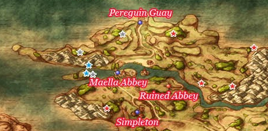

## Collectable Items

* Overworld
  * Magic Water - West of Peregrin Quay
  * Stone Axe - Southwest of Peregrin Quay
  * Feathered Cap - East of Peregrin Quay
  * Seed of Magic - East of Peregrin Quay North Coast
  * Seed of Wisdom - South of Seed of Magic
  * Seed of Strength - West of Seed of Wisdom
* Maella Abbey
  * Mini Medal - Outdoor Pot
  * Holy Water - Outdoor Barrel

# Simpleton

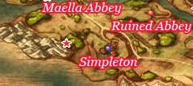

## Collectable Items

* Overworld
  * Bunny Tail - South of Maella Abbey
  * Chain Mail - Far East River Bank
* Simpleton
  * Mini Medal - Bar Barrel
  * 26G - Bar Barrel

## Stores

<table>
  <tr>
      <th colspan="10">Item Shop</th>
  </tr>
  <tr>
    <th>Item</th>
    <th>Cost</th>
    <th>DEF</th>
    <th>H</th>
    <th>Y</th>
    <th>J</th>
    <th>A</th>
    <th>M</th>
    <th>R</th>
    <th>Effect</th>
  </tr>
  <tr>
    <th>Medicinal Herb</th>
    <th>8G</th>
    <th>-</th>
    <th>+</th>
    <th>+</th>
    <th>+</th>
    <th>+</th>
    <th>+</th>
    <th>+</th>
    <th>Restores 30-40HP for one character</th>
  </tr>
  <tr>
    <th>Antidotal Herb</th>
    <th>10G</th>
    <th>-</th>
    <th>+</th>
    <th>+</th>
    <th>+</th>
    <th>+</th>
    <th>+</th>
    <th>+</th>
    <th>Cures Poison for one character</th>
  </tr>
  <tr>
    <th>Holy Water</th>
    <th>20G</th>
    <th>-</th>
    <th>+</th>
    <th>+</th>
    <th>+</th>
    <th>+</th>
    <th>+</th>
    <th>+</th>
    <th>When used on the field, avoids battles with low level enemies, When used in battle deals 10-15 damage to a single enemy</th>
  </tr>
  <tr>
    <th>Chimaera Wing</th>
    <th>25G</th>
    <th>-</th>
    <th>+</th>
    <th>+</th>
    <th>+</th>
    <th>+</th>
    <th>+</th>
    <th>+</th>
    <th>Allows you to teleport to any town and some dungeons you have already visited</th>
  </tr>
  <tr>
    <th>Chain Mail</th>
    <th>500G</th>
    <th>20</th>
    <th>-</th>
    <th>+</th>
    <th>-</th>
    <th>-</th>
    <th>+</th>
    <th>+</th>
    <th>A comfortable and lightweight suit of armout constructed from innumerable metal links</th>
  </tr>
  <tr>
    <th>Turban</th>
    <th>410G</th>
    <th>8</th>
    <th>+</th>
    <th>+</th>
    <th>-</th>
    <th>-</th>
    <th>-</th>
    <th>-</th>
    <th>-</th>
  </tr>
</table>

<table>
  <tr>
      <th colspan="10">Weapon Shop</th>
  </tr>
  <tr>
    <th>Item</th>
    <th>Cost</th>
    <th>ATK</th>
    <th>H</th>
    <th>Y</th>
    <th>J</th>
    <th>A</th>
    <th>M</th>
    <th>R</th>
    <th>Effect</th>
  </tr>
  <tr>
    <th>Rapier</th>
    <th>300G</th>
    <th>17</th>
    <th>-</th>
    <th>-</th>
    <th>-</th>
    <th>+</th>
    <th>-</th>
    <th>-</th>
    <th>-</th>
  </tr>
  <tr>
    <th>Thorn Whip</th>
    <th>350G</th>
    <th>14</th>
    <th>-</th>
    <th>-</th>
    <th>+</th>
    <th>-</th>
    <th>-</th>
    <th>+</th>
    <th>Hits all monsters in a group</th>
  </tr>
  <tr>
    <th>Wizard Staff</th>
    <th>1300G</th>
    <th>15</th>
    <th>-</th>
    <th>-</th>
    <th>+</th>
    <th>+</th>
    <th>-</th>
    <th>-</th>
    <th>Casts Frizz when used in battle</th>
  </tr>
  <tr>
    <th>Long Spear</th>
    <th>1700G</th>
    <th>30</th>
    <th>+</th>
    <th>-</th>
    <th>-</th>
    <th>-</th>
    <th>-</th>
    <th>-</th>
    <th>-</th>
  </tr>
  <tr>
    <th>Sledgehammer</th>
    <th>1700G</th>
    <th>33</th>
    <th>-</th>
    <th>+</th>
    <th>-</th>
    <th>-</th>
    <th>+</th>
    <th>-</th>
    <th>-</th>
  </tr>
</table>

## Blue Chests

* East of Maella Abbey
* East of Bunny Tail

## Cameron's Codex

15. Old Abbey Metal Slime
30. Stained Glass House at Abbey back
31. Torture Room in Abbey Basement
33. Stained Glass at Abbey Front
93. Abbey First Floor, Right Side

# Ruined Abbey

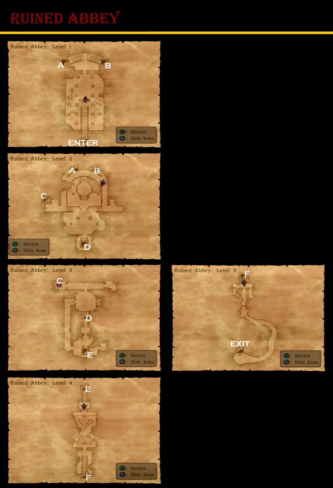

## Collectable Items

* 300G - East Alcove
* Iron Nail - Right Alcove
* Mini Medal - Down Ladder Pot
* 50G -
* Waterweed Mould

# Savella Cathedral

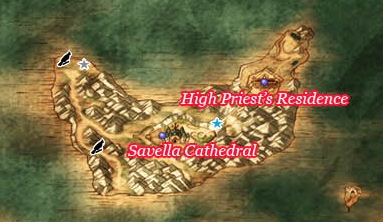

## Collectable Items

* Overworld
  * Seed of Life (Bird at Northern Point)
  * Magic Water (Chest at Northern Point)
  * Fresh Milk (Cow at Northern Point, just South of Chest and Bird)
  * Seed of Magic (Bird on North Side of Southern Path)
  * Seed of Defense (East of Savella Cathedral, Against Cliff Edge)
* Town
  * Mini Medal (Armor Shop Chest)
  * Seed of Wisdom (Armor Shop Chest)
  * Staff of Divine Wrath (Princess Minnie)

## Stores

<table>
  <tr>
      <th colspan="9">Savella Item Shop</th>
  </tr>
  <tr>
    <th>Item</th>
    <th>Cost</th>
    <th>H</th>
    <th>Y</th>
    <th>J</th>
    <th>A</th>
    <th>M</th>
    <th>R</th>
    <th>Effects</th>
  </tr>
  <tr>
    <td>Medicinal Herb</td>
    <td>8G</td>
    <td>-</td>
    <td>-</td>
    <td>-</td>
    <td>-</td>
    <td>-</td>
    <td>-</td>
    <td>Restores 30-40HP to one target</td>
  </tr>
  <tr>
    <td>Antidotal Herb</td>
    <td>10G</td>
    <td>-</td>
    <td>-</td>
    <td>-</td>
    <td>-</td>
    <td>-</td>
    <td>-</td>
    <td>Cures Poison for one character</td>
  </tr>
  <tr>
    <td>Holy Water</td>
    <td>-</td>
    <td>-</td>
    <td>-</td>
    <td>-</td>
    <td>-</td>
    <td>-</td>
    <td>-</td>
    <td>When used on the field, avoids battles with low level enemies, When used in battle deals 10-15 damage to a single enemy</td>
  </tr>
  <tr>
    <td>Chimaera Wing</td>
    <td>25G</td>
    <td>-</td>
    <td>-</td>
    <td>-</td>
    <td>-</td>
    <td>-</td>
    <td>-</td>
    <td>Allows you to teleport to any town and some dungeons that you have already visited.</td>
  </tr>
  <tr>
    <td>Moonwort Bulb</td>
    <td>30G</td>
    <td>-</td>
    <td>-</td>
    <td>-</td>
    <td>-</td>
    <td>-</td>
    <td>-</td>
    <td>Cures Sleep and Paralysis for one character</td>
  </tr>
  <tr>
    <td>Gold Rosary</td>
    <td>500G</td>
    <td>+</td>
    <td>+</td>
    <td>+</td>
    <td>+</td>
    <td>+</td>
    <td>+</td>
    <td>Wisdom +5</td>
  </tr>
</table>

<table>
  <tr>
      <th colspan="10">Savella Weapon Shop</th>
  </tr>
  <tr>
    <th>Item</th>
    <th>Cost</th>
    <th>ATK</th>
    <th>H</th>
    <th>Y</th>
    <th>J</th>
    <th>A</th>
    <th>M</th>
    <th>R</th>
    <th>Effects</th>
  </tr>
  <tr>
    <td>Steel Scythe</td>
    <td>3700G</td>
    <td>42</td>
    <td>-</td>
    <td>+</td>
    <td>-</td>
    <td>-</td>
    <td>-</td>
    <td>-</td>
    <td>-</td>
  </tr>
  <tr>
    <td>Eagle Dagger</td>
    <td>3900G</td>
    <td>39</td>
    <td>-</td>
    <td>-</td>
    <td>+</td>
    <td>-</td>
    <td>-</td>
    <td>+</td>
    <td>-</td>
  </tr>
  <tr>
    <td>Partisan</td>
    <td>4400G</td>
    <td>44</td>
    <td>+</td>
    <td>-</td>
    <td>-</td>
    <td>-</td>
    <td>-</td>
    <td>-</td>
    <td>-</td>
  </tr>
  <tr>
    <td>Holy Silver Rapier</td>
    <td>6600G</td>
    <td>54</td>
    <td>-</td>
    <td>-</td>
    <td>-</td>
    <td>+</td>
    <td>-</td>
    <td>-</td>
    <td>-</td>
  </tr>
</table>

<table>
  <tr>
      <th colspan="10">Savella Armour Shop</th>
  </tr>
  <tr>
    <th>Item</th>
    <th>Cost</th>
    <th>DEF</th>
    <th>H</th>
    <th>Y</th>
    <th>J</th>
    <th>A</th>
    <th>M</th>
    <th>R</th>
    <th>Effects</th>
  </tr>
  <tr>
    <td>Full Plate Armour</td>
    <td>2300G</td>
    <td>39</td>
    <td>+</td>
    <td>-</td>
    <td>-</td>
    <td>-</td>
    <td>-</td>
    <td>-</td>
    <td>-</td>
  </tr>
  <tr>
    <td>Silver Mail</td>
    <td>4300G</td>
    <td>50</td>
    <td>-</td>
    <td>-</td>
    <td>-</td>
    <td>+</td>
    <td>-</td>
    <td>-</td>
    <td>Silver Armour that reduces damage from enemy spells by 20 points</td>
  </tr>
  <tr>
    <td>Magic Vestment</td>
    <td>4400G</td>
    <td>39</td>
    <td>-</td>
    <td>-</td>
    <td>+</td>
    <td>+</td>
    <td>+</td>
    <td>+</td>
    <td>An enchanted garment that reduces damage from spells by 2/3</td>
  </tr>
  <tr>
    <td>Steel Shield</td>
    <td>2500G</td>
    <td>22</td>
    <td>+</td>
    <td>+</td>
    <td>-</td>
    <td>-</td>
    <td>-</td>
    <td>-</td>
    <td>Fire and Ice attacks cause 7 less points of damage</td>
  </tr>
  <tr>
    <td>Iron Mask</td>
    <td>3500G</td>
    <td>25</td>
    <td>+</td>
    <td>+</td>
    <td>-</td>
    <td>-</td>
    <td>-</td>
    <td>-</td>
    <td>-</td>
  </tr>
</table>

## Cameron's Codex

## Walkthrough Tasks

1. Purchases (26000 G)
  * 2 Partisans
  * 4 Silver Mail
2. Alchemy
  * Dancer's Costume + Silver Mail = Dancer's Mail

# Kingdom of Argonia

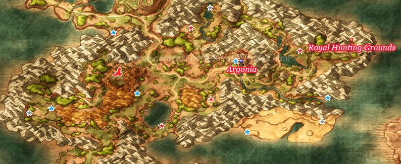

## Collectable Items

* Overworld
  * Iron Helmet (East of Argonia, next to Docked Ship at mouth of river)
  * Seed of Wisdom (East River side Northwest of Argonia)
  * Mini Medal (Corner of Argonia's Western Wall)
  * Eagle River (Soutwest of Argonia, East of lake)
  * 41 Gold Coins (Royal Hunting Grounds hut, Pot)
  * Mini Medal (Royal Hunting Grounds hut, Barrel)
  * Prayer Ring (Northeast of Peddler's Tent, on plateau near river)
  * Fresh Milk (Cow beside Mystic Spring hut)
  * Mini Medal (Mystic Spring Hut, Pot)
  * Seed of Skill (Mystic Spring Hut, Cupboard)
  * 1500 Gold Coins (South of Mysic Spring Hut)
  * Seed of Agility (Northwest of Lake Argonia)
  * Steel Shield (South Shore of Lake Argonia)
  * 2 Fresh Milks (Cows along South Shore of Lake Argonia)
  * Prayer Ring (Far West of Lake Argonia, Southwest of Mystic Spring Hut)
* Argonia Town
  * Strong Medicine (Inn, Barrel)
  * 38 Gold Coins (Inn, Pot)
  * Mini Medal (Inn, Cupboard)
  * Wayfarer's Clothes (Inn, Closet)
  * Mini Medal (Barrel, Near Gate)
  * Cool Cheese (First Southern House, Pot)
  * Turban (First Southern House, Cupboard)
  * Strong Antidote (Second Southern House, Barrel)
  * Hairband (Second Southern House, Closet)
  * Leather Cape (Western Hall, Cupboard)
  * Iron Axe (Weapon Shop, Cupboard)
  * 80 Gold Coins (Pot, Outside Weapon Shop)
  * Rennet Powder (Pot, Weapon Shop Neighbour)
  * Magic Water (Mansion, Closet)
  * Plain Cheese (Mansion, Barrel)
* Argonia Castle
  * Mini Medal (1F Cupboard)
  * Mini Medal (3F Closet)
  * 50 Gold Coins (3F Pot)
  * Rennet Powder (3F Pot)
  * Seed of Strength (3F Cupboard)
  * 30 Gold Coins (3F Closet)
  * Mini Medal (3F Cupboard)
  * Elfin Elixir (5F Closet)
  * Cloak of Evasion (4F)
  * Rock Salt (1F Barrel)

### Desert

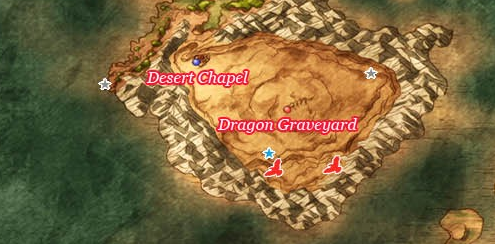

#### Available Items

* Overworld
  * Lightning Staff (Southwest end of Continent, West of Desert Chapel)
  * Dragon Scale (Southern Desert Edge, Near Well)
  * Dragon Dung (Northeastern Desert Edge, Near Well)

## Stores

<table>
  <tr>
      <th colspan="11">Campsite Merchant</th>
  </tr>
  <tr>
    <th>Item</th>
    <th>Cost</th>
    <th>ATK</th>
    <th>DEF</th>
    <th>H</th>
    <th>Y</th>
    <th>J</th>
    <th>A</th>
    <th>M</th>
    <th>R</th>
    <th>Effects</th>
  </tr>
  <tr>
    <td>Medicinal Herb</td>
    <td>8G</td>
    <td>-</td>
    <td>-</td>
    <td>-</td>
    <td>-</td>
    <td>-</td>
    <td>-</td>
    <td>-</td>
    <td>-</td>
    <td>Restores 30-40HP to one target</td>
  </tr>
  <tr>
    <td>Moonwort Bulb</td>
    <td>30G</td>
    <td>-</td>
    <td>-</td>
    <td>-</td>
    <td>-</td>
    <td>-</td>
    <td>-</td>
    <td>-</td>
    <td>-</td>
    <td>Cures Sleep and Paralysis for one character</td>
  </tr>
  <tr>
    <td>Holy Water</td>
    <td>20G</td>
    <td>-</td>
    <td>-</td>
    <td>-</td>
    <td>-</td>
    <td>-</td>
    <td>-</td>
    <td>-</td>
    <td>-</td>
    <td>When used on the field, avoids battles with low level enemies, When used in battle deals 10-15 damage to a single enemy</td>
  </tr>
  <tr>
    <td>Dream Blade</td>
    <td>4700G</td>
    <td>43</td>
    <td>-</td>
    <td>+</td>
    <td>-</td>
    <td>+</td>
    <td>+</td>
    <td>-</td>
    <td>+</td>
    <td>Casts Snooze when used in battle. Sometimes causes monsters to fall asleep when attack</td>
  </tr>
  <tr>
    <td>Tortoise Shell</td>
    <td>2300G</td>
    <td>-</td>
    <td>37</td>
    <td>-</td>
    <td>+</td>
    <td>-</td>
    <td>-</td>
    <td>+</td>
    <td>-</td>
    <td>A large tortoise shell worn in place of armour by those who don't mind looking silly</td>
  </tr>
  <tr>
    <td>Cloak of Evasion</td>
    <td>3000G</td>
    <td>-</td>
    <td>29</td>
    <td>-</td>
    <td>-</td>
    <td>+</td>
    <td>+</td>
    <td>+</td>
    <td>+</td>
    <td>A magical cloak that makes it easier to dodge enemy attacks</td>
  </tr>
</table>

<table>
  <tr>
      <th colspan="10">Desert Chapel Store</th>
  </tr>
  <tr>
    <th>Item</th>
    <th>Cost</th>
    <th>ATK</th>
    <th>H</th>
    <th>Y</th>
    <th>J</th>
    <th>A</th>
    <th>M</th>
    <th>R</th>
    <th>Effects</th>
  </tr>
  <tr>
    <td>Medicinal Herb</td>
    <td>8G</td>
    <td>-</td>
    <td>-</td>
    <td>-</td>
    <td>-</td>
    <td>-</td>
    <td>-</td>
    <td>-</td>
    <td>Restores 30-40HP to one target</td>
  </tr>
  <tr>
    <td>Antidotal Herb</td>
    <td>10G</td>
    <td>-</td>
    <td>-</td>
    <td>-</td>
    <td>-</td>
    <td>-</td>
    <td>-</td>
    <td>-</td>
    <td>Cures Poison for one character</td>
  </tr>
  <tr>
    <td>Chimaera Wing</td>
    <td>25G</td>
    <td>-</td>
    <td>-</td>
    <td>-</td>
    <td>-</td>
    <td>-</td>
    <td>-</td>
    <td>-</td>
    <td>Allows you to teleport to any town and some dungeons that you have already visited.</td>
  </tr>
  <tr>
    <td>Amor Seco Essence</td>
    <td>120G</td>
    <td>-</td>
    <td>-</td>
    <td>-</td>
    <td>-</td>
    <td>-</td>
    <td>-</td>
    <td>-</td>
    <td>Restores 70-90HP for one character</td>
  </tr>
  <tr>
    <td>Dream Blade</td>
    <td>4700G</td>
    <td>43</td>
    <td>+</td>
    <td>-</td>
    <td>+</td>
    <td>+</td>
    <td>-</td>
    <td>+</td>
    <td>Casts Snooze when used in battle. Sometimes causes monsters to fall asleep when attacked</td>
  </tr>
</table>

<table>
  <tr>
      <th colspan="3">Item Store</th>
  </tr>
  <tr>
    <th>Item</th>
    <th>Cost</th>
    <th>Effects</th>
  </tr>
  <tr>
    <td>Medicinal Herb</td>
    <td>8G</td>
    <td>Restores 30-40HP to one target</td>
  </tr>
  <tr>
    <td>Antidotal Herb</td>
    <td>10G</td>
    <td>Cures Poison for one character</td>
  </tr>
  <tr>
    <td>Holy Water</td>
    <td>20G</td>
    <td>When used on the field, avoids battles with low level enemies, When used in battle deals 10-15 damage to a single enemy</td>
  </tr>
  <tr>
    <td>Moonwort Bulb</td>
    <td>30G</td>
    <td>Cures Sleep and Paralysis for one character</td>
  </tr>
  <tr>
    <td>Chimaera Wing</td>
    <td>25G</td>
    <td>Allows you to teleport to any town and some dungeons that you have already visited.</td>
  </tr>
</table>

<table>
  <tr>
      <th colspan="11">Weapons and Armour Shop</th>
  </tr>
  <tr>
    <th>Item</th>
    <th>Cost</th>
    <th>ATK</th>
    <th>DEF</th>
    <th>H</th>
    <th>Y</th>
    <th>J</th>
    <th>A</th>
    <th>M</th>
    <th>R</th>
    <th>Effects</th>
  </tr>
  <tr>
    <td>Battle-axe</td>
    <td>4300G</td>
    <td>45</td>
    <td>-</td>
    <td>-</td>
    <td>+</td>
    <td>-</td>
    <td>-</td>
    <td>-</td>
    <td>-</td>
    <td>-</td>
  </tr>
  <tr>
    <td>Partisan</td>
    <td>4300G</td>
    <td>44</td>
    <td>-</td>
    <td>+</td>
    <td>-</td>
    <td>-</td>
    <td>-</td>
    <td>-</td>
    <td>-</td>
    <td>-</td>
  </tr>
  <tr>
    <td>Silver Mail</td>
    <td>4300G</td>
    <td>-</td>
    <td>50</td>
    <td>+</td>
    <td>-</td>
    <td>-</td>
    <td>+</td>
    <td>-</td>
    <td>-</td>
    <td>Silver Armour that reduces damage from enemy spells by 20 points</td>
  </tr>
  <tr>
    <td>Magic Vestment</td>
    <td>4400G</td>
    <td>-</td>
    <td>39</td>
    <td>-</td>
    <td>-</td>
    <td>+</td>
    <td>+</td>
    <td>+</td>
    <td>+</td>
    <td>An enchanted garment that reduces damage from spells by 2/3</td>
  </tr>
  <tr>
    <td>Light Shield</td>
    <td>2250G</td>
    <td>-</td>
    <td>17</td>
    <td>+</td>
    <td>+</td>
    <td>+</td>
    <td>+</td>
    <td>+</td>
    <td>+</td>
    <td>-</td>
  </tr>
  <tr>
    <td>Silver Tiara</td>
    <td>1450G</td>
    <td>-</td>
    <td>24</td>
    <td>-</td>
    <td>-</td>
    <td>+</td>
    <td>-</td>
    <td>-</td>
    <td>+</td>
    <td>-</td>
  </tr>
</table>

### Bazaar Stores

After Royal Hunting Grounds

<table>
  <tr>
      <th colspan="9">Item Shop</th>
  </tr>
  <tr>
    <th>Item</th>
    <th>Cost</th>
    <th>H</th>
    <th>Y</th>
    <th>J</th>
    <th>A</th>
    <th>M</th>
    <th>R</th>
    <th>Effects</th>
  </tr>
  <tr>
    <td>Bunny Tail</td>
    <td>50G</td>
    <td>+</td>
    <td>+</td>
    <td>+</td>
    <td>+</td>
    <td>+</td>
    <td>+</td>
    <td>Agility +2</td>
  </tr>
  <tr>
    <td>Gold Bracer</td>
    <td>350G</td>
    <td>+</td>
    <td>+</td>
    <td>+</td>
    <td>+</td>
    <td>+</td>
    <td>+</td>
    <td>Defense +4</td>
  </tr>
  <tr>
    <td>Gold Ring</td>
    <td>2000G</td>
    <td>+</td>
    <td>+</td>
    <td>+</td>
    <td>+</td>
    <td>+</td>
    <td>+</td>
    <td>Defense +10</td>
  </tr>
  <tr>
    <td>Tough Guy Tattoo</td>
    <td>2400G</td>
    <td>+</td>
    <td>+</td>
    <td>+</td>
    <td>+</td>
    <td>+</td>
    <td>+</td>
    <td>Attack +8</td>
  </tr>
  <tr>
    <td>Scholar's Specs</td>
    <td>2700G</td>
    <td>+</td>
    <td>+</td>
    <td>+</td>
    <td>+</td>
    <td>+</td>
    <td>+</td>
    <td>Wisdom +15</td>
  </tr>
  <tr>
    <td>Ruby of Protection</td>
    <td>3100</td>
    <td>+</td>
    <td>+</td>
    <td>+</td>
    <td>+</td>
    <td>+</td>
    <td>+</td>
    <td>Defense +15</td>
  </tr>
</table>

<table>
  <tr>
      <th colspan="10">Weapon Shop</th>
  </tr>
  <tr>
    <th>Item</th>
    <th>Cost</th>
    <th>ATK</th>
    <th>H</th>
    <th>Y</th>
    <th>J</th>
    <th>A</th>
    <th>M</th>
    <th>R</th>
    <th>Effects</th>
  </tr>
  <tr>
    <td>Chain Whip</td>
    <td>2200G</td>
    <td>32</td>
    <td>-</td>
    <td>-</td>
    <td>+</td>
    <td>-</td>
    <td>-</td>
    <td>+</td>
    <td>Attacks all enemies in a group</td>
  </tr>
  <tr>
    <td>Razor Wing Boomerang</td>
    <td>3800G</td>
    <td>42</td>
    <td>+</td>
    <td>-</td>
    <td>-</td>
    <td>-</td>
    <td>+</td>
    <td>-</td>
    <td>Causes damage to all enemies</td>
  </tr>
  <tr>
    <td>Zombiesbane</td>
    <td>6300G</td>
    <td>54</td>
    <td>+</td>
    <td>-</td>
    <td>+</td>
    <td>-</td>
    <td>-</td>
    <td>+</td>
    <td>Causes additional damage when attacking zombie-type monsters</td>
  </tr>
  <tr>
    <td>War Hammer</td>
    <td>6700G</td>
    <td>51</td>
    <td>-</td>
    <td>+</td>
    <td>-</td>
    <td>-</td>
    <td>+</td>
    <td>-</td>
    <td>-</td>
  </tr>
  <tr>
    <td>Falcon Knife</td>
    <td>7700G</td>
    <td>34</td>
    <td>+</td>
    <td>-</td>
    <td>+</td>
    <td>+</td>
    <td>-</td>
    <td>+</td>
    <td>Attacks 2 times in one round</td>
  </tr>
</table>

<table>
  <tr>
      <th colspan="10">Armour Shop</th>
  </tr>
  <tr>
    <th>Item</th>
    <th>Cost</th>
    <th>DEF</th>
    <th>H</th>
    <th>Y</th>
    <th>J</th>
    <th>A</th>
    <th>M</th>
    <th>R</th>
    <th>Effects</th>
  </tr>
  <tr>
    <td>Heavy Armour</td>
    <td>5000G</td>
    <td>52</td>
    <td>-</td>
    <td>+</td>
    <td>-</td>
    <td>-</td>
    <td>-</td>
    <td>-</td>
    <td>-</td>
  </tr>
  <tr>
    <td>Silk Bustier</td>
    <td>5500G</td>
    <td>44</td>
    <td>-</td>
    <td>-</td>
    <td>+</td>
    <td>-</td>
    <td>-</td>
    <td>+</td>
    <td>-</td>
  </tr>
  <tr>
    <td>Magic Armour</td>
    <td>6100G</td>
    <td>55</td>
    <td>+</td>
    <td>-</td>
    <td>-</td>
    <td>+</td>
    <td>+</td>
    <td>-</td>
    <td>-</td>
  </tr>
  <tr>
    <td>Magic Shield</td>
    <td>5000G</td>
    <td>27</td>
    <td>+</td>
    <td>-</td>
    <td>-</td>
    <td>+</td>
    <td>+</td>
    <td>-</td>
    <td>Mitigates 15 points of damage from Bang, Frizz and Sizz magic groups</td>
  </tr>
  <tr>
    <td>Magical Hat</td>
    <td>2700G</td>
    <td>25</td>
    <td>-</td>
    <td>-</td>
    <td>+</td>
    <td>-</td>
    <td>-</td>
    <td>+</td>
    <td>-</td>
  </tr>
  <tr>
    <td>Iron Mask</td>
    <td>3500G</td>
    <td>25</td>
    <td>+</td>
    <td>+</td>
    <td>-</td>
    <td>-</td>
    <td>-</td>
    <td>-</td>
    <td>-</td>
  </tr>
</table>

## Walkthrough Tasks

1. Purchases - Campsite Merchant (2300 G)
  * 1 Turtle Shell
2. Alchemy
  * Eagle Dagger + Poison Needle = Assassin's Dagger
  * Light Shield + Fresh Milk + Fresh Milk = White Shield
3. Purchases - Town Merchant (4300 G)
  * 1 Battle-axe
4. Alchemy
  * Battle-axe + Thief's Key = Bandit Axe
  * Magic Water + Plain Cheese = Chunky Cheese

# Royal Hunting Grounds

## Available Items

* Royal Hunting Grounds
  * Mini Medal (Northeastern Path)
  * Dragon Scale (Eastern Path)
* Argonia Castle Vault
  * Mini Medal
  * Devil's Tail
  * Battle Fork
  * Magical Hat
* Waterfall Hut - Woodsman
  * 2 Cured Cheese
  * 2 Angel Cheese
  * 4 Mild Cheese
* Pickham
  * Eros' Bow Recipe (Behind Watchtower ladder)

## Walkthrough Tasks

1. Bazaar Purchases (69350 G)
  * 2 Zombiesbanes
  * 1 War Hammer
  * 1 Heavy Armor
  * 1 Silk Bustier
  * 2 Magical Hats
  * Yggdrasil Leaf as needed
  * 2 Gold BRacers
  * 5 Gold Rings
  * 3 Tough Guy Tattoos
  * 2 Rubies of Protection
  * 2 Magic Shields
2. Alchemy
  * Zombiesbane + Silver Mail = Zombie Mail
  * Silk Bustier + Bunny Tail = Bunny Suit
  * Heavy Armor + Bandit Axe + Bandit's Grass Skirt = Bandit Mail
  * Red Mould + Waterweed Mould + Yggdrasil Leaf = Premium Mould
  * 2x Holy Water + Gold Rosary + Tough Guy Tattoo = Holy Talisman
  * Magic Water + Yggdrasil Leaf = Yggdrasil Dew
3. Alchemy
  * Holy Talisman + Templar's Sword = Holy Silver Rapier
  * Holy Talisman + Zombiesbane = Zombie Slayer
4. Recharge Sun Mirror
  * Sea Dragon Appears along river beneath Arcadia

# Dark Ruins

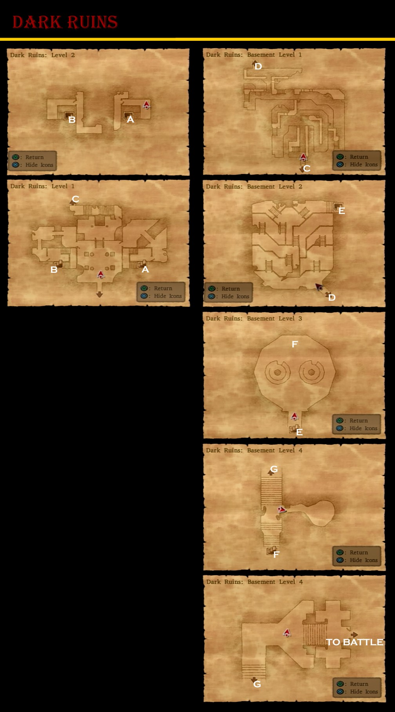

## Available Items

* Dragon Scale (B1 North East Corner)
* Mini Medal (B1 North East Corner)
* Saint's Ashes (B2 Bottom Right)
* 2000 Gold Coins (L2 East Side)

# Argonia

## Available Items

* Argonia
  * Wizard's Staff (Dominico's 2F Closet)
  * Magic Water (Dominico's 1F Pot)
  * Lesser Panacea (Dominico's 1F Pot)
  * Mini Medal (Dominico's 1F Cupboard)
  * Mini Medal (Above Armor Shop, Pot)
  * Cloak of Evasion (Behind Armor Counter, Closet)
  * Mini Medal (Behind Armor Counter, Barrel)
  * Mini Medal (Inn, Barrel)
  * Seed of Strength (Inn, Closet)
  * 26 Gold Coins (Item Shop, Barrel)
  * Mystifying Mixture (Mystery Shop, Pot)
  * Rock Salt (Under Church Courtyard, Pot)
  * Rennet Powder (South House, Upper West, Pot)
  * Poison Moth Knife (South House, Upper West, Cupboard)
  * Cowpat (South House, Upper North, Barrel)
  * Mini Medal (South House, Upper North, Pot)
  * Bunny Tail (South House, Upper North, Cupboard)
  * 350 Gold Coins (Bar, Barrel)
  * Magic Water (Bar, Barrel)
  * Amor Seco Essence (Bar, Barrel)
  * Leather Dress (Kranbattle's, Closet)
  * 27 Gold Coins (North House, Upper West, Pot)
  * Strength Ring (North House, Upper West, Closet)
  * Seed of Strength (North House, Upper South, Pot)
  * Mini Medal (North House, Upper South, Pot)
  * 230 Gold Coins (North House, Upper South, Pot)
  * Dragon Scale (North House, Upper South, Cupboard)
  * Giant Maller (North house, Upper South)
  * Fresh Milk (North House, Front, Barrel)
  * Rennet Powder (North House, Front, Barrel)
  * Gold Bracer (North House, Front, Closet)
  * Dragon Dung (North House, Front, Barrel)
  * Seed of Skill (Secret Shop, 2000 G)
* Castle Trodain
  * Imp Knife Reciple (By Fountain)

## Stores

<table>
  <tr>
      <th colspan="10">Weapon Shop</th>
  </tr>
  <tr>
    <th>Item</th>
    <th>Cost</th>
    <th>ATK</th>
    <th>H</th>
    <th>Y</th>
    <th>J</th>
    <th>A</th>
    <th>M</th>
    <th>R</th>
    <th>Effects</th>
  </tr>
  <tr>
    <td>Sword Breaker</td>
    <td>5500G</td>
    <td>56</td>
    <td>-</td>
    <td>-</td>
    <td>+</td>
    <td>-</td>
    <td>-</td>
    <td>-</td>
    <td>-</td>
  </tr>
  <tr>
    <td>Swallowtail</td>
    <td>6800G</td>
    <td>53</td>
    <td>+</td>
    <td>-</td>
    <td>-</td>
    <td>-</td>
    <td>+</td>
    <td>-</td>
    <td>Causes damage to all enemies</td>
  </tr>
  <tr>
    <td>Bastard Sword</td>
    <td>8800G</td>
    <td>61</td>
    <td>+</td>
    <td>-</td>
    <td>+</td>
    <td>-</td>
    <td>-</td>
    <td>-</td>
    <td>-</td>
  </tr>
  <tr>
    <td>Hell Scythe</td>
    <td>9500G</td>
    <td>65</td>
    <td>-</td>
    <td>+</td>
    <td>-</td>
    <td>-</td>
    <td>-</td>
    <td>-</td>
    <td>-</td>
  </tr>
</table>

<table>
  <tr>
      <th colspan="10">Armour Shop</th>
  </tr>
  <tr>
    <th>Item</th>
    <th>Cost</th>
    <th>DEF</th>
    <th>H</th>
    <th>Y</th>
    <th>J</th>
    <th>A</th>
    <th>M</th>
    <th>R</th>
    <th>Effects</th>
  </tr>
  <tr>
    <td>Cloak of Evasion</td>
    <td>3000G</td>
    <td>29</td>
    <td>-</td>
    <td>-</td>
    <td>+</td>
    <td>+</td>
    <td>+</td>
    <td>+</td>
    <td>A magical cloak that makes it easier to dodge enemy attacks</td>
  </tr>
  <tr>
    <td>Magic Armour</td>
    <td>6100G</td>
    <td>55</td>
    <td>+</td>
    <td>-</td>
    <td>-</td>
    <td>+</td>
    <td>+</td>
    <td>-</td>
    <td>-</td>
  </tr>
  <tr>
    <td>Magic Bikini</td>
    <td>13800G</td>
    <td>50</td>
    <td>-</td>
    <td>-</td>
    <td>+</td>
    <td>-</td>
    <td>-</td>
    <td>+</td>
    <td>Reduces non-Zap spell damage by 15 points</td>
  </tr>
  <tr>
    <td>Magic Shield</td>
    <td>5000G</td>
    <td>27</td>
    <td>+</td>
    <td>-</td>
    <td>-</td>
    <td>+</td>
    <td>+</td>
    <td>-</td>
    <td>Mitigates 15 points of damage from Bang, Frizz and Sizz magic groups</td>
  </tr>
  <tr>
    <td>Magical Shield</td>
    <td>2700G</td>
    <td>25</td>
    <td>-</td>
    <td>-</td>
    <td>+</td>
    <td>-</td>
    <td>-</td>
    <td>+</td>
    <td>-</td>
  </tr>
  <tr>
    <td>Iron Mask</td>
    <td>3500G</td>
    <td>25</td>
    <td>+</td>
    <td>+</td>
    <td>-</td>
    <td>-</td>
    <td>-</td>
    <td>-</td>
    <td>-</td>
  </tr>
</table>

<table>
  <tr>
      <th colspan="3">Item Shop</th>
  </tr>
  <tr>
    <th>Item</th>
    <th>Cost</th>
    <th>Effects</th>
  </tr>
  <tr>
    <td>Medicinal Herb</td>
    <td>8G</td>
    <td>Restores 30-40HP to one target</td>
  </tr>
  <tr>
    <td>Antidotal Herb</td>
    <td>10G</td>
    <td>Cures Poison for one character</td>
  </tr>
  <tr>
    <td>Holy Water</td>
    <td>20G</td>
    <td>When used on the field, avoids battles with low level enemies, When used in battle deals 10-15 damage to a single enemy</td>
  </tr>
  <tr>
    <td>Chimaera Wing</td>
    <td>25G</td>
    <td>Allows you to teleport to any town and some dungeons that you have already visited.</td>
  </tr>
  <tr>
    <td>Moonwort Bulb</td>
    <td>30G</td>
    <td>Cures Sleep and Paralysis for one character</td>
  </tr>
  <tr>
    <td>Rockbomb Shard</td>
    <td>450G</td>
    <td>Causes 50-100 damage to all enemies</td>
  </tr>
</table>

## Walkthrough Tasks

1. Purchases (34900 G)
  * 1 Sword Breaker
  * 1 Swallowtail
  * 1 Bastard Sword
  * 1 Magic Bikini
2. Alchemy
  * Cloak of Evasion + Boxer Swords = Robe of Serenity
  * Rock Salt + Amor Seco Essence = Holy Water
  * Rock Salt + Plain Cheese = Hard Cheese
  * Rock Salt + Fresh Milk + Rennet Powder = Soft Cheese
  * Giant Mallet + Iron Helmet + Iron Helmet = Sledgehammer

# Arcadia Region

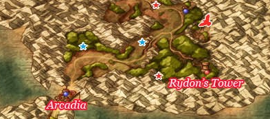

## Available Items

* Titan Belt (Just North of Arcadia)
* Silver Tiara (Near Mountains Southeast of Arcadia)
* Elfin Elixir (West of Rydon's Tower)
* Fresh Milk (Cow next to Chapel)
* Assassin's Dagger (West of Chapel)

# Rydon's Tower

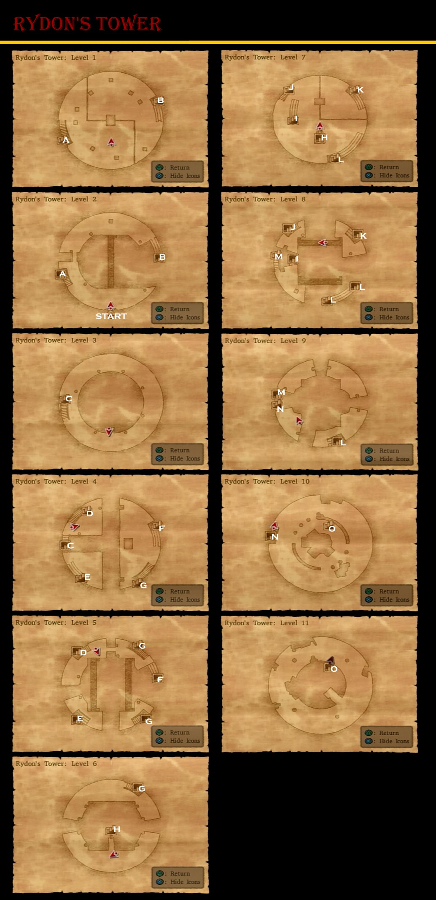

## Available Items

* 3000 Gold Coins (Front Entrance)
* Recovery Ring (L9 North East Platform)
* Cheiron's Bow (L11 South)

# Return to Arcadia

## Available Items

* Secret Library
  * Mini Medal
  * Magic Vestment
  * 650 Gold Coins

# Marta's Cottage

## Available Items

### VIP Items here can be lost if not found before finishing Herb Grotto

* Mini Medal (Closet)
* Special Medicine (Pot)
* Special Antidote (Pot)
* Mini Medal (Barn, Barrel)

# Blizzard Peaks

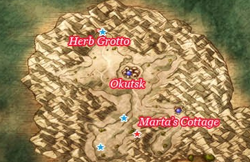

## Available Items

* Holy Silver Rapier (West of Marta's Cottage)
* Agility Ring (South of Holy Silver Rapier)
* Yggdrasil Leaf (Crevasse Southeast of Holy Silver Rapier)
* Mini Medal (Outside Herb Grotto Entrance)

## Walkthrough Tasks

1. Recruit Roborg just south of Holy Silver Rapier

# Orkutsk

## Available Items

* Amor Seco Essence (Bar, Barrel)
* Mini Medal (Item Store, Pot)
* Mini Medal (Mayor's, Pot)
* Chilly Cheese (Mayor's Closet)
* Seed of Defense (Tunnel, Barrel)
* Mini Medal (Tunnel, Cupboard)
* Rockbomb Shard (Tunnel, Barrel)
* Chimaera Wing (Item Shop, Pot)
* Ruby of Protection (Item Shop, Pot)
* Magic Water (Marek's Room, Pot)
* Wing of Bat (Marek's Room, Pot)
* Mini Medal (Beneath Weapon Shop, Barrel)
* Edged Boomerang (Weapon Shop)
* Miracle Sword (Princess Minie)

## Stores

<table>
  <tr>
      <th colspan="3">Item Shop</th>
  </tr>
  <tr>
    <th>Item</th>
    <th>Cost</th>
    <th>Effects</th>
  </tr>
  <tr>
    <td>Medicinal Herb</td>
    <td>8G</td>
    <td>Restores 30-40HP to one target</td>
  </tr>
  <tr>
    <td>Antidotal Herb</td>
    <td>10G</td>
    <td>Cures Poison for one character</td>
  </tr>
  <tr>
    <td>Holy Water</td>
    <td>20G</td>
    <td>When used on the field, avoids battles with low level enemies, When used in battle deals 10-15 damage to a single enemy</td>
  </tr>
  <tr>
    <td>Chimaera Wing</td>
    <td>25G</td>
    <td>Allows you to teleport to any town and some dungeons that you have already visited.</td>
  </tr>
  <tr>
    <td>Amor Seco Essence</td>
    <td>120G</td>
    <td>Restores 70-90HP for one character</td>
  </tr>
  <tr>
    <td>White Gold Bell</td>
    <td>200G</td>
    <td>Summons a white great sabrecat</td>
  </tr>
</table>

<table>
  <tr>
      <th colspan="10">Armour Shop</th>
  </tr>
  <tr>
    <th>Item</th>
    <th>Cost</th>
    <th>DEF</th>
    <th>H</th>
    <th>Y</th>
    <th>J</th>
    <th>A</th>
    <th>M</th>
    <th>R</th>
    <th>Effects</th>
  </tr>
  <tr>
    <td>Velvet Cape</td>
    <td>9400G</td>
    <td>60</td>
    <td>-</td>
    <td>-</td>
    <td>-</td>
    <td>+</td>
    <td>+</td>
    <td>-</td>
    <td>-</td>
  </tr>
  <tr>
    <td>Dragon Mail</td>
    <td>12000G</td>
    <td>60</td>
    <td>+</td>
    <td>+</td>
    <td>-</td>
    <td>-</td>
    <td>-</td>
    <td>-</td>
    <td>-</td>
  </tr>
  <tr>
    <td>Dragon Shield</td>
    <td>6900G</td>
    <td>30</td>
    <td>+</td>
    <td>+</td>
    <td>-</td>
    <td>-</td>
    <td>-</td>
    <td>-</td>
    <td>Mitigates 25 points of fire and ice damage</td>
  </tr>
  <tr>
    <td>Ice Shield</td>
    <td>8500G</td>
    <td>33</td>
    <td>+</td>
    <td>-</td>
    <td>-</td>
    <td>+</td>
    <td>-</td>
    <td>-</td>
    <td>Mitigates 5 points of Ice Damage. Casts Insulatle when used as an item in battle</td>
  </tr>
  <tr>
    <td>Iron Headgear</td>
    <td>5500G</td>
    <td>32</td>
    <td>+</td>
    <td>+</td>
    <td>-</td>
    <td>-</td>
    <td>+</td>
    <td>-</td>
    <td>-</td>
  </tr>
</table>

<table>
  <tr>
      <th colspan="10">Weapon Shop</th>
  </tr>
  <tr>
    <th>Item</th>
    <th>Cost</th>
    <th>ATK</th>
    <th>H</th>
    <th>Y</th>
    <th>J</th>
    <th>A</th>
    <th>M</th>
    <th>R</th>
    <th>Effects</th>
  </tr>
  <tr>
    <td>Swallowtail</td>
    <td>6800G</td>
    <td>53</td>
    <td>+</td>
    <td>-</td>
    <td>-</td>
    <td>-</td>
    <td>+</td>
    <td>-</td>
    <td>Causes damage to all enemies</td>
  </tr>
  <tr>
    <td>Falcon Knife</td>
    <td>7700G</td>
    <td>34</td>
    <td>+</td>
    <td>-</td>
    <td>+</td>
    <td>+</td>
    <td>-</td>
    <td>+</td>
    <td>Attacks 2 times in one round</td>
  </tr>
  <tr>
    <td>Spiked Steel Whip</td>
    <td>8300G</td>
    <td>62</td>
    <td>-</td>
    <td>-</td>
    <td>+</td>
    <td>-</td>
    <td>-</td>
    <td>+</td>
    <td>Attacks all enemies in a group</td>
  </tr>
  <tr>
    <td>Dragonsbane</td>
    <td>11000G</td>
    <td>72</td>
    <td>+</td>
    <td>-</td>
    <td>+</td>
    <td>-</td>
    <td>-</td>
    <td>+</td>
    <td>Causes additional damage when attacking dragon-type emonsters</td>
  </tr>
  <tr>
    <td>King Axe</td>
    <td>17000</td>
    <td>80</td>
    <td>-</td>
    <td>+</td>
    <td>-</td>
    <td>-</td>
    <td>-</td>
    <td>-</td>
    <td>-</td>
  </tr>
  <tr>
    <td>Iron Claw</td>
    <td>2000G</td>
    <td>55</td>
    <td>-</td>
    <td>-</td>
    <td>-</td>
    <td>-</td>
    <td>+</td>
    <td>-</td>
    <td>-</td>
  </tr>
  <tr>
    <td>Iron Fan</td>
    <td>1600G</td>
    <td>47</td>
    <td>-</td>
    <td>-</td>
    <td>-</td>
    <td>-</td>
    <td>-</td>
    <td>+</td>
    <td>-</td>
  </tr>
</table>

## Walkthrough Tasks

1. Purchases (25900 G)
  * 1 Dragonsbane
  * 1 Velvet Cape
  * 1 Iron Headgear
2. Alchemy
  * Wizard's Staff + Rockbomb Shard + Rockbomb Shard = Magma Staff
  * 2x Chilly Cheese + Waterweed Mould + Waterweed Mould = Cold Cheese
3. Monster Arena
  * Use Roborg for Ranks G-D
    * Strength Ring
    * Bunny Suit
    * Ring of Clarity
    * Mighty Armlet
  * Recruit Cybot West of Orkutusk
  * Recruit Talos South of Neos
  * Use these Roborg, Cybot and Talos for Ranks D-B
    * Saint's Ashes
    * Bardiche of Binding
  * Recruit Octurion on southeast coast of Desert South of Argonia
  * Recruit Skeledoid on southwest of Dark Ruins
  * Use Talos, Octurion and Skeledoid for Ranks A-S
    * Hero Spear
    * Dragon Robe

# Baccrat 2

## Available Items

* Mini Medal (Cabin, Barrel)
* Magic Water (Mansion Balcony, Barrel)
* Rennet Powder (Mansion, Barrel)
* Fresh Milk (Mansion, Pot)
* Seed of Wisdom (Mansion, Pot)
* Gold Ring (Mansion, Closet)
* Mini Medal (Mansion, Closet)
* Spangled Dress (Mansion, Closet)

## Walkthrough Tasks

1. Alchemy
  * Gold Ring + Seed of Magic = Prayer Ring
  * 2x Gold Ring + Poison Needle = Ring of Immunity
  * Gold Ring + Poison Moth Knife = Full Moon Ring
  * Gold Ring + Dream Blade = Ring of Awakening

# Dragon Graveyard

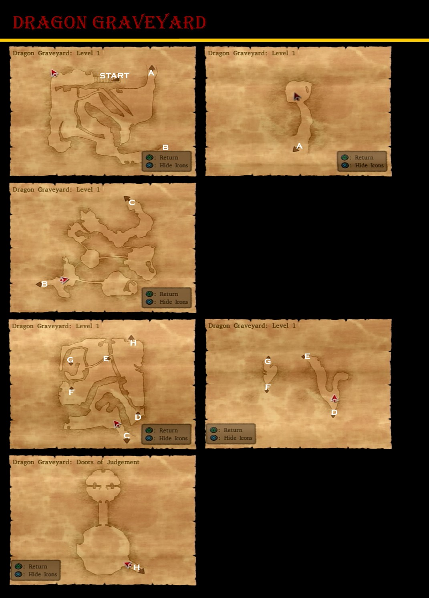

## Available Items

* 2000 Gold Coins (Straight Ahead, Entrance)
* Mini Medal (North Passageway from First Room)
* Dragon Dung (East of First Room, Bottom Right Corner)
* Dragon Shield (Side Passage Below Surface)

## Walkthrough Tasks

1. Casino Purchases (502000 Tokens)
  * 4 Silver Platters
  * 6 Agility Rings
  * 3 Rune Staffs
  * 1 Platinum Headgear
  * 9 Prayer Rings
  * 2 Spangled Dresses
  * 17 Saint's Ashes
  * 3 Falcon Blades
  * 3 Liquid Metal Armors
  * 1 Gringham Whip
2. Alchemy
  * Rune Staff + Wizard's Staff = Staff of Antimagic
  * Iron Shield + Silver Platter = White Shield
  * Coral Hairpin + Silver Platter = Silver Tiara
  * 3x Seed of Strength + Prayer Ring = Strength Ring
  * 5x Seed of Life + Prayer Ring = Recovery Ring
  * Seed of Defense + Prayer Ring = Ruby of Protection
  * Seed of Agility + Prayer Ring = Agility Ring
  * Saint's Ashes + Zombie Mail = Platinum Mail
  * 2x Saint's Ashes + Partisan = Sandstorm Spear
  * Strength Ring + Leather Kilt = Titan Belt
  * Strength Ring + Magic Shield + Cured Cheese = Power Shield
  * Cypress Stick + Cypress Stick + Strength Ring = Hunter's Bow
  * Seed of Wisdom + Ring of Clarity + Ring of Awakening = Scholar's Specs
  * Full Plate Armor + Ruby of Protection + Prayer Ring = Magic Armor
  * 3x Spangled Dress + Ruby of Protection + Gold Bracer = Shimmering Dress
  * Steel Shield + Ruby of Protection + Prayer Ring = Magic Shield
  * Iron Curiass + Silver Platter + Silver Platter = Silver Curiass
3. Alchemy
  * 3x Agility Ring + Bandana = Mercury's Bandana
  * 2x Recovery Ring + Gold Bracer = Life Bracer
  * Gold Ring + Sandstorm Spear = Ring of Truth
  * Magic Armor + Edged Boomerang = Spiked Armor
  * 2x Strength Ring + Titan Belt = Mighty Armlet
  * 2x Magical Hat + Scholar's Specs = Scholar's Cap
  * Hunter's Bow + Garter = Eros' Bow
  * Rune Staff + Light Shield + Shimmering Dress = Shamshir of Light
  * Slime Earrings + Tough Guy Tattoo + Agility Ring = Falcon Knife
4. Alchemy
  * Feathered Cap + Mercury's Bandana = Hermes' Hat
  * Miracle Sword + Life Bracer = Uber Miracle Sword
  * Eros' Bow + Power Shield = Cheiron's Bow
  * Scholar's Cap + Magic Vestment = Sage's Robe
  * Rune Staff + Life Bracer + Yggdrasil Leaf = Staff or Ressurection
  * Full Moon Ring + Ring of Immunity + Ring of Truth = Catholicon Ring

# Herb Grotto

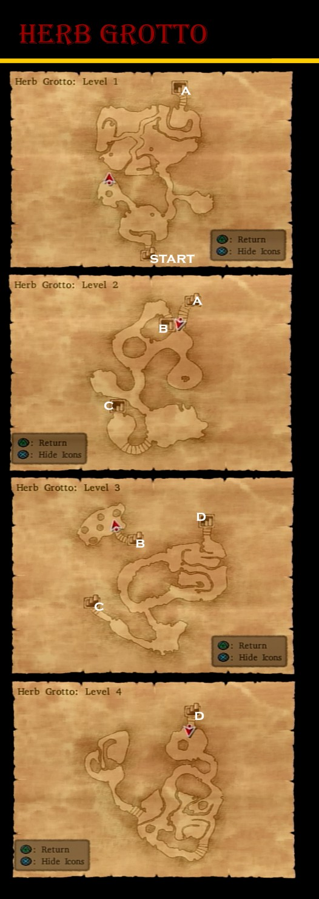

## Available Items

* 3000 Gold Coins (L1, Right Passage from Entrance)
* Mini Medal (L1, Right Turn down Long Passage, Pot)
* Rose Wort (L1, Right Turn down Long Passage, Pot)
* Hermes' Hat (L1, South exit of Ice Bridge)
* Elfin Elixir (L2, Directly opposite Entrance)
* Devil's Tail (L3, Top Left)
* 2100 Gold Coins (L3, Top Left)
* Mini Medal (L2, Lower Left, Above Stairs, Pot)
* Rose Root (L2, Lower Left, Above Stairs, Pot)
* Seed of Life (L2, West of Stairs, Pot)
* Mini Medal (L3, Past Entrance, Pot)
* Icicle Dirk (South End of High Passage)
* Sacred Armor (Princess Minnie)

## Ultimate Key - Treasure Hunting

* Pickham - Back Left House
  * Rune Staff
  * Power Shield
  * Mini Medal
* Red's Basement
  * Spiked Steel Whip
  * Seed of Agility
  * Mini Medal
  * Garter
* Trodain Castle - 2F Right Building
  * Seed of Magic
  * Yggdrasil Dew
  * Rusty Old Sword
  * Mini Medal
* Argonia - 3rd Floor Treasury
  * Skull Ring
  * Mini Medal
  * Moon Axe
* Le Puff-Puff Club - Changing Room
  * Mini Medal
  * Silver Platter
* Arcadia - Item Shop
  * Mini Medal
  * Titan Belt
  * Seed of Magic
* Princess Minnie's Castle
  * Double-Edged Sword
  * Seed of Strength
  * Seed of Life
  * Mini Medal
* Orichalcum (Princess Minnie)

## Walkthrough Tasks

1. Alchemy
  * Skull Ring + Saint's Ashes + Saint's Ashes = Sorceror's Ring
  * Double-Edged Sword + Saint's Ashes + Saint's Ashes = Uber Double-Edge

# Pirate's Cove

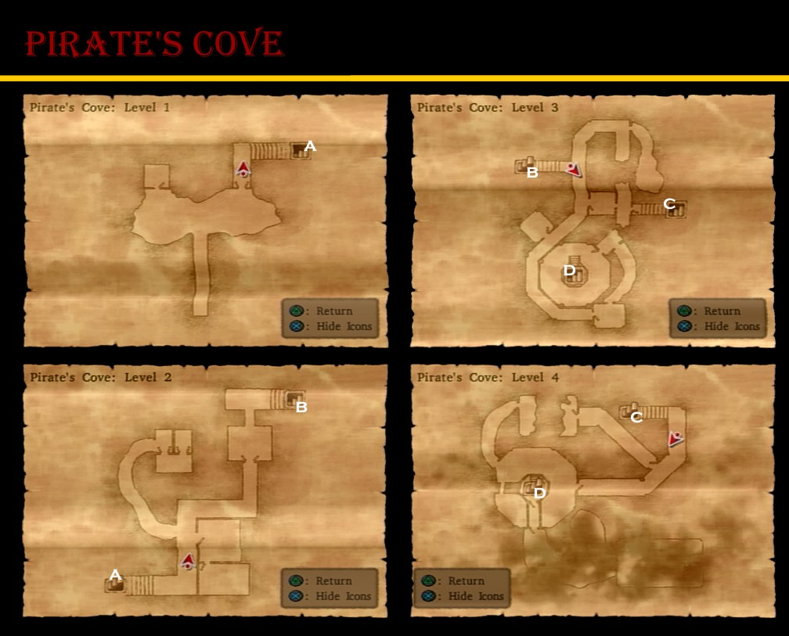

## Available Items

*
